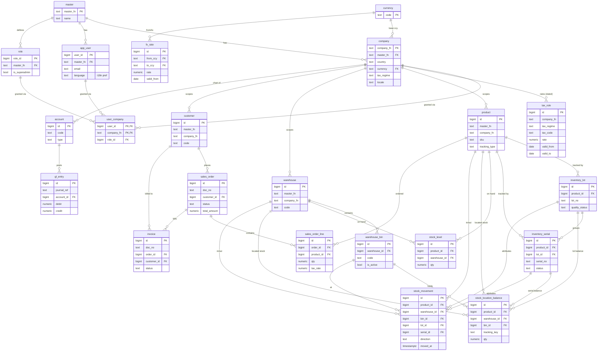

# Data Model

One Drizzle schema, shared by both modes. Same tables, same types, same migrations in
PGlite (demo) and PostgreSQL (production).

## 1. Modules and core tables

```
tenancy/     master, company, app_user, role, user_company
localization/ tax_rule (effective-dated), currency, fx_rate
inventory/   product, warehouse, stock_level, stock_movement,
             warehouse_bin, inventory_lot, inventory_serial,
             stock_location_balance, inventory_adjustment(+line),
             stock_transfer(+line)
sales/       customer, sales_order, sales_order_line, delivery, invoice, payment
purchasing/  supplier, purchase_order, purchase_order_line, goods_receipt
finance/     account (chart of accounts), gl_entry
system/      audit_log
```

`master` / `company` define the tenant hierarchy ([MULTI_TENANCY.md](MULTI_TENANCY.md));
`company` also holds country/currency/tax_regime ([LOCALIZATION.md](LOCALIZATION.md)).

Each module owns its tables. Cross-module references are by id (e.g. `sales_order_line.product_id`).

`stock_movement` is the inventory fact trail. `stock_level` is the rebuildable
product/warehouse projection, while `stock_location_balance` is the rebuildable
product/warehouse/bin/tracking projection. Production commands update both
projections only while appending the corresponding movement in the same transaction;
ordinary API resources cannot directly update either balance.

## 2. Conventions

| Convention | Rule |
| --- | --- |
| Primary key | `bigint GENERATED ALWAYS AS IDENTITY` (room to grow past int4 at 800 GB) |
| Money | `numeric(18,2)` — never `float` |
| Timestamps | `timestamptz`, UTC; `created_at`, `updated_at` on every table |
| Tenant columns | `master_fn` + `company_fn` (NOT NULL) on every business table |
| Soft delete | `deleted_at timestamptz NULL` where history matters; hard delete only via partition detach |
| Document number | human-facing `doc_no` (e.g. `SO-2026-000123`), separate from `id` |

## 3. Multi-tenant scoping

Three-level tenancy: **`master_fn` → `company_fn` → `user_id`** (full model in
[MULTI_TENANCY.md](MULTI_TENANCY.md)). Every business table has `master_fn` + `company_fn`.
**Every query filters by both**, and they are the **leading columns** of composite indexes:

```sql
CREATE INDEX idx_so_tenant_status_created
  ON sales_order (master_fn, company_fn, status, created_at DESC);
```

The data-access layer injects `master_fn` + `company_fn` from the authenticated session —
never from client input. A missing tenant filter on a large table is a correctness *and* a
performance bug (full-tenant scan). See [SCALABILITY.md](SCALABILITY.md#2-keyset-pagination-the-offset-replacement).

## 4. Cross-module flow (the ERP core)

The canonical transaction, enforced server-side in production:

```
Confirm Sales Order
  ├─ insert sales_order (status = confirmed)
  ├─ for each line: decrement stock_level, insert stock_movement (out)
  ├─ create invoice (status = unpaid)
  └─ post gl_entry (debit AR, credit revenue)         ← all in ONE transaction
```

If any step fails, the whole transaction rolls back. This is the single source of truth
in action — one user action, consistent state across four modules.

**Implemented & verified — the full chain.** `confirmSalesOrder`
([`src/modules/sales/confirmOrder.ts`](../src/modules/sales/confirmOrder.ts)) runs the
entire flow in one `db.transaction`: insert `sales_order` + lines → `issueStockWithin`
per line (the composable stock-issue unit from
[`src/modules/inventory/stock.ts`](../src/modules/inventory/stock.ts), `SELECT … FOR
UPDATE` row lock) → `invoice` → balanced double-entry `gl_entry` (Dr AR, Cr Revenue, Cr
output tax). `npm run demo` proves on **both** engines:

- **Happy path:** 2-line order → net 110 + 9% GST 9.90 = 119.90; 2 stock movements; ledger
  balanced (Dr 119.90 = Cr 119.90); stock reduced.
- **Whole-chain rollback:** an order whose line 2 exceeds stock throws and rolls back
  *everything* — **including line 1's valid stock deduction** (widget stays 95, not 90);
  no order, invoice, movement, or ledger row persists.
- **Cross-engine equality:** repo + stock-tx + sales results are byte-identical on PGlite
  and PostgreSQL.
- **Concurrency (PostgreSQL only):** two concurrent issues of 8 from stock 10 → exactly one
  succeeds, final stock 2 (never −6). PGlite is single-connection (single-user), so true
  concurrency is a PostgreSQL-only guarantee — correct, since the demo/browser is
  single-user.

## 5. Big tables (partitioned — see SCALABILITY.md)

These are expected to dominate the 800 GB footprint and are **range-partitioned by date**:

- `gl_entry` (ledger)
- `stock_movement`
- `audit_log`
- `sales_order_line` / `purchase_order_line` (if line volume is high)

## 6. Audit log

`audit_log` records who changed what, when. Append-only, partitioned by month, never
updated. Columns: `master_fn, company_fn, actor_user_id, entity, entity_id, action, diff jsonb, at`.

## 7. Tenancy, roles & permissions

```
master         (master_fn, name)                          -- top tenant
company        (company_fn, master_fn, country, currency, tax_regime, ...)
app_user       (user_id, master_fn, email, language, ...)  -- user belongs to ONE master; language = UI i18n pref
role           (role_id, master_fn, name, is_superadmin)
user_company   (user_id, company_fn, role_id)             -- M:N: user ↔ many companies
```

A user belongs to one `master_fn` but can be granted **many companies** (the
`user_company` junction), each with a role — e.g. an accountant covering both the SG and
MY entities. `is_superadmin` (master-level) sees all companies under its master. Full
rules and the app-level-vs-RLS isolation model are in
[MULTI_TENANCY.md](MULTI_TENANCY.md). The demo ships a sample user with access to both the
SG and MY demo companies; production wires real auth.

## 8. Migrations

Drizzle migrations live in `drizzle/` and run identically in both modes:

- Demo: applied into PGlite on first load.
- Production: `npm run migrate` against PostgreSQL.

Never hand-edit the live schema — change the Drizzle schema, generate a migration, apply
it. This keeps demo and production schemas in lockstep.

## 9. ER diagram — implemented schema

The Drizzle schema lives in [`src/data/schema/`](../src/data/schema/) and is the single
source of truth. The diagram below reflects the **implemented** tables (tenancy,
localization, inventory).

**Referential-integrity rule (consistent across the model):**
- The **tenancy tables** (`master`/`company`/`app_user`/`role`/`user_company`) form a real
  FK hierarchy, plus reference-data FKs to `currency`.
- Every **business table** (`product`, `warehouse`, `stock_*`, `tax_rule`) carries
  `master_fn` + `company_fn` as **scope columns that are NOT FK-bound** to `company` —
  tenancy is enforced at the **app + production-RLS layer**, not by composite FKs (which
  would add write overhead at 800 GB). Intra-tenant entity links (`stock_*` → `product` /
  `warehouse`) and reference-data links (`currency`) remain real FKs.
- `currency` / `fx_rate` are **global** reference/market data (no tenant columns).



### Future modules (not yet implemented)

**Purchasing** (supplier, purchase_order, goods_receipt) follows the same conventions and
will extend this diagram:

```
company ||--o{ supplier ||--o{ purchase_order ||--o{ purchase_order_line }o--|| product
purchase_order ||--o{ goods_receipt   (receive stock → stock_movement 'in')
```

Also planned: `delivery` and `payment` to extend the sales flow.
