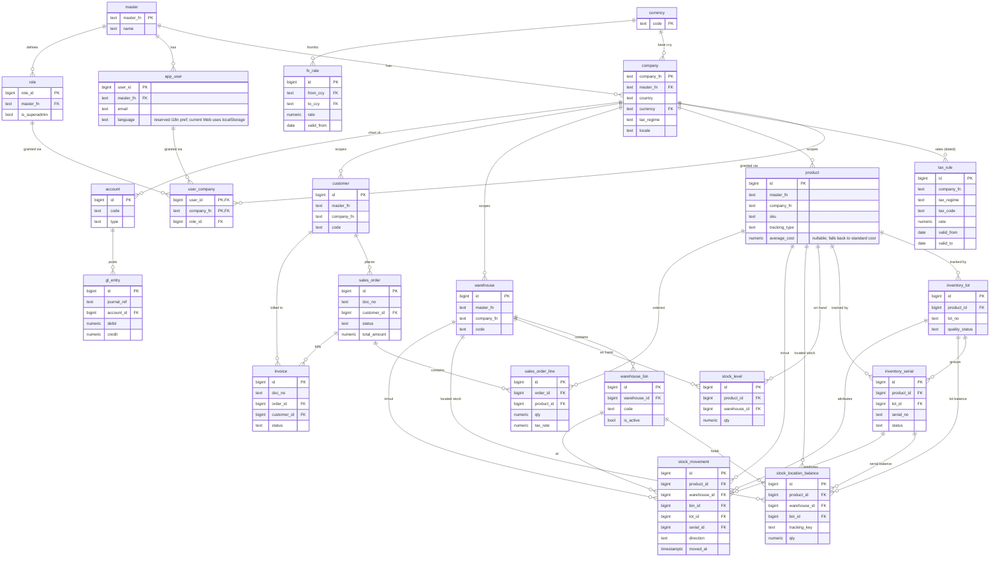

# Data Model

One Drizzle schema, shared by both modes. Same tables, same types, same migrations in
PGlite (demo) and PostgreSQL (production).

## 1. Modules and core tables

```
tenancy/     master, company, app_user, role, user_company,
             user_company_role, user_company_role_scope, role_resource_scope
localization/ tax_rule (effective-dated), currency, fx_rate
inventory/   product, warehouse, stock_level, stock_movement,
             warehouse_bin, inventory_lot, inventory_serial,
             stock_location_balance, inventory_adjustment(+line),
             stock_transfer(+line)
sales/       customer, sales_order, sales_order_line, delivery, invoice, payment
purchasing/  supplier, purchase_order, purchase_order_line, goods_receipt,
             purchase_order_approval, landed_cost(+line)
finance/     account (chart of accounts), gl_entry
system/      audit_log, user_permission_override, company_module
platform/    platform_principal, platform_role, platform_principal_role,
             platform_role_permission, platform_session, support_access_grant
integration/ import_job, import_job_row, import_row_error, outbox_event
```

`master` / `company` define the tenant hierarchy ([MULTI_TENANCY.md](MULTI_TENANCY.md));
`company` also holds country/currency/tax_regime ([LOCALIZATION.md](LOCALIZATION.md)).

Each module owns its tables. Cross-module references are by id (e.g. `sales_order_line.product_id`).

`stock_movement` is the inventory fact trail. `stock_level` is the rebuildable
product/warehouse projection, while `stock_location_balance` is the rebuildable
product/warehouse/bin/tracking projection. Production commands update both
projections only while appending the corresponding movement in the same transaction;
ordinary API resources cannot directly update either balance.

`import_job` is the bounded user-import header and summary. `import_job_row` stores only
normalized fields supported by the target command; `import_row_error` preserves
row/field/error facts. Raw arbitrary files and tenant identifiers are not stored. The
current Canonical target is customer CSV (`code,name,industry`, maximum 250 rows); a
validated job applies all ready rows atomically with an explicit update-or-skip policy.

## 2. Conventions

| Convention | Rule |
| --- | --- |
| Primary key | `bigint GENERATED ALWAYS AS IDENTITY` (room to grow past int4 at 800 GB) |
| Money | `numeric(18,2)` — never `float` |
| Timestamps | `timestamptz`, UTC; `created_at`, `updated_at` on every table |
| Tenant columns | `master_fn` + `company_fn` (NOT NULL) on every business table |
| Soft delete | `deleted_at timestamptz NULL` where history matters; hard delete only via partition detach |
| Document number | human-facing `doc_no` (e.g. `SO-2026-000123`), separate from `id` |

## 3. Multi-tenant scoping

Three-level tenancy: **`master_fn` → `company_fn` → `user_id`** (full model in
[MULTI_TENANCY.md](MULTI_TENANCY.md)). Every business table has `master_fn` + `company_fn`.
**Every query filters by both**, and they are the **leading columns** of composite indexes:

```sql
CREATE INDEX idx_so_tenant_status_created
  ON sales_order (master_fn, company_fn, status, created_at DESC);
```

The data-access layer injects `master_fn` + `company_fn` from the authenticated session —
never from client input. A missing tenant filter on a large table is a correctness *and* a
performance bug (full-tenant scan). See [SCALABILITY.md](SCALABILITY.md#2-keyset-pagination-the-offset-replacement).

## 4. Cross-module flow (the ERP core)

The canonical transaction, enforced server-side in production:

```
Confirm Sales Order
  ├─ insert sales_order (status = confirmed)
  ├─ for each line: decrement stock_level, insert stock_movement (out)
  ├─ create invoice (status = unpaid)
  └─ post gl_entry (debit AR, credit revenue)         ← all in ONE transaction
```

If any step fails, the whole transaction rolls back. This is the single source of truth
in action — one user action, consistent state across four modules.

**Implemented & verified — the full chain.** `confirmSalesOrder`
([`src/modules/sales/confirmOrder.ts`](../src/modules/sales/confirmOrder.ts)) runs the
entire flow in one `db.transaction`: insert `sales_order` + lines → `issueStockWithin`
per line (the composable stock-issue unit from
[`src/modules/inventory/stock.ts`](../src/modules/inventory/stock.ts), `SELECT … FOR
UPDATE` row lock) → `invoice` → balanced double-entry `gl_entry` (Dr AR, Cr Revenue, Cr
output tax). `npm run demo` proves on **both** engines:

- **Happy path:** 2-line order → net 110 + 9% GST 9.90 = 119.90; 2 stock movements; ledger
  balanced (Dr 119.90 = Cr 119.90); stock reduced.
- **Whole-chain rollback:** an order whose line 2 exceeds stock throws and rolls back
  *everything* — **including line 1's valid stock deduction** (widget stays 95, not 90);
  no order, invoice, movement, or ledger row persists.
- **Cross-engine equality:** repo + stock-tx + sales results are byte-identical on PGlite
  and PostgreSQL.
- **Concurrency (PostgreSQL only):** two concurrent issues of 8 from stock 10 → exactly one
  succeeds, final stock 2 (never −6). PGlite is single-connection (single-user), so true
  concurrency is a PostgreSQL-only guarantee — correct, since the demo/browser is
  single-user.

## 5. Big tables (partitioned — see SCALABILITY.md)

These are expected to dominate the 800 GB footprint and are **range-partitioned by date**:

- `gl_entry` (ledger)
- `stock_movement`
- `audit_log`
- `sales_order_line` / `purchase_order_line` (if line volume is high)

## 6. Audit log

`audit_log` records who changed what, when. Append-only, partitioned by month, never
updated. Columns: `master_fn, company_fn, actor_user_id, entity, entity_id, action, diff jsonb, at`.

## 7. Tenancy, roles & permissions

```
master         (master_fn, name)                          -- top tenant
company        (company_fn, master_fn, country, currency, tax_regime, ...)
app_user       (user_id, master_fn, email, language, ...)  -- user belongs to ONE master; language reserved, current Web uses localStorage
role           (role_id, master_fn, company_fn, name, is_superadmin, source_template_key)
user_company   (user_id, company_fn, role_id)             -- membership + compatibility role
user_company_role (assignment_id PK, user_id, company_fn, role_id, valid_from, valid_until,
                   revoked_at, provenance, managed_by_system)       -- effective role grants
user_company_role_scope (assignment_id, resource_key, scope, target_type, target_id) -- assignment scope
role_permission (role_id, permission_key, allowed)        -- current Allow grants
role_resource_scope (role_id, resource_key, scope)        -- legacy role-level fallback
user_permission_override (id, user_id, permission_key, resource_key, effect,
                          scope, target_type, target_id, validity, revocation) -- explicit exception
company_module (master_fn, company_fn, module_key, enabled, configured)
```

A user belongs to one `master_fn` but can be granted **many companies** through
`user_company`, and may hold multiple active roles per company through
`user_company_role`. Current permissions union Allow rows from assignments whose
`[valid_from, valid_until)` window is active and which are not revoked. Assignment-owned
`user_company_role_scope` rows union to the widest `self/team/department/company` scope
after target validation; assignments with a null `scope_backfilled_at` also dual-read
the legacy `role_resource_scope` rows. The assignment service records source, actor,
reason and revocation metadata. The stable assignment key allows multiple independent
assignments of the same reusable role.
`is_superadmin` is retained as a legacy migration/audit flag only. Migration 0089 makes
it inert for authorization and establishes the immutable, company-scoped Company Owner
role with 112 explicit registered tenant permissions and `* / company` scope. It is not
a platform role and does not imply approval, payment, payroll, sensitive tax-evidence or
platform-support authority. `role_permission.permission_key` remains a text compatibility
store: TASK-171 adds the application-owned registry in `src/auth/permissionRegistry.ts`,
explicit canonical aliases and tenant/platform-domain separation without adding a
permission database table or foreign key. Migration 0086 adds the assignment lifecycle
and scope table; migration 0087 adds reasoned, valid and revocable user-level explicit
allow/deny overrides. Deny overrides are evaluated before role grants. Migration 0088
adds the authorization-version marker; migration 0089 performs the Company Owner
expand/backfill/cutover.
Full current/target rules are in [MULTI_TENANCY.md](MULTI_TENANCY.md) and
[ROLE_PERMISSION_ARCHITECTURE.md](ROLE_PERMISSION_ARCHITECTURE.md).

## 8. Employee self-service, leave and expenses

> Delivery boundary: TASK-106 identity fields/`user_company_role`, TASK-107's employee
> binding/account lifecycle and TASK-108's effective-dated
> `employee_hierarchy_scope` are present in the current Drizzle schema. TASK-109 adds
> five UI shell routes and no table. TASK-110 adds role-grant provenance without a
> new table. TASK-111 adds the calendar/type/policy entities listed below. The
> immutable balance ledger is implemented by TASK-112. TASK-113 adds the governed
> leave request/revision/event/evidence/cancellation entities. TASK-114 adds the
> versioned approval policy/step, workflow instance/step, immutable decision/event,
> bounded delegation, capacity-rule and capacity-snapshot entities. TASK-115 adds the
> outbound calendar connection/event entities. TASK-116 adds the leave-to-Payroll
> source and one-time run mapping entities. TASK-117 adds the first four managed
> document storage entities in section 8.3. TASK-118 adds immutable page counts
> without a new entity. TASK-119 adds `document_processing_policy`,
> `document_scan_job` and `document_extraction`. TASK-120 adds immutable
> `document_extraction_field`, `receipt_upload_authorization` and `receipt_inbox_item`
> entities. TASK-121 adds the managed-document lifecycle, correction, governance-event,
> purge-request and tombstone entities. TASK-122 adds immutable sensitive-access
> events. TASK-123 adds the first five effective policy/snapshot entities in section
> 8.4. TASK-124 adds the employee claim, line, allocation, authorization, revision and
> event entities. TASK-125 adds the five control, assessment, signal, override and
> line-approval entities listed below. TASK-126 adds the corporate-card import,
> transaction, candidate, follow-up and event entities. TASK-127 adds the allowance
> policy/calculation and cash-advance application/posting/event entities. TASK-128
> adds `expense_posting` and `expense_posting_leg` entities. TASK-129 adds
> five-language expense SSOT screens and audit proof without a new table. TASK-130
> adds `employee_payout_profile` and `employee_payout_profile_event` entities.
> TASK-131 adds `reimbursement_payment_batch`, `reimbursement_payment_batch_line`
> and `reimbursement_payment_batch_event` entities. TASK-132 adds
> `reimbursement_bank_template_version`, `reimbursement_bank_export`
> (+`_line`/`_access_event`), `reimbursement_bank_result_import`,
> `reimbursement_bank_line_result` and `reimbursement_settlement` entities. TASK-133
> adds `tax_evidence_snapshot` (+`_line`/`_document`), `tax_evidence_report_job`,
> `tax_evidence_artifact` and `tax_evidence_access_event` entities. TASK-134 adds
> `tax_evidence_pack`, `tax_evidence_pack_legal_hold_event` and
> `tax_evidence_retention_policy` entities. TASK-135 proves the complete
> employee-to-tax chain without a new table. TASK-136 locks the i18n contract with
> no new entity. TASK-137 adds the locale/message/formatting engine without a new
> table. TASK-138 migrates Canonical UI to live i18n bindings without a new table.
> TASK-139 proves five-language Canonical release quality without a new table.
> TASK-140 registers the dual-mode end-user audit findings without a new table.
> TASK-141 adds migration 0074's deterministic `employee_opening` leave-balance
> backfill without a new table. TASK-142 opens Invite user to every eligible
> tenant role without a new table. TASK-143 remediates dependency advisories
> without a new table. TASK-144 makes document-queue tests clock-independent
> without a new table. TASK-145 derives shell navigation from effective
> permissions without a new table. TASK-146 stabilizes integration-test setup
> without a new table. TASK-147 guards the PostgreSQL demo proof against seeded
> databases without a new table. TASK-148 deduplicates My Work identity conflicts
> without a new table. TASK-149 names icon-only user administration controls
> without a new table. TASK-150 locks the employee access, Demo and onboarding
> specification with no new entity. TASK-151 adds migration 0073's
> `role_resource_scope`, `company_module`, `staff_onboarding_draft`,
> `company_onboarding`, `onboarding_import_job` and `onboarding_import_row`
> entities plus `role.company_fn`, `role.source_template_key` and
> `app_user.initial_password_expires_at` (see "EPIC-059 access and onboarding
> tables" below). TASK-152 implements atomic Staff onboarding and credential
> lifecycle without a new table. TASK-153 enforces action permissions and data
> scopes server-side without a new table. TASK-154 delivers the deterministic
> enterprise Demo and 12 personas without a new table. TASK-155 delivers
> production onboarding, atomic imports and Go Live without a new table. TASK-156
> completes five-language UI and operator documentation without a new table.
> TASK-157 proves dual-mode release quality and performance without a new table.
> TASK-158 completes the interactive walkthrough and remediates every confirmed
> issue without a new table. TASK-159 polishes Team Calendar and deterministic
> Demo leave coverage without a new table. TASK-160 adds `vision_base_url`,
> `vision_model` and `vision_credential_required` columns to
> `document_processing_policy` (migration 0075's `openai_compatible` BYOK vision
> provider) without a new table. TASK-161–171 synchronize the subsequent operational,
> editable-record, Sales, session, HR Calendar, Staff Calendar and authorization
> documentation work. TASK-173 adds migration 0087's `user_permission_override` table. The
> delivered Purchase Requisition approval slice is additive application logic only: it
> uses the existing `purchase_requisition.status`/`decided_at` state row and adds no
> generic approval-instance table. The Sales Commission approval slice likewise uses
> the existing `sales_commission_run.status`/`version`/approval snapshot columns and
> adds no workflow table. Allowance calculation approval likewise uses the existing
> `expense_allowance_calculation.status` row (`calculated` → `approved`) and adds no
> generic approval-instance/step table. Budget approval uses the existing
> `budget_version.status`/`is_active`/`version` state plus imported `budget_line` rows;
> it also adds no generic approval-instance/step table.
> The current boundary is migration 0089: **90 journal entries and 244 generated
> tables**. Migration 0088 adds `company.authorization_version`, defaulting to `1` as
> the tenant authorization freshness source. Migration 0089 adds the Company Owner
> role/permission/scope expand-backfill cutover. Each subsequent schema capability must still
> add tenant indexes, API contracts and cross-engine proofs before becoming Canonical.

### Current schema boundary — August 2026 Sales and Staff Calendar additions

```text
sales_enquiry_line               enquiry Header–Detail rows (migration 0076)
sales_quotation_line           + stock/non_stock description/UoM snapshot (0077)
sales_order_line               + stock/non_stock description/UoM snapshot (0078)
app_session                    + impersonator_user_id/impersonated_at (0079)
calendar_holiday              + submit/reject/version governance (0080)
staff_appointment               retained versioned employee appointment (0082)
staff_appointment_reminder      durable occurrence reminder queue (0083)
staff_appointment_outbound_event durable one-way calendar projection queue (0083)
platform_principal              platform operator identity, separate from app_user (0084)
platform_role / *_permission    application-owned platform support roles (0084)
platform_principal_role         platform role assignments (0084)
platform_session                hash-backed platform bearer/CSRF session (0084)
support_access_grant             bounded, auditable customer-support authorization (0084/0085)
user_company_role_scope          assignment-owned scope grants and validated targets (0086)
user_company_role                 stable assignment identity, validity and provenance (0086)
user_permission_override          reasoned user-level explicit allow/deny exception (0087)
company.authorization_version     monotonic tenant authorization freshness marker (0088)
role.source_template_key          immutable Company Owner template identity (0089)
audit_log.platform_principal_id platform actor correlation for platform events (0084)
```

Appointment recurrence remains a bounded rule on the appointment master; occurrences
are projected for reads/jobs and are not copied into a second authoritative event table.
Reminder and outbound rows are retryable derived work with revision and supersession
checks. Migration 0081 is a data-only approval-authority transition and adds no table.

### 8.1 Identity, employment and delegated authority

```
master                         login_code (implemented, globally unique login code)
app_user                       username + nullable email + account_state +
                               password_change_required (implemented)
employee                     + user_id (company-scoped unique binding, implemented)
user_company_role              user ↔ company ↔ role, many roles +
                               managed_by_system provenance (implemented)
employee_activation_secret     encrypted recoverable one-time secret (implemented)
employee_account_handoff       immutable offboarding transfer summary (implemented)
employee_hierarchy_scope      direct/tree authority + effective dates (implemented)
approval_delegation            effective-dated, bounded delegation (implemented)
```

`master.login_code` is globally unique and `(master_fn, username)` is unique.
Authentication resolves the master from organization code before resolving the
username. An employee identity is
derived from the authenticated session; `/api/my/*` resources never accept a client
supplied `employee_id`. Activation-secret reads are audited, and the recoverable cipher
text is permanently cleared after the employee sets a password. Role permissions are the
union of all active company roles, while tenant, employee and reporting-line data scopes
remain restrictive.

`user_company_role.managed_by_system` distinguishes a role derived from reporting
facts from a manual authorization. TASK-110 currently uses it for Manager: a linked,
active employee with at least one active direct report receives the system grant.
Reconciliation may remove only a system-owned grant; an existing manual Manager grant
remains manual and is never silently revoked.

### 8.2 Versioned approvals and leave

```
approval_policy(+version/+step) configurable multi-stage workflow definition (implemented)
approval_instance(+step)        snapshotted authority and current workflow projection (implemented)
approval_decision/event         immutable actor, authority, outcome and timer trail (implemented)
working_calendar(+version)      workdays and effective dates
calendar_holiday                tenant-scoped holiday with draft/approval lifecycle
leave_type / leave_policy       effective-dated eligibility, evidence and carry rules
leave_request                   versioned governed header + retained Legacy rows (implemented)
leave_request_revision          immutable policy/calendar/day/reason snapshot (implemented)
leave_request_event             immutable transition and actor trail (implemented)
staff_appointment               tenant-scoped appointment fact with optimistic version (implemented, migration 0082)
staff_appointment_reminder      durable bounded occurrence reminder queue (implemented, migration 0083)
staff_appointment_outbound_event appointment occurrence calendar delivery projection (implemented, migration 0083)
leave_cancellation_request      separately decided approved-leave cancellation (implemented)
leave_balance_entry             append-only grant/accrual/reserve/use/cancel/adjust ledger (implemented)
leave_evidence                  immutable private evidence metadata; content deferred (implemented)
leave_capacity_rule             department minimum-coverage rule and action (implemented)
approval_capacity_snapshot      immutable submission/decision coverage fact (implemented)
calendar_outbound_connection    optional tenant-scoped one-way provider configuration (implemented)
calendar_outbound_event         revision-keyed approved/change/cancel delivery job (implemented)
payroll_leave_source            immutable revision/balance-linked earning or deduction (implemented)
payroll_run_leave_source        one-time source application and signed run-line trace (implemented)
```

Every leave request retains the policy/calendar versions and calculated-day snapshot used
at submission. `Pending` creates a reservation ledger entry; later decisions append
release or consumption entries rather than mutating balances. Legacy leave rows retain
their original `days` snapshot, are labelled `Legacy Policy`, and are not retroactively
recalculated.

`working_calendar`, `working_calendar_version`, `calendar_holiday`, `leave_type` and
`leave_policy_version` are implemented by migration 0050. Confirmed versions may not
overlap. Official holiday imports start as drafts; the HR Calendar management flow
uses `draft → pending_approval → confirmed` or `rejected`, with an optimistic
`record_version` and an audit event for each command. Legacy company-holiday seed/import
helpers may still create an already-confirmed fact. Only confirmed facts affect
calculation, so historical versions remain reproducible while current HR-lite
`leave_request.days` stays untouched.

`leave_balance_entry` is implemented by migration 0051 as an append-only,
tenant-scoped ledger. A database trigger rejects `UPDATE` and `DELETE`; a
company-scoped idempotency key prevents duplicate facts. Decimal full/half-day deltas
cover grant, accrual, reserve, use, release, cancellation, adjustment, carry-forward,
expiry and encashment. Projection sums balance and reservation deltas rather than
storing a mutable balance. Paid-leave reservation locks the employee row before
checking availability so concurrent Pending requests cannot overspend entitlement.

Migration 0052 implements the governed lifecycle without rewriting historical HR-lite
facts. `leave_request` is the versioned state projection, while immutable
`leave_request_revision` and `leave_request_event` rows preserve what changed, why and
by whom. `leave_evidence` currently stores only managed-document references and private
file metadata; document bytes remain out of scope until TASK-117/118. A submitted
request is never physically deleted: owner deletion becomes `Voided`, Pending uses
`Withdrawn`, and Approved uses `leave_cancellation_request` before becoming
`Cancelled`. Legacy rows retain revision zero and their original day snapshot.

Migration 0053 implements generic approval governance. Confirmed effective-dated
policy versions match tenant-scoped employee, department, request type, days, amount
and currency conditions by priority and specificity, then create ordered step
snapshots. Direct-manager, named-employee and permission authorities retain both
original and current/escalated authority. Immutable decisions and events identify
direct, delegated, permission or escalated actions; the command boundary rejects
self-approval. Delegations are effective-dated, capped at 90 days, revocable without
deleting history and linked to delegated decisions. Leave-capacity rules snapshot
active staff and approved absence counts at submission and decision, applying
warning, additional-level or blocking behavior.

Migration 0054 implements optional one-way calendar delivery. Connection rows contain
bounded provider configuration but no Demo credentials. Outbound events are unique by
connection, leave request, revision and event type; changed and cancelled deliveries
reuse the original external event identity. The worker re-reads the current ERP
request revision/status before delivery, supersedes stale jobs and retries transient
failures with bounded exponential backoff. Payloads include availability dates and a
neutral summary only—never private reasons or evidence references.

Migration 0055 implements the leave-to-Payroll boundary. `payroll_leave_source`
snapshots employee, request revision or encashment ledger entry, direction, full/half
days, monthly base salary, the 26-day divisor, exact amount and effective date.
`payroll_run_leave_source` uniquely consumes a source once and links it to the
resulting run line. Both tables are append-only. `payroll_run_line` separately
snapshots base gross, leave earnings and unpaid-leave deductions so Payslip history
does not depend on later salary or policy changes.

Migration 0082 implements `staff_appointment` as the canonical appointment fact source.
It is deliberately separate from `leave_request`: Staff Calendar is a read-model
projection that combines tenant-scoped leave and appointment facts, while each source
retains its own lifecycle and permissions. Appointment writes use idempotent API
commands, optimistic `record_version` updates, cancellation instead of deletion and
audit events; production RLS includes the new table. Appointments overlap the selected
calendar window and are returned with namespaced `appointment:` IDs so leave and
appointment events cannot collide in the shared listing.

Migration 0083 extends that same appointment SSOT without materialising recurring rows
in the master table. `time_zone` preserves the local wall-clock context, and the
bounded recurrence subset (daily/weekly/monthly with `COUNT` or `UNTIL`) is expanded
only for a requested calendar window or the worker's 93-day horizon. DST gaps and
ambiguous folds are rejected rather than silently shifted. `staff_appointment_reminder`
is a durable, recipient-scoped in-app notification queue; `staff_appointment_outbound_event`
is a separate idempotent projection for appointment occurrences because the existing
Leave outbound table remains hard-wired to `leave_request`. Both queues re-read the
current appointment revision before delivery, supersede stale work, and never become a
second source of appointment truth.

### 8.3 Managed documents and extraction

```
managed_document               identity, lifecycle/version, retention, hold, custody [0056/0060]
document_version               immutable version/hash/MIME/size/backend metadata [0056]
document_blob                  default PostgreSQL/PGlite binary payload [0056]
document_file_location         optional single-node server-file locator [0056]
document_link                  typed owner link (leave, claim, receipt, tax pack)
document_scan_job              quarantine/malware result and retry state
document_extraction            versioned OCR/Vision output and retry state [0058]
document_extraction_field      immutable source/model/value/confidence candidates [0059]
receipt_upload_authorization   immutable uploader choice per document version [0059]
receipt_inbox_item             ready/review/submitted projection and attribution [0059]
document_governance_event      immutable state/hold/custody/purge actor trail [0060]
document_correction            source to correction/reversal version linkage [0060]
document_purge_request         records-manager request + distinct Finance review [0060]
document_tombstone             permanent hash/version provenance after purge [0060]
document_access_event          view/download/print/export actor-purpose proof [0061]
```

Migration 0056 implements the first four rows. Migration 0057 adds positive page-count
metadata to each immutable version and the actor-owned receipt upload command reuses
those rows with database binary content by default. Database binary storage is the default,
cluster-safe provider. Server-file storage requires `DOCUMENT_STORAGE_FS_ROOT` and is
an explicit single-node deployment option; the database still owns all tenant,
integrity, version, retention and legal-hold metadata. Identity and versions cannot be
updated or deleted, while the managed projection may advance only its current version,
retention deadline or legal hold. Every read verifies stored bytes against the
database-owned SHA-256 and size. TASK-119 places every captured version in a unique
`document_scan_job` and keeps preview, OCR, submission and export blocked until its
result is `clean`. Scanner unavailability or an indeterminate result fails closed.
Clean versions receive one versioned `document_extraction`; OCR is local by default,
while external Vision requires a connected encrypted BYOK credential plus company-level
provider, region and retention policy.
TASK-120 implements field provenance as immutable candidates and records the uploader's
prior auto-submit choice separately from the receipt inbox projection. The inbox is
`review_required`, `ready` or system-`submitted`; submission attribution is valid only
with both the uploader authorization and `receipt-auto-submit-v1` system actor.
TASK-121 adds the `draft` → `submitted` → `approved` → `posted` → `sealed`
governance lifecycle, reasoned Void, linked correction/reversal versions, tax
finalisation, paper custody and legal hold. Post-retention purge requires Records
Manager initiation and a distinct Finance review; it deletes operational content and
metadata only after revalidation, while preserving a permanent hash/version tombstone.
TASK-122 records tenant, actor, declared access purpose, immutable document/version
hash, action, retry key and timestamp for every user-facing view, download, print or
export. Events survive governed purge. Content remains inaccessible until the scan is
clean; both database and filesystem providers pass the same owner/manager, tenant,
retention and SHA-256 contract.

### 8.4 Claims, expenses and accounting

```
expense_policy(+version)        effective-dated limits, evidence, tax and posting rules
expense_category                GL/input-tax mapping and deductibility
expense_line_policy_snapshot    immutable submitted original/base tax/FX/GL facts
expense_bank_charge_override    Finance-verified actual FX + clean evidence
expense_claim(+revision)        employee-owned header and workflow state
expense_claim_line              merchant/date/purpose/currency/tax/payment-source facts
expense_allocation              department/cost-centre/project split
receipt_inbox_item              uploaded receipt before or during claim assembly
expense_control_policy_version  effective duplicate threshold and budget action
expense_line_control_assessment immutable per-line duplicate/budget snapshot
expense_duplicate_signal        immutable hash/image/business-key evidence
expense_duplicate_override      reasoned Finance high-risk disposition
expense_line_approval           line ↔ generic approval workflow projection
corporate_card_import           immutable bounded source and statement identity
corporate_card_transaction      imported statement line and reconciliation state
corporate_card_match_candidate  reviewable confidence and reason evidence
corporate_card_follow_up        unresolved holder/missing receipt work item
corporate_card_event            append-only import/review/follow-up history
expense_allowance_policy_version confirmed mileage/per-diem unit and rate
expense_allowance_calculation   immutable no-receipt formula evidence and approval
cash_advance                    issue and exactly reconciled closing projection
cash_advance_application        immutable approved expense/allowance source
cash_advance_posting            paired GL ids for issue/application/repayment
cash_advance_event              append-only issue/close evidence
expense_posting                 idempotent balanced GL linkage
expense_posting_leg             immutable debit/credit GL evidence
```

Migration 0062 implements `expense_category`, `expense_policy`,
`expense_policy_version`, `expense_line_policy_snapshot` and
`expense_bank_charge_override`. Confirmed versions for a category cannot overlap.
Each submitted line resolves policy and effective tax/FX on its transaction date,
calculates with Decimal, and snapshots original currency amounts, functional-currency
expense/input tax/gross, payment source and debit/credit account mappings. Snapshots
and verified overrides are append-only. An actual bank charge is eligible only for a
foreign-currency company-paid line whose policy allows it; Finance must link a
tenant-scoped clean document version and reason.

Migration 0063 implements `expense_claim`, `expense_claim_line`,
`expense_allocation`, `expense_claim_submission_authorization`,
`expense_claim_revision` and `expense_claim_event`. Amount allocations must sum
exactly to line gross; percentage allocations must sum exactly to 100%, with
deterministic final-line rounding so derived amounts also reconcile. Only the
session-derived employee owner may replace a complete draft line set or submit it.
Every line receives the applicable immutable TASK-123 policy snapshot during final
submission. Explicit prior claim authorization and an eligible authorized
system-submitted receipt on every line are mandatory for automatic submission.
Database triggers keep submitted employee facts and all authorization/revision/event
records immutable.

Migration 0064 implements `expense_control_policy_version`,
`expense_line_control_assessment`, `expense_duplicate_signal`,
`expense_duplicate_override` and `expense_line_approval`. Submission evaluates each
line before approval and snapshots the effective duplicate threshold, budget action,
approved budget reference, consumption and remaining amount. Exact document SHA-256,
provider-generated visual fingerprint and normalized merchant/date/gross/tax-number
keys contribute weighted immutable signals. A high-risk line cannot receive final
Finance approval until a user holding the duplicate-override permission records a
reason. Missing/exceeded budget follows the confirmed policy's warn, extra-approval or
transactional-block action. The generic approval workflow now supports reasoned Return;
all line facts, assessments, signals and override facts remain immutable.

Migration 0065 implements `corporate_card_import`,
`corporate_card_transaction`, `corporate_card_match_candidate`,
`corporate_card_follow_up` and `corporate_card_event`. One exact eight-column CSV or
single-sheet XLSX source is bounded to 5 MB and 1,000 rows, then completely validates
before any row is applied. Source SHA-256, issuer/statement reference, external
transaction ids and normalized line fingerprints prevent replay under another key.
Candidate scoring requires the resolved card holder plus exact amount/currency and
receipt date within two days; confidence and the contributing reasons remain visible
until Finance explicitly accepts or rejects. Unknown holders, no candidate and
exhausted suggestions persist as follow-up. Import facts and event history are
append-only, while guarded projections allow only valid review and resolution changes.

Migration 0066 implements `expense_allowance_policy_version`,
`expense_allowance_calculation`, `cash_advance`, `cash_advance_application`,
`cash_advance_posting` and `cash_advance_event`. Mileage and per-diem calculations
select exactly one confirmed policy for the service date and retain its version,
unit, Decimal rate/units/amount, formula and explicit no-receipt treatment. An advance
posts its issue to Advance Receivable and Bank. Closing accepts only approved,
unapplied employee-owned sources in functional currency, applies the lesser of total
expenses and advance, requires the remaining employee repayment exactly, and records
any excess as employee payable. Every posting stores both balanced GL leg ids; source,
posting and event evidence cannot be rewritten or deleted.

Allowance approval now re-checks the registered `expenses.allowance.manage` permission
inside the domain command before changing a locked `calculated` calculation; the
existing status is the current legacy workflow authority. Budget approval re-checks
`finance.budget.approve` inside the domain command before changing a draft budget; the
existing status/active/version/line state is the current legacy workflow authority.
Neither path introduces a generic approval-instance/step table.

Migration 0067 implements `expense_posting` and `expense_posting_leg`. Final Finance
approval and posting occur in one transaction after locking exactly one open accounting
period. Approved employee-paid expenses post Dr Expense/Input Tax and Cr Employee
Payable; company-paid expenses credit the snapshotted bank/card clearing account. An
eligible verified actual bank charge proportionally scales input tax and persists both
the policy gross and posted gross. Stable journal identity makes replay idempotent;
posting records, leg links and their GL rows are database-protected from mutation.
Failure rolls back the approval, claim refresh and every ledger effect together.

### 8.5 Reimbursement and tax evidence

```
employee_payout_profile           encrypted, masked and verification-versioned bank details [0068]
employee_payout_profile_event     append-only non-sensitive lifecycle/access proof [0068]
reimbursement_payment_batch(+line/+event) maker-authored batch; checker release freezes membership [0069]
reimbursement_bank_template_version confirmed effective-dated bank CSV layout [0070]
reimbursement_bank_export(+line)  versioned encrypted bank artifact from one released batch [0070]
reimbursement_bank_export_access_event append-only audited plaintext artifact access [0070]
reimbursement_bank_result_import  one immutable bank-result import [0070]
reimbursement_bank_line_result    one final bank outcome per export attempt line [0070]
reimbursement_settlement          idempotent balanced cash settlement from a successful result [0070]
tax_evidence_snapshot(+line/+document) immutable filtered period/category evidence snapshot [0071]
tax_evidence_report_job           retryable async register/PDF/XLSX/CSV/ZIP generation job [0071]
tax_evidence_artifact             one rendered output owned by exactly one job/snapshot [0071]
tax_evidence_access_event         append-only purpose-bound sensitive artifact access [0071]
tax_evidence_retention_policy     immutable effective-dated company retention policy [0072]
tax_evidence_pack                 immutable sealed envelope; corrections form one chain [0072]
tax_evidence_pack_legal_hold_event append-only legal-hold placed/released trail [0072]
```

Migration 0068 implements `employee_payout_profile` and `employee_payout_profile_event`.
Bank facts live only inside an AES-256-GCM envelope; ordinary self-service and HR/Finance
reads expose masked holder/account projections only. Reveal requires a distinct
permission, an explicit purpose and an audited no-store response. Verification requires
an independent HR/Finance actor, and any subsequent owner modification invalidates that
verification; every change and reveal is recorded as an immutable, non-sensitive event.

Migration 0069 implements `reimbursement_payment_batch`, `reimbursement_payment_batch_line`
and `reimbursement_payment_batch_event`. A batch reserves only posted, open employee
payables whose same-currency payout profile remains verified. Only the preparer may
replace draft membership, and release requires a distinct checker who never released
their own claim. Release re-locks every profile version, snapshots only its encrypted
envelope, hashes the complete release facts and freezes both batch and membership with
database triggers — enforcing separation of duties and excluding self-release.

Migration 0070 implements `reimbursement_bank_template_version`, `reimbursement_bank_export`
(+`_line`/`_access_event`), `reimbursement_bank_result_import`,
`reimbursement_bank_line_result` and `reimbursement_settlement`. A confirmed
effective-dated template renders one immutable, encrypted export per released batch;
every plaintext access is append-only audited. Bank-result imports may cover disjoint
export subsets, and a failed line may be re-exported while a successful line is
protected by settlement uniqueness. Settlement posts Dr Employee Payable / Cr Bank only
for successful lines, is idempotent per result line under the same key, and links the
accounting period plus both balanced GL leg ids; failures remain independently retryable.

Migration 0071 implements `tax_evidence_snapshot` (+`_line`/`_document`),
`tax_evidence_report_job`, `tax_evidence_artifact` and `tax_evidence_access_event`. A
snapshot freezes filtered source rows by period, category, project and tax status, their
reconciliation totals and the exact evidence document versions behind one source hash.
One retryable job per snapshot renders a deterministic artifact set — register PDF/XLSX/
CSV, merged PDF, originals ZIP and hash manifest — and every access to a rendered
artifact is purpose-bound and append-only audited.

Migration 0072 implements `tax_evidence_pack`, `tax_evidence_pack_legal_hold_event` and
`tax_evidence_retention_policy`. Sealing an artifact set creates an immutable pack
version; late evidence or a correction creates a new version with an explicit
difference manifest in a single, non-branching supersession chain — the original is
never silently overwritten. An immutable, effective-dated policy sets the statutory
minimum (five years for Singapore, seven years for Malaysia) and company retention
floor; legal-hold events are appended, never deleted, and the latest event is
authoritative.

## 9. Migrations

Drizzle migrations live in `drizzle/` and run identically in both modes:

- Demo: applied into PGlite on first load.
- Production: `npm run migrate` against PostgreSQL.

Never hand-edit the live schema — change the Drizzle schema, generate a migration, apply
it. This keeps demo and production schemas in lockstep.

## 10. ER diagram — implemented schema

The Drizzle schema lives in [`src/data/schema/`](../src/data/schema/) and is the single
source of truth. The diagram below reflects the **implemented** tables (tenancy,
localization, inventory).

**Referential-integrity rule (consistent across the model):**
- The **tenancy tables** (`master`/`company`/`app_user`/`role`/`user_company`) form a real
  FK hierarchy, plus reference-data FKs to `currency`.
- Every **business table** (`product`, `warehouse`, `stock_*`, `tax_rule`) carries
  `master_fn` + `company_fn` as **scope columns that are NOT FK-bound** to `company` —
  tenancy is enforced at the **app + production-RLS layer**, not by composite FKs (which
  would add write overhead at 800 GB). Intra-tenant entity links (`stock_*` → `product` /
  `warehouse`) and reference-data links (`currency`) remain real FKs.
- `currency` / `fx_rate` are **global** reference/market data (no tenant columns).



### Additional implemented modules

**Purchasing** follows the same tenant, immutable-line-snapshot and movement-ledger
conventions. The outbound return is not a negative receipt and never rewrites the
original invoice:

```
company ||--o{ supplier ||--o{ purchase_order ||--o{ purchase_order_line }o--|| product
purchase_order ||--|| purchase_order_approval
purchase_order create → pending_approval; approve/reject requires `purchasing.approve`,
locks the pending order/approval pair and snapshots actor + required note
purchase_order approval writes no stock_movement or gl_entry
goods receipt requires purchase_order.status = open (approved)
purchase_order ||--o{ goods_receipt   (receive stock → stock_movement 'in')
purchase_order ||--o{ supplier_invoice (Dr Inventory/Input Tax, Cr AP)
goods_receipt ||--o{ purchase_return ||--o{ purchase_return_line
purchase_return ||--|| supplier_credit_note ||--o{ supplier_credit_note_line
purchase_return ship-and-credit → stock_movement 'out' + Dr AP / Cr Inventory/Input Tax
supplier_invoice ||--o{ supplier_debit_note
supplier_debit_note post → Dr AP / Cr Purchase Variance/Input Tax (no stock movement)
payment_voucher settles invoice total − posted supplier credits − posted supplier debits
goods_receipt ||--o{ landed_cost ||--o{ landed_cost_line }o--|| product
landed_cost allocate → product.average_cost revaluation + Dr Inventory / Cr Landed Cost Accrual
landed_cost allocation writes no stock_movement because on-hand quantity is unchanged
```

Sales delivery/returns, purchasing sourcing, treasury payments, manufacturing, quality,
assets, projects, service, HR and payroll are also implemented in Drizzle; the route-level
production boundary remains authoritative in [STATUS.md](STATUS.md).

## EPIC-059 access and onboarding tables

Migration 0073 adds `role_resource_scope`, `company_module`,
`staff_onboarding_draft`, `company_onboarding`, `onboarding_import_job` and
`onboarding_import_row`, plus `role.company_fn`, `role.source_template_key` and
`app_user.initial_password_expires_at`. Existing roles and module states use an
expand/backfill migration; legacy rows are retained during compatibility rollout.
All company-owned additions carry `master_fn` and `company_fn` and participate in
production RLS.

## 10. Company Receipt aggregate (EPIC-063 / TASK-177–178)

Migration 0090 adds `company_receipt` through the shared Drizzle schema used by
PostgreSQL and PGlite. Each row carries `master_fn`, `company_fn`, an immutable unique
receipt key, a governed `managed_document`/`document_version` reference, uploader,
confirmed transaction date/merchant/receipt number/amount/currency/category/business
purpose/notes, state, optimistic `version`, timestamps and retained void attribution.
Migration 0091 backfills `evidence_sha256` from the referenced document version and
adds a unique `(master_fn, company_fn, evidence_sha256)` constraint plus hash format
check. This is exact-byte deduplication only; no similarity identity is stored.
The row and evidence records each carry tenant columns; application commands join and
predicate every reference by the active tenant and additionally require the referenced
version to be current, uploader-owned, non-void and clean. Production RLS supplies the
database tenant boundary around those commands.

The aggregate does not duplicate bytes or scan/OCR provenance; its stored SHA-256 is an
integrity/deduplication projection of the immutable document version. It has
no Employee, Expense Claim, reimbursement, GL or tax-treatment foreign key. Current
commands create `ready` rows (transaction date may remain null), permit
versioned metadata correction, and transition to `voided` without physical deletion.
The wider Draft/Processing/Needs Attention workflow remains target state vocabulary for
TASK-180. `company_receipt` is included in production tenant RLS and has PGlite plus
non-superuser PostgreSQL isolation proof.

## 11. Planned platform module entitlement data changes (EPIC-064)

Current rows remain authoritative until TASK-185/186: `master_module` is legacy history
and `company_module` is the active tenant-mutable Company switch. The planned migration
reuses rather than duplicates those tables:

```text
master_module
  master_fn, module_key, enabled, default_company_allocated, version, timestamps

company_module
  master_fn, company_fn, module_key, allocated, configured, version, timestamps

effective_enabled = master_module.enabled AND company_module.allocated
```

Before switching reads, migration upserts one Master row per business module with
`enabled=true` when any current Company row is enabled, and preserves each current
Company state as its allocation. Master disable never rewrites Company rows. Missing
rows deny. Baseline Dashboard/Home, My Work, Admin, Settings and Account/Notifications
do not receive commercial rows.

Platform mutations use optimistic versions and audit before/after with
`platform_principal_id`. The independent `platform_superadmin` role gains
`platform.modules.read/manage`; `admin.modules.manage` tenant grants are removed and
retained only as deprecated compatibility metadata where historical explanation needs
them.

TASK-187 additionally needs independent platform password credentials and a bounded
platform-to-tenant simulation session linking the platform principal/session, target
active `app_user`, exact Master/Company, issue/expiry/revoke facts and audit correlation.
It must not turn the platform principal into an `app_user`, persist platform permission
inside tenant roles or union platform authority into target-user decisions. Exact schema
and migration files do not exist yet; this section is approved target only.
