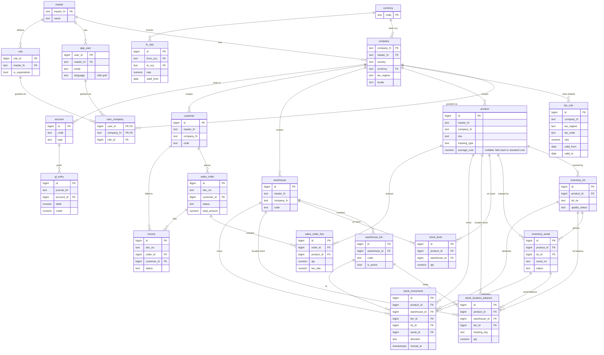

# Data Model

One Drizzle schema, shared by both modes. Same tables, same types, same migrations in
PGlite (demo) and PostgreSQL (production).

## 1. Modules and core tables

```
tenancy/     master, company, app_user, role, user_company
localization/ tax_rule (effective-dated), currency, fx_rate
inventory/   product, warehouse, stock_level, stock_movement,
             warehouse_bin, inventory_lot, inventory_serial,
             stock_location_balance, inventory_adjustment(+line),
             stock_transfer(+line)
sales/       customer, sales_order, sales_order_line, delivery, invoice, payment
purchasing/  supplier, purchase_order, purchase_order_line, goods_receipt,
             purchase_order_approval, landed_cost(+line)
finance/     account (chart of accounts), gl_entry
system/      audit_log
integration/ import_job, import_job_row, import_row_error, outbox_event
```

`master` / `company` define the tenant hierarchy ([MULTI_TENANCY.md](MULTI_TENANCY.md));
`company` also holds country/currency/tax_regime ([LOCALIZATION.md](LOCALIZATION.md)).

Each module owns its tables. Cross-module references are by id (e.g. `sales_order_line.product_id`).

`stock_movement` is the inventory fact trail. `stock_level` is the rebuildable
product/warehouse projection, while `stock_location_balance` is the rebuildable
product/warehouse/bin/tracking projection. Production commands update both
projections only while appending the corresponding movement in the same transaction;
ordinary API resources cannot directly update either balance.

`import_job` is the bounded user-import header and summary. `import_job_row` stores only
normalized fields supported by the target command; `import_row_error` preserves
row/field/error facts. Raw arbitrary files and tenant identifiers are not stored. The
current Canonical target is customer CSV (`code,name,industry`, maximum 250 rows); a
validated job applies all ready rows atomically with an explicit update-or-skip policy.

## 2. Conventions

| Convention | Rule |
| --- | --- |
| Primary key | `bigint GENERATED ALWAYS AS IDENTITY` (room to grow past int4 at 800 GB) |
| Money | `numeric(18,2)` — never `float` |
| Timestamps | `timestamptz`, UTC; `created_at`, `updated_at` on every table |
| Tenant columns | `master_fn` + `company_fn` (NOT NULL) on every business table |
| Soft delete | `deleted_at timestamptz NULL` where history matters; hard delete only via partition detach |
| Document number | human-facing `doc_no` (e.g. `SO-2026-000123`), separate from `id` |

## 3. Multi-tenant scoping

Three-level tenancy: **`master_fn` → `company_fn` → `user_id`** (full model in
[MULTI_TENANCY.md](MULTI_TENANCY.md)). Every business table has `master_fn` + `company_fn`.
**Every query filters by both**, and they are the **leading columns** of composite indexes:

```sql
CREATE INDEX idx_so_tenant_status_created
  ON sales_order (master_fn, company_fn, status, created_at DESC);
```

The data-access layer injects `master_fn` + `company_fn` from the authenticated session —
never from client input. A missing tenant filter on a large table is a correctness *and* a
performance bug (full-tenant scan). See [SCALABILITY.md](SCALABILITY.md#2-keyset-pagination-the-offset-replacement).

## 4. Cross-module flow (the ERP core)

The canonical transaction, enforced server-side in production:

```
Confirm Sales Order
  ├─ insert sales_order (status = confirmed)
  ├─ for each line: decrement stock_level, insert stock_movement (out)
  ├─ create invoice (status = unpaid)
  └─ post gl_entry (debit AR, credit revenue)         ← all in ONE transaction
```

If any step fails, the whole transaction rolls back. This is the single source of truth
in action — one user action, consistent state across four modules.

**Implemented & verified — the full chain.** `confirmSalesOrder`
([`src/modules/sales/confirmOrder.ts`](../src/modules/sales/confirmOrder.ts)) runs the
entire flow in one `db.transaction`: insert `sales_order` + lines → `issueStockWithin`
per line (the composable stock-issue unit from
[`src/modules/inventory/stock.ts`](../src/modules/inventory/stock.ts), `SELECT … FOR
UPDATE` row lock) → `invoice` → balanced double-entry `gl_entry` (Dr AR, Cr Revenue, Cr
output tax). `npm run demo` proves on **both** engines:

- **Happy path:** 2-line order → net 110 + 9% GST 9.90 = 119.90; 2 stock movements; ledger
  balanced (Dr 119.90 = Cr 119.90); stock reduced.
- **Whole-chain rollback:** an order whose line 2 exceeds stock throws and rolls back
  *everything* — **including line 1's valid stock deduction** (widget stays 95, not 90);
  no order, invoice, movement, or ledger row persists.
- **Cross-engine equality:** repo + stock-tx + sales results are byte-identical on PGlite
  and PostgreSQL.
- **Concurrency (PostgreSQL only):** two concurrent issues of 8 from stock 10 → exactly one
  succeeds, final stock 2 (never −6). PGlite is single-connection (single-user), so true
  concurrency is a PostgreSQL-only guarantee — correct, since the demo/browser is
  single-user.

## 5. Big tables (partitioned — see SCALABILITY.md)

These are expected to dominate the 800 GB footprint and are **range-partitioned by date**:

- `gl_entry` (ledger)
- `stock_movement`
- `audit_log`
- `sales_order_line` / `purchase_order_line` (if line volume is high)

## 6. Audit log

`audit_log` records who changed what, when. Append-only, partitioned by month, never
updated. Columns: `master_fn, company_fn, actor_user_id, entity, entity_id, action, diff jsonb, at`.

## 7. Tenancy, roles & permissions

```
master         (master_fn, name)                          -- top tenant
company        (company_fn, master_fn, country, currency, tax_regime, ...)
app_user       (user_id, master_fn, email, language, ...)  -- user belongs to ONE master; language = UI i18n pref
role           (role_id, master_fn, name, is_superadmin)
user_company   (user_id, company_fn, role_id)             -- M:N: user ↔ many companies
```

A user belongs to one `master_fn` but can be granted **many companies** (the
`user_company` junction), each with a role — e.g. an accountant covering both the SG and
MY entities. `is_superadmin` (master-level) sees all companies under its master. Full
rules and the app-level-vs-RLS isolation model are in
[MULTI_TENANCY.md](MULTI_TENANCY.md). The demo ships a sample user with access to both the
SG and MY demo companies; production wires real auth.

## 8. Employee self-service, leave and expenses

> Delivery boundary: TASK-106 identity fields/`user_company_role`, TASK-107's employee
> binding/account lifecycle and TASK-108's effective-dated
> `employee_hierarchy_scope` are present in the current Drizzle schema. TASK-109 adds
> five UI shell routes and no table. TASK-110 adds role-grant provenance without a
> new table. TASK-111 adds the calendar/type/policy entities listed below. The
> immutable balance ledger is implemented by TASK-112. TASK-113 adds the governed
> leave request/revision/event/evidence/cancellation entities. TASK-114 adds the
> versioned approval policy/step, workflow instance/step, immutable decision/event,
> bounded delegation, capacity-rule and capacity-snapshot entities. TASK-115 adds the
> outbound calendar connection/event entities. TASK-116 adds the leave-to-Payroll
> source and one-time run mapping entities. The remaining entities are approved
> targets for TASK-117–135 and are
> **not yet present**. Each task must add migrations,
> tenant indexes, API contracts and cross-engine proofs before its capability becomes
> Canonical.

### 8.1 Identity, employment and delegated authority

```
master                         login_code (implemented, globally unique login code)
app_user                       username + nullable email + account_state +
                               password_change_required (implemented)
employee                     + user_id (company-scoped unique binding, implemented)
user_company_role              user ↔ company ↔ role, many roles +
                               managed_by_system provenance (implemented)
employee_activation_secret     encrypted recoverable one-time secret (implemented)
employee_account_handoff       immutable offboarding transfer summary (implemented)
employee_hierarchy_scope      direct/tree authority + effective dates (implemented)
approval_delegation            effective-dated, bounded delegation (implemented)
```

`master.login_code` is globally unique and `(master_fn, username)` is unique.
Authentication resolves the master from organization code before resolving the
username. An employee identity is
derived from the authenticated session; `/api/my/*` resources never accept a client
supplied `employee_id`. Activation-secret reads are audited, and the recoverable cipher
text is permanently cleared after the employee sets a password. Role permissions are the
union of all active company roles, while tenant, employee and reporting-line data scopes
remain restrictive.

`user_company_role.managed_by_system` distinguishes a role derived from reporting
facts from a manual authorization. TASK-110 currently uses it for Manager: a linked,
active employee with at least one active direct report receives the system grant.
Reconciliation may remove only a system-owned grant; an existing manual Manager grant
remains manual and is never silently revoked.

### 8.2 Versioned approvals and leave

```
approval_policy(+version/+step) configurable multi-stage workflow definition (implemented)
approval_instance(+step)        snapshotted authority and current workflow projection (implemented)
approval_decision/event         immutable actor, authority, outcome and timer trail (implemented)
working_calendar(+version)      workdays and effective dates
calendar_holiday                official draft/company-confirmed holiday
leave_type / leave_policy       effective-dated eligibility, evidence and carry rules
leave_request                   versioned governed header + retained Legacy rows (implemented)
leave_request_revision          immutable policy/calendar/day/reason snapshot (implemented)
leave_request_event             immutable transition and actor trail (implemented)
leave_cancellation_request      separately decided approved-leave cancellation (implemented)
leave_balance_entry             append-only grant/accrual/reserve/use/cancel/adjust ledger (implemented)
leave_evidence                  immutable private evidence metadata; content deferred (implemented)
leave_capacity_rule             department minimum-coverage rule and action (implemented)
approval_capacity_snapshot      immutable submission/decision coverage fact (implemented)
calendar_outbound_connection    optional tenant-scoped one-way provider configuration (implemented)
calendar_outbound_event         revision-keyed approved/change/cancel delivery job (implemented)
payroll_leave_source            immutable revision/balance-linked earning or deduction (implemented)
payroll_run_leave_source        one-time source application and signed run-line trace (implemented)
```

Every leave request retains the policy/calendar versions and calculated-day snapshot used
at submission. `Pending` creates a reservation ledger entry; later decisions append
release or consumption entries rather than mutating balances. Legacy leave rows retain
their original `days` snapshot, are labelled `Legacy Policy`, and are not retroactively
recalculated.

`working_calendar`, `working_calendar_version`, `calendar_holiday`, `leave_type` and
`leave_policy_version` are implemented by migration 0050. Confirmed versions may not
overlap. Official holiday imports start as drafts; company holidays are explicit
confirmed facts. Only confirmed facts affect calculation, so historical versions
remain reproducible while current HR-lite `leave_request.days` stays untouched.

`leave_balance_entry` is implemented by migration 0051 as an append-only,
tenant-scoped ledger. A database trigger rejects `UPDATE` and `DELETE`; a
company-scoped idempotency key prevents duplicate facts. Decimal full/half-day deltas
cover grant, accrual, reserve, use, release, cancellation, adjustment, carry-forward,
expiry and encashment. Projection sums balance and reservation deltas rather than
storing a mutable balance. Paid-leave reservation locks the employee row before
checking availability so concurrent Pending requests cannot overspend entitlement.

Migration 0052 implements the governed lifecycle without rewriting historical HR-lite
facts. `leave_request` is the versioned state projection, while immutable
`leave_request_revision` and `leave_request_event` rows preserve what changed, why and
by whom. `leave_evidence` currently stores only managed-document references and private
file metadata; document bytes remain out of scope until TASK-117/118. A submitted
request is never physically deleted: owner deletion becomes `Voided`, Pending uses
`Withdrawn`, and Approved uses `leave_cancellation_request` before becoming
`Cancelled`. Legacy rows retain revision zero and their original day snapshot.

Migration 0053 implements generic approval governance. Confirmed effective-dated
policy versions match tenant-scoped employee, department, request type, days, amount
and currency conditions by priority and specificity, then create ordered step
snapshots. Direct-manager, named-employee and permission authorities retain both
original and current/escalated authority. Immutable decisions and events identify
direct, delegated, permission or escalated actions; the command boundary rejects
self-approval. Delegations are effective-dated, capped at 90 days, revocable without
deleting history and linked to delegated decisions. Leave-capacity rules snapshot
active staff and approved absence counts at submission and decision, applying
warning, additional-level or blocking behavior.

Migration 0054 implements optional one-way calendar delivery. Connection rows contain
bounded provider configuration but no Demo credentials. Outbound events are unique by
connection, leave request, revision and event type; changed and cancelled deliveries
reuse the original external event identity. The worker re-reads the current ERP
request revision/status before delivery, supersedes stale jobs and retries transient
failures with bounded exponential backoff. Payloads include availability dates and a
neutral summary only—never private reasons or evidence references.

Migration 0055 implements the leave-to-Payroll boundary. `payroll_leave_source`
snapshots employee, request revision or encashment ledger entry, direction, full/half
days, monthly base salary, the 26-day divisor, exact amount and effective date.
`payroll_run_leave_source` uniquely consumes a source once and links it to the
resulting run line. Both tables are append-only. `payroll_run_line` separately
snapshots base gross, leave earnings and unpaid-leave deductions so Payslip history
does not depend on later salary or policy changes.

### 8.3 Managed documents and extraction

```
managed_document               tenant ownership, hash, MIME, size, page count and state
document_version               immutable content-version metadata
document_blob                  default PostgreSQL/PGlite binary payload
document_file_location         optional single-node server-file reference
document_link                  typed owner link (leave, claim, receipt, tax pack)
document_scan_job              quarantine/malware result and retry state
document_extraction(+field)     OCR/Vision model, source, value and confidence
document_retention             retention deadline, paper-custody state and legal hold
document_purge_approval         records-manager request and finance review
document_tombstone             retained hash/provenance after authorized purge
```

Database binary storage is the default provider. Server-file storage is an explicit
single-node deployment option; the database still owns all tenant, integrity, version,
retention and audit metadata. New files remain `Quarantined` until a successful scan.
Scanner unavailability or an indeterminate result fails closed. OCR is local by default;
external Vision is opt-in BYOK with company-level region and retention policy.

### 8.4 Claims, expenses and accounting

```
expense_policy(+version)        effective-dated limits, evidence, tax and posting rules
expense_category                GL/input-tax mapping and deductibility
expense_claim(+revision)        employee-owned header and workflow state
expense_line                    merchant/date/purpose/currency/tax/payment-source facts
expense_allocation              department/cost-centre/project split
receipt_inbox_item              uploaded receipt before or during claim assembly
corporate_card_transaction      imported statement line and reconciliation state
cash_advance                    issue, application and outstanding balance
expense_duplicate_signal        hash/image/business-key match and disposition
expense_posting                 idempotent balanced GL linkage
```

Approved employee-paid expenses post Dr Expense/Input Tax and Cr Employee Payable;
company-paid expenses credit the configured bank/card clearing account. Original and
base-currency amounts, exchange-rate source, verified actual bank charge and Decimal
rounding evidence are persisted. Approval is line-aware, but approvers cannot rewrite
employee-submitted facts.

### 8.5 Reimbursement and tax evidence

```
employee_payout_profile         encrypted, masked and verification-versioned bank details
reimbursement_batch(+line)      maker/checker release and per-line bank result
payment_export_artifact         versioned bank file, checksum and access audit
tax_evidence_pack               immutable company/period/version seal
tax_evidence_artifact           PDF/XLSX/CSV/ZIP/hash-manifest member
record_legal_hold               scoped retention override and release history
```

Batch release enforces separation of duties and excludes self-release. Only successful
bank-result lines post Dr Employee Payable / Cr Bank; failures remain independently
retryable under the same idempotency scope. Tax evidence packs are immutable after seal;
late evidence or corrections create a new version and delta manifest. Default minimum
retention is five years for Singapore and seven years for Malaysia, subject to longer
company policy and legal hold.

## 9. Migrations

Drizzle migrations live in `drizzle/` and run identically in both modes:

- Demo: applied into PGlite on first load.
- Production: `npm run migrate` against PostgreSQL.

Never hand-edit the live schema — change the Drizzle schema, generate a migration, apply
it. This keeps demo and production schemas in lockstep.

## 10. ER diagram — implemented schema

The Drizzle schema lives in [`src/data/schema/`](../src/data/schema/) and is the single
source of truth. The diagram below reflects the **implemented** tables (tenancy,
localization, inventory).

**Referential-integrity rule (consistent across the model):**
- The **tenancy tables** (`master`/`company`/`app_user`/`role`/`user_company`) form a real
  FK hierarchy, plus reference-data FKs to `currency`.
- Every **business table** (`product`, `warehouse`, `stock_*`, `tax_rule`) carries
  `master_fn` + `company_fn` as **scope columns that are NOT FK-bound** to `company` —
  tenancy is enforced at the **app + production-RLS layer**, not by composite FKs (which
  would add write overhead at 800 GB). Intra-tenant entity links (`stock_*` → `product` /
  `warehouse`) and reference-data links (`currency`) remain real FKs.
- `currency` / `fx_rate` are **global** reference/market data (no tenant columns).



### Additional implemented modules

**Purchasing** follows the same tenant, immutable-line-snapshot and movement-ledger
conventions. The outbound return is not a negative receipt and never rewrites the
original invoice:

```
company ||--o{ supplier ||--o{ purchase_order ||--o{ purchase_order_line }o--|| product
purchase_order ||--|| purchase_order_approval
purchase_order create → pending_approval; approve/reject snapshots actor + required note
purchase_order approval writes no stock_movement or gl_entry
goods receipt requires purchase_order.status = open (approved)
purchase_order ||--o{ goods_receipt   (receive stock → stock_movement 'in')
purchase_order ||--o{ supplier_invoice (Dr Inventory/Input Tax, Cr AP)
goods_receipt ||--o{ purchase_return ||--o{ purchase_return_line
purchase_return ||--|| supplier_credit_note ||--o{ supplier_credit_note_line
purchase_return ship-and-credit → stock_movement 'out' + Dr AP / Cr Inventory/Input Tax
supplier_invoice ||--o{ supplier_debit_note
supplier_debit_note post → Dr AP / Cr Purchase Variance/Input Tax (no stock movement)
payment_voucher settles invoice total − posted supplier credits − posted supplier debits
goods_receipt ||--o{ landed_cost ||--o{ landed_cost_line }o--|| product
landed_cost allocate → product.average_cost revaluation + Dr Inventory / Cr Landed Cost Accrual
landed_cost allocation writes no stock_movement because on-hand quantity is unchanged
```

Sales delivery/returns, purchasing sourcing, treasury payments, manufacturing, quality,
assets, projects, service, HR and payroll are also implemented in Drizzle; the route-level
production boundary remains authoritative in [STATUS.md](STATUS.md).
