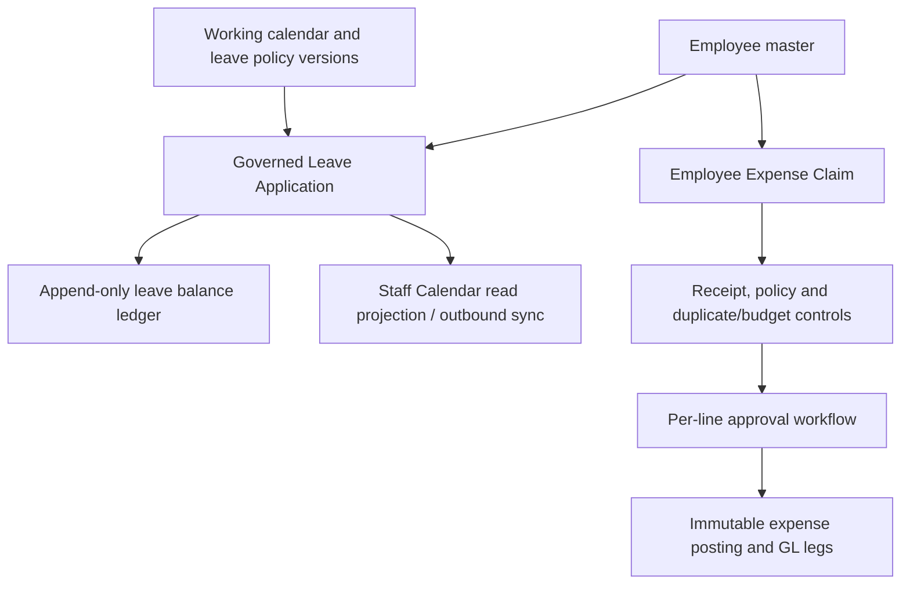

# ERP-System Project Logic

> Main project knowledge base: `KBID: erp-system-project-logic`
> KB UUID: `ef47bf4b-83e1-42b2-a412-66912d04ea24`
> Source review: 2026-08-12
> Scope: Platform bootstrap/provisioning, Module Entitlement, Employee, Leave Application, Staff Calendar and Claim Record behavior

This document is the source-backed project-logic mirror for future agents and
maintainers. The KB is the primary continuity layer, while the current source and
tests remain the implementation proof. When behavior changes, update this document,
the relevant KB item and the tests in the same task.

## 1. System boundary and execution contract

ERP-System has one domain contract in two runtimes:

- Demo uses the static web app with PGlite/IndexedDB.
- Production uses the web/API/PostgreSQL stack.
- `src/data/schema/` is the schema source of truth and `src/modules/` contains the
  shared transactional commands used by both modes.
- Commands named `*Within` run inside a caller-provided transaction. API routes
  derive `masterFn` and the active `companyFn` from the authenticated session.

The domain rule is therefore: validate the actor and tenant scope, lock or version
check the aggregate, write all related facts in one transaction, and emit the
append-only/audit evidence required by that domain. Client input never selects the
tenant boundary.

## 2. Employee logic

### 2.1 Employee master facts

The `employee` row is a tenant/company-scoped employment identity. It stores the
employee number, profile/contact data, department, job title, employment type,
manager, start date, annual leave entitlement, base salary, optional linked
`app_user` and `isActive` state. The database enforces a unique employee number per
`masterFn + companyFn` and a unique non-null employee-to-user link in that scope.

Source: `src/data/schema/hr.ts:1-46`.

### 2.2 Create flow

`createEmployeeWithin` performs the following in one transaction:

1. Validate full name, email, department, job title, employment type, ISO start
   date, non-negative annual leave days and a positive salary.
2. Accept a manual employee number or allocate one with
   `nextEmployeeNoWithin`. Auto allocation locks the company/sequence row, uses the
   scoped `documentSequence`, and formats the default as `EMP-<period>-<number>`.
3. Validate the manager belongs to the active company and reject duplicate employee
   numbers.
4. Insert the employee as active and synchronize manager-role projections when a
   manager is present.
5. Call `initializeEmployeeAnnualLeaveOpeningWithin`; the annual opening is
   idempotent by employee/leave type and only applies when a confirmed eligible
   `ANNUAL` policy exists.

Source: `src/modules/hr/employee.ts:127-213, 354-451` and
`src/modules/hr/leaveBalance.ts:130-213`.

### 2.3 Update flow and invariants

`updateEmployeeWithin` locks the row and accepts `expectedUpdatedAt` as the
optimistic-concurrency token for this legacy table. It does not allow the employee
number to change. Manager changes must stay in the same company, point to an active
employee and cannot create a reporting cycle; manager-role projections are then
reconciled.

Changing `annualLeaveDays` is not a silent overwrite of the displayed balance. The
profile is updated and an immutable `leaveBalanceEntry` of type `adjustment` is
appended with the delta. If the employee has no annual opening yet, the opening is
initialized instead. A linked application user's display name is synchronized when
the employee name changes.

Source: `src/modules/hr/employee.ts:290-352, 454-572`.

### 2.4 Staff onboarding and account lifecycle

Staff onboarding is a separate draft-to-activation path:

- `createStaffOnboardingDraftWithin` and
  `updateStaffOnboardingDraftWithin` maintain the pre-activation draft.
- `activateStaffOnboardingWithin` validates the selected roles, allocates/checks the
  employee number, creates or links the active application user, creates the
  employee, links the user, assigns company roles and emits audit evidence.
- `employeeAccount.ts` models `preactivated`, `active` and `offboarded`. Activation
  and password reset use expiring encrypted activation secrets. Offboarding
  deactivates the employee/account and records responsibility handoff; historical
  document attribution is not rewritten.

Sources: `src/modules/hr/staffOnboarding.ts:1-330`,
`src/modules/hr/employeeAccount.ts:1-630`, and `src/data/schema/hr.ts:141-198`.

### 2.5 Employee access boundary

The API derives the signed-in user's employee identity from the session/company
scope. HR management routes can operate on behalf of an employee; self-service
routes must resolve the actor's linked employee and must not accept a client-selected
owner as authority. Permission checks occur before the command and the command still
validates ownership/scope.

Sources: `src/api/routes/hr.ts`, `src/api/routes/my.ts`,
`src/modules/hr/employeeAccount.ts`.

## 3. Leave Application logic

### 3.1 Governed aggregate versus legacy compatibility

The current Leave Application function is the governed path in
`src/modules/hr/leaveApplication.ts`. A governed request has `legacyPolicy = false`,
an effective policy version, a working-calendar version, a current immutable
revision and lifecycle events. `src/modules/hr/leaveRequest.ts` is a legacy
compatibility path and must not be used as evidence that governed requests can skip
policy or approval governance.

The governed status vocabulary is:

`draft → pending → approved | rejected | withdrawn | voided`, with
`approved → cancelled` only through the cancellation process.

### 3.2 Draft creation and revision snapshot

`createLeaveDraftWithin` derives the subject employee from the actor or HR
management context, then `revisionSnapshot` validates and snapshots:

- active employee and active leave type;
- a confirmed effective-dated leave policy;
- employment-type eligibility;
- one working-calendar version covering both dates;
- chargeable working days for the selected full/half-day unit; and
- whether evidence is required after the policy's configured duration threshold.

The command creates the request, revision 1 and a `created_draft` event. It does not
trust a client-supplied days total.

Sources: `src/modules/hr/leaveApplication.ts:35-230, 232-295` and
`src/data/schema/hr.ts:229-476`.

### 3.3 Amend and submit

Only `draft`, `rejected` or `withdrawn` applications can be amended. The command
requires `expectedVersion` and an amendment reason, appends a new immutable revision,
resets the request to `draft` and records an `amended` event.

`submitLeaveApplicationWithin` requires the expected version and a draft. If the
revision requires evidence, the latest evidence state must be `received` or
`verified`. For paid leave it reserves the requested days before starting approval;
the reservation fails when `available = balance - reserved` is insufficient. The
request then moves to `pending`, an approval instance is started from the current
workflow configuration and a `submitted` event is appended.

Sources: `src/modules/hr/leaveApplication.ts:297-368, 387-473` and
`src/modules/hr/leaveBalance.ts:59-87, 351-443`.

### 3.4 Approval decision

Leave approval is a versioned, snapshotted approval workflow. The current actionable
queue is resolved for the signed-in actor and current approval step; a broad HR
permission does not replace a manager/named-employee/permission authority. The
workflow can also evaluate a department/type/date capacity rule as `none`, `warn`,
`extra_approval` or `block`.

An employee cannot approve their own leave. An intermediate decision keeps the leave
`pending` and advances the request version. On final decision:

- `approved`: settle the paid-leave reservation as `use`, append the decision event,
  create the applicable unpaid-leave payroll source and enqueue calendar sync;
- `rejected`: settle the paid-leave reservation as `release`, store the rejection
  reason and append the decision event.

Sources: `src/modules/hr/leaveApproval.ts:49-173, 221-470`,
`src/modules/hr/leaveApprovalWorkflow.ts:419-546`, and
`src/modules/hr/leaveApplication.ts:542-614`.

### 3.5 Withdraw, void and cancellation

- A pending request may be withdrawn by its owner/manager with a reason. Approval is
  cancelled, paid reservation is released and the request becomes `withdrawn`.
- HR may void non-terminal requests. An approved request must use cancellation; a
  cancelled or already voided request cannot be voided again.
- The owner may void only `draft`, `rejected` or `withdrawn` requests. This is the
  employee-facing delete/remove semantic: it creates a `voided` tombstone and keeps
  revisions/events/evidence; it does not physically delete the record.
- An approved request enters a separate `leaveCancellationRequest`. HR approval of
  that request credits back paid leave as a `cancellation` ledger entry, changes the
  leave to `cancelled`, emits the cancellation event and enqueues calendar/payroll
  effects. A rejected cancellation leaves the source leave `approved`.

Sources: `src/modules/hr/leaveApplication.ts:500-705, 707-858` and
`src/data/schema/hr.ts:579-676`.

### 3.6 Leave balance and evidence rules

`leaveBalanceEntry` is append-only. Supported entry types include `grant`, `accrual`,
`reserve`, `use`, `release`, `cancellation`, `adjustment`, `carry_forward`,
`expiry` and `encashment`. A projection sums `balanceDelta` and `reservedDelta` in
entry order:

`available = balance - reserved`.

Entries use full-day or half-day increments, a stable unique `entryKey`, a confirmed
policy context and a source reference. Replaying the same key with different facts
fails rather than silently changing history. Leave evidence stores managed-document
metadata/reference only; the current boundary does not upload or store file bytes in
the leave aggregate.

Sources: `src/modules/hr/leaveBalance.ts:1-340`,
`src/modules/hr/leaveApplication.ts:860-908`, and
`src/data/schema/hr.ts:413-476, 609-641`.

## 4. Staff Calendar and working calendar logic

### 4.1 Staff appointments are a separate fact source

`staffAppointment` is the canonical source for meetings, training, interviews,
client visits, medical appointments and other staff events. It stores UTC instants,
the display/recurrence timezone, an optional bounded RFC5545-like recurrence rule,
reminder minutes, external-sync opt-in, location, status and `recordVersion`.

Create/update/cancel commands validate `endAt > startAt`, recurrence and reminder
bounds, employee/company scope and optimistic record version. Appointment statuses
are `scheduled`, `completed` and `cancelled`.

Source: `src/data/schema/hr.ts:48-139` and
`src/modules/hr/appointment.ts:1-365`.

### 4.2 Staff Calendar is a projection, not a second owner

Leave requests remain governed by the Leave aggregate; appointments remain governed
by the appointment aggregate. The Staff Calendar read model projects both sources
without copying one into the other. Recurrence occurrences and reminders are bounded
materializations; the appointment master and recurrence rule remain authoritative.

Approved/cancelled Leave and opted-in staff appointments can enqueue outbound
calendar events. `calendarSync.ts` uses tenant-scoped outbox rows, event keys,
worker leases, retryable `pending/failed` states, `delivered` and `superseded` states,
and provider drivers (generic/Google/Microsoft). A failed external delivery must not
change the internal Leave or appointment fact.

Sources: `src/modules/hr/teamCalendar.ts`,
`src/modules/hr/calendarSync.ts:1-235, 319-503`, and
`src/data/schema/hr.ts` calendar/outbound tables.

### 4.3 Working calendar is part of Leave calculation

`workingCalendar` is a stable identity; its immutable versions carry effective dates,
weekday patterns and `draft/confirmed/retired` status. Holidays are attached to a
calendar version and use `draft/pending_approval/confirmed/rejected` governance.
Leave duration resolves one confirmed version for the request's dates; a request
cannot cross two working-calendar versions.

Sources: `src/data/schema/hr.ts:229-332`,
`src/modules/hr/leavePolicy.ts`, `src/modules/hr/holidayCalendar.ts`.

## 5. Employee Expense Claim Record logic

### 5.1 Do not confuse two “Claim” domains

This document's Claim Record section describes the employee reimbursement flow:
`expense_claim` and `src/modules/expenses/claims.ts`.

Project billing uses a different `progress_claim` aggregate. It has only `draft` and
`posted`, validates that the project is not completed and that an effective tax rule
exists, then posts balanced AR/revenue/output-tax legs and increments project
`billedToDate`. See `src/modules/project/progressClaim.ts:47-170`.

### 5.2 Claim aggregate and draft ownership

An Employee Expense Claim has a stable tenant-scoped `claimKey`, human `claimNo`,
title, employee owner, status and version. A claim is composed of 1–100 lines and
each line may have allocations across department, cost center or project.

`createExpenseClaimDraftWithin` is idempotent by `claimKey` when the existing facts
match. It creates the draft, an employee-owned submission-authorization row and a
`created` event. Only the employee owner may replace draft facts.

`replaceExpenseClaimDraftLinesWithin` replaces the complete draft line set under an
expected version. Each line validates:

- merchant, purpose, ISO transaction date, category, currency and payment source;
- `originalNet + originalTax = originalGross` exactly;
- amount allocations reconcile exactly to line gross, or percentage allocations
  reconcile exactly to 100%; and
- a receipt can be linked only once and must belong to the employee in the active
  company.

Submitted facts cannot be rewritten through this draft command.

Sources: `src/data/schema/expenses.ts:199-386` and
`src/modules/expenses/claims.ts:40-461`.

### 5.3 Employee submission and system-assisted submission

`submitExpenseClaimWithin` requires the employee owner, a draft, the expected version
and at least one line. It snapshots the effective expense policy for every line and
rejects a missing receipt when the policy requires evidence. It hashes the submitted
facts, stores an immutable claim revision and starts one approval/control instance
per line before changing the claim to `pending_approval`.

There are two submission kinds:

- `employee`: the employee submits directly;
- `system`: an automatic actor may submit only when the employee explicitly enabled
  the fixed `expense-auto-submit-v1` authorization and every line has an
  employee-authorized, system-submitted receipt.

The system path is employee authority delegated under a recorded statement; it is
not a generic server bypass.

Sources: `src/modules/expenses/claims.ts:463-680` and
`src/data/schema/expenses.ts:318-386`.

### 5.4 Controls and per-line approval

At submission, `startExpenseLineControlsWithin` verifies the claim owner is an
active employee, then stores an immutable line control assessment containing:

- duplicate signals and a risk score/level (`none`, `low`, `medium`, `high`);
- effective duplicate/budget policy version;
- budget consumption, remaining amount and breach/action (`warn`,
  `extra_approval`, `block`); and
- the approval instance and line-approval projection.

Budget `block` rejects submission. A budget `extra_approval` inserts a permission
step. A high-risk duplicate requires a Finance override with a reason before final
approval; the override itself is immutable and permission-checked.

Approval is per expense line, not only at the claim header. A line may be
`pending`, `approved`, `rejected` or `returned`, and the aggregate projection is
recomputed as:

- any `returned` → claim `returned`;
- all lines `approved` → claim `approved`;
- all lines `rejected` → claim `rejected`;
- a mixture of approved/rejected → claim `partially_approved`;
- otherwise → claim remains `pending_approval`.

The approval queue is filtered to the current actor's actionable workflow authority.
Self-service claim reads are owner-scoped and redact duplicate evidence from the
ordinary employee projection.

Sources: `src/modules/expenses/controls.ts:448-860`,
`src/api/routes/expenseApprovals.ts`, and
`src/api/routes/my.ts:795-816, 996-1116`.

### 5.5 Final posting and downstream reimbursement

When a line reaches final `approved`, `decideExpenseLineWithin` calls
`postApprovedExpenseLineWithin` in the same transaction. Posting is idempotent by
line approval and refuses to proceed unless:

- the approval is final and its claim version matches the current claim;
- exactly one covering accounting period exists and is open;
- the effective policy snapshot and configured account types are valid; and
- rounded expense, input tax and gross amounts reconcile exactly.

The posting stores a facts hash and immutable posting row, then creates balanced GL
legs: expense debit, optional input-tax debit and credit to employee payable for
`employee_paid` or company-paid clearing for `company_paid`. A later reimbursement
batch/payment flow consumes posted employee-payable rows; it must preserve maker/checker
separation and masked/encrypted payout handling.

Sources: `src/modules/expenses/controls.ts:668-759`,
`src/modules/expenses/postings.ts:57-293`, and
`src/data/schema/expenses.ts:973-1051, 1140-1210`.

### 5.6 Supported claim states and deletion expectation

The schema vocabulary is `draft`, `submitted`, `pending_approval`,
`partially_approved`, `approved`, `rejected`, `returned`, `voided` and `posted`.
The canonical employee command path above explicitly creates `draft`,
`pending_approval`, and the per-line-driven approval projections. Do not assume that
every enum value has a public transition without checking the current route/action
registry. Submitted facts are revisioned and hashed; a “remove” operation must be a
domain-approved correction/void/tombstone path, never an ad-hoc physical delete.

## 6. Company Receipt logic (Expenses & Tax v1)

TASK-177–179 implement the canonical aggregate, secure capture-to-confirmation
foundation and permission-scoped browser register. TASK-180 query-side search/date
behavior and TASK-181's standalone immutable Receipt Pack are current. TASK-182 completes
the platform-owned `expenses_tax` entitlement and canonical Company Receipt mutation
permission cutover. TASK-183 is complete: `screens-company-receipts.js` now selects
the uploader's evidence from `my.receipts()`, reads the immutable confirmation context
and creates the receipt through the same adapter contract in both modes. The authenticated
API-mode browser harness passes against an isolated same-origin PGlite fixture and a
newly created disposable PostgreSQL 16 database. TASK-192 later deployed through 0098
and reset production to first-run state; the fixtures remain distinct from authenticated
production receipt UAT.

### 6.1 Ownership and evidence

A Company Receipt is a `masterFn + companyFn` business record. It references one
governed managed-document/version and keeps `uploaderUserId` as audit and current
visibility attribution. Creation requires the signed-in uploader's current,
clean, non-void `purpose='receipt'` document version. The direct command does not require
an Employee record, `expense_claim`, reimbursement, approval, bank data, GL posting or
tax decision. The current browser picker uses `/api/my/receipts`, which requires Employee
Self Service and a linked Employee; TASK-197 must remove or explicitly retain that
narrower UI boundary.
Migration 0091 stores the document SHA-256 on the aggregate, backfills existing rows and
uniquely prevents another receipt with the same exact bytes inside the Company.

### 6.2 State and confirmation

The schema vocabulary reserves Draft, Processing, Ready, Needs Attention and Voided, but
current commands produce only Ready and retained Voided. Creation stores Ready even when
transaction date is absent; current Missing Date UI is a navigation placeholder, not a
correction workflow. Upload/scan/OCR state remains in the
document services; confirmed merchant, receipt/invoice number, transaction date,
amount, currency, category, business purpose and notes belong to the Company Receipt.
The confirmation context reads candidate value, normalized value, source, model,
confidence, critical/review state and duplicate warnings without changing extraction
facts. Clean evidence permits manual entry when extraction is failed, unavailable or
not started; quarantined/void/stale evidence remains blocked.
The Company Receipts UI is an orchestration-only client: it can select only uploader-owned
document versions returned by `my.receipts()`, then delegates the clean/current/duplicate
decision to `readCompanyReceiptConfirmationWithin` and creation to
`createCompanyReceiptWithin`. It cannot elevate a My Receipts document into a receipt
while the security scan remains unavailable.
Metadata correction requires `expectedVersion`; evidence/uploader identity is immutable.
Void requires a reason and retains who/when rather than physically deleting the row.

### 6.3 Register, date range and Receipt Pack

Current list/detail reads derive `masterFn`, `companyFn` and actor from Session, then
require explicit `expenses.company_receipts.read_own` or
`expenses.company_receipts.read_company`. The API passes only `own | company` visibility
to tenant-scoped domain predicates and paginates by bounded `afterId`. Confirmation and
create require `expenses.company_receipts.create`, metadata correction requires `.edit`,
and retained void requires `.void`; all remain uploader-scoped in the domain. Migration
0097 backfills those canonical grants for roles that previously held the old
`employee.receipts.write` capability and invalidates affected Company authorization
versions. That compatibility key now remains only for the My Receipts document flow.
Migration 0092 gives Employee/Manager own scope and Finance/Receipt Manager/Company Owner
explicit company scope without role-name authorization at request time.
TASK-180 implements query-side merchant, receipt-number, notes and category search. Date range
is inclusive on company-local `transaction_date`;
missing-date records stay visible but are excluded whenever a date range is active. The
badge only navigates to My Receipts and does not edit Company Receipt metadata.

Migration 0093 and `companyReceiptPack.ts` resolve every permission-visible Ready receipt
with a non-null date in the selected inclusive range, independently of UI pagination
(maximum 5,000), then freeze the filters, chronological receipt/document facts, source
SHA-256 and exact Decimal totals grouped by currency. A stable `packKey` gives
fact-matched sequential replay; the creator alone may read/render the snapshot. Current
routes recheck only any receipt-read grant and the domain rechecks tenant plus creator;
they do not require current `read_company` for a frozen company Pack after a downgrade.
TASK-196 owns that P0. Rendering otherwise rechecks document-version/hash identity,
scan-clean state, content integrity and the 250 MB source limit. `companyReceiptPackPdf.ts` builds an A4
landscape register, then `documents/evidencePdf.ts` copies all PDF pages, embeds JPEG/PNG
or emits an explicit unsupported/corrupt evidence placeholder. Preview, download and
Print use the same no-store artifact and are audited without changing receipt state.
The shared PDF primitive is technical reuse only: Tax Evidence still joins
`expensePosting`, `expenseClaimLine` and `receiptInboxItem` and is not this business query.

Current source: `src/data/schema/expenses.ts`, migration
`drizzle/0090_company_receipts.sql`, `drizzle/0091_sloppy_blackheart.sql`,
`drizzle/0093_company_receipt_pack.sql`, `drizzle/0097_company_receipt_canonical_permissions.sql`,
`src/modules/expenses/companyReceipt.ts`,
`src/modules/expenses/companyReceiptPack.ts`, `src/modules/expenses/companyReceiptPackPdf.ts` and
`src/api/routes/companyReceipts.ts`. Evidence/upload dependencies remain
`src/data/schema/documents.ts`, `src/modules/documents/upload.ts`,
`src/modules/documents/processing.ts`, `src/modules/documents/evidencePdf.ts` and
`src/api/routes/my.ts`. `src/api/moduleEntitlement.ts`,
`src/auth/accessMatrix.ts` and both data adapters apply the same commercial
`expenses_tax` Master-entitlement-plus-Company-allocation gate before route or API use.

## 7. Cross-cutting safety rules

- Scope all reads/writes by `masterFn` and `companyFn` from session/context.
- Use `expectedVersion`, `expectedUpdatedAt` or idempotency keys exactly where the
  command contract requires them; stale writes return conflicts.
- Keep financial and balance effects in the same transaction as the state change.
- Preserve append-only lifecycle evidence (`leaveRequestEvent`, claim events,
  revisions and ledger entries); do not mutate history to “fix” a display.
- Store document references/metadata at the domain boundary; do not put receipt or
  medical-file bytes into Leave/Claim facts unless the dedicated document-storage
  contract explicitly says so.
- If a UI or KB summary disagrees with `src/` and its tests, verify and update the
  summary. Do not implement a new rule from a stale KB hit alone.

## 8. Source and verification index

| Slice | Schema/source | Core tests |
| --- | --- | --- |
| Employee master | `src/data/schema/hr.ts`, `src/modules/hr/employee.ts` | `src/modules/hr/employee.test.ts`, `src/api/employeeUpdate.integration.test.ts` |
| Onboarding/account | `src/modules/hr/staffOnboarding.ts`, `src/modules/hr/employeeAccount.ts` | `src/modules/hr/staffOnboarding.test.ts`, `src/modules/hr/employeeAccount.test.ts`, `src/api/employeeAccount.integration.test.ts` |
| Leave application | `src/modules/hr/leaveApplication.ts`, `leaveApproval.ts`, `leaveApprovalWorkflow.ts` | `src/modules/hr/leaveApplication.test.ts`, `leaveApproval.test.ts`, `leaveApprovalWorkflow.test.ts`, `src/api/leaveApplication.integration.test.ts` |
| Leave balance/policy | `src/modules/hr/leaveBalance.ts`, `leavePolicy.ts` | `src/modules/hr/leaveBalance.test.ts`, `leavePolicy.test.ts` |
| Staff Calendar | `src/modules/hr/appointment.ts`, `calendarSync.ts`, `teamCalendar.ts` | `src/modules/hr/appointment.test.ts`, `teamCalendar.test.ts`, `src/api/hrCalendar.integration.test.ts` |
| Expense Claim | `src/modules/expenses/claims.ts`, `controls.ts`, `postings.ts` | `src/modules/expenses/claims.test.ts`, `controls.test.ts`, `postings.test.ts` |
| Company Receipt foundation | `src/data/schema/expenses.ts`, `src/modules/expenses/companyReceipt.ts`, `src/api/routes/companyReceipts.ts` | `src/modules/expenses/companyReceipt.test.ts`, `src/api/companyReceipts.integration.test.ts`, `src/api/postgresSecurity.integration.test.ts` |
| Company Receipt Pack | `src/modules/expenses/companyReceiptPack.ts`, `companyReceiptPackPdf.ts`, `src/modules/documents/evidencePdf.ts` | `src/modules/expenses/companyReceiptPack.test.ts`, `src/api/companyReceipts.integration.test.ts`, `src/modules/expenses/taxEvidence.test.ts`, `tests/e2e/company-receipts.spec.mjs` |
| Claim downstream | `src/modules/expenses/reimbursementBatches.ts`, `reimbursementPayments.ts` | matching module tests |
| Project Progress Claim | `src/modules/project/progressClaim.ts` | project module/API tests where registered |

For a code change, also check `docs/STATUS.md`, `docs/SPEC.md`, the API route and
the Demo/API adapter path affected by the change. For this documentation-only sync,
the minimum local checks are `git diff --check` and Markdown/link inspection.

## 9. Module Access Control — current logic and approved replacement

Current source truth (verified 2026-08-12):

- `src/auth/moduleAccess.ts` is now a read-only tenant projection and requires both
  `master_module.enabled` and `company_module.enabled`; missing/unknown state denies;
- `/api/admin/modules` and its mutation action now return 403
  `platform_authority_required` after tenant authentication and disclose no entitlement
  state. `admin.modules.manage` is deprecated/non-assignable and migration 0095 removes
  stored tenant grants and revokes active overrides;
- the tenant Module Activation route/UI and onboarding modules stage are removed. New
  Masters receive the product default and new Companies inherit the Master default
  allocation through trusted bootstrap code;
- `src/auth/moduleCatalog.ts`, `src/auth/platformEntitlement.ts`,
  `src/auth/platformSupport.ts`, `src/auth/platformSimulation.ts` and
  `src/api/routes/platform.ts` provide the commercial catalog, separate password/cookie
  platform realm, Master/Company entitlement API and exact-user simulation.

TASK-185 foundation and TASK-186 tenant-authority cutover:

1. Migration 0094 rebuilds `master_module` from the union of current enabled Company
   state, preserves `company_module`, and adds optimistic versions/default allocation.
2. The platform domain computes `effectiveEnabled = Master entitlement AND Company
   allocation`; missing/unknown facts deny and hard dependency violations conflict.
3. Only `platform_superadmin` with `platform.modules.read/manage` can use the platform
   APIs. TASK-186 removed tenant mutation authority and switched generic and mapped
   bespoke tenant paths to the dual-layer check.
4. TASK-186 applies the stored platform-owned Master default to newly created Companies;
   tenant onboarding can no longer select modules.
5. TASK-187/migration 0096 authenticates Platform Superadmin with independent password
   credentials, one-hour non-remembered platform cookies and `platform.simulation.manage`.
   Explicit simulation of an active assigned tenant user is default-15-minute, cannot
   outlive the platform session, runs with exactly the target authority, remains visibly
   marked/revocable and records both identities; it never provides a MAC bypass.

For the API-mode hosted Demo only, the web build may set `VITE_PLATFORM_DEMO_AUTOFILL=true`.
The Platform bootstrap, Master and first Company forms then show editable public sample
values, a dismissible warning and `Next`/`Finish` progression; the source/customer default
is `false`. HEAD also adds one-click Demo Platform login, password Show/Hide, tenant-only
Remember and responsive containment. An existing Company resumes in tenant control without
rendering another creation form, action bar or next Demo password. The operator must select
`+ Create Company` to open the inline panel; only then does Demo mode derive `Acme Malaysia`
/ `myowner` for Company 2 or deterministic `Acme Company N` / `ownerN` identities later.
Cancel performs no mutation, returns focus to the opener and retains the Master-plus-ordinal
in-memory draft. Success selects the API-returned `companyFn`, clears the submitted draft and
closes the panel without opening the next one. The flag changes no API contract, permission,
transaction or audit rule, and disabled builds keep explicitly opened forms blank. Master
and Company mutations retain separate stable form-fingerprint Idempotency-Key values.

| Boundary | Current sources/tests | Target owner |
| --- | --- | --- |
| Platform entitlement foundation | `moduleCatalog.ts`, `platformEntitlement.ts`, migration 0094 and focused tests | TASK-185 done |
| Tenant effective module state | `moduleAccess.ts`, `moduleEntitlement.ts`, focused tests | TASK-186 done |
| Retired tenant mutation API/UI | `routes/admin.ts`, migration 0095, web app | TASK-186 done |
| Platform login and simulation | `platformSupport.ts`, `platformSimulation.ts`, `routes/platform.ts`, `platformSuperadmin.integration.test.ts` | TASK-187 done |
| Migration preservation | migration 0094 and `platformEntitlementMigration.test.ts` | TASK-185 done |
| Full adversarial/release proof | Focused platform/tenant evidence plus recorded cross-engine, browser and release gates; no production deployment implied | TASK-188 done |

## 10. Platform Bootstrap & Tenant Provisioning — current source contract

`GET /api/setup/status` is the staged setup source: it reports platform-admin, Master,
Company and tenant-admin facts independently. Public bootstrap is open only when
`isFreshDatabase` is true. `completePlatformBootstrap` locks
`system_state.production_setup`, counts platform and tenant foundation rows, creates one
`platform_principal`/Superadmin role with a hash-only password and records a
`__platform__` audit event with request correlation and hashed source IP. It never writes
`app_user` or `erp_session`; concurrent or later attempts fail `already_initialized`.

`createMasterWithin` requires `platform.tenants.manage`, generates `masterFn`, validates
the commercial catalog/dependencies and stores Master entitlement/default Company
allocation. `createCompanyWithin` is one transaction for SG/MY localization/tax,
control-plane, accounts, live onboarding, inherited `company_module` rows, immutable
Master Admin and Company Owner roles/users/memberships. `master_admin_account` lets later
Companies add a system-managed membership for the same Master Admin identity. The
Platform API wraps both mutations in `platform_idempotency` keyed by principal/operation/
request hash and requires Platform CSRF, request ID and append-only audit.

The Master Admin role is not a master-scope bypass. Its exact permissions are dashboard
read, company switch, users invite/read/manage, roles read/write, audit read and settings
read/manage. Company Owner remains tenant-scoped and cannot mutate MAC. Business access
still requires `authenticated target user AND Master entitlement AND Company allocation
AND permission AND scope AND workflow authority`; Platform Superadmin privileges never
enter a simulation target. Migration 0098 adds the provisioning tables and backfills
`platform.tenants.read/manage` for existing Superadmins.

Current production-RLS caveat: the Platform route's `runPlatformMutation` opens a
transaction but does not set `app.master_fn`/`app.company_fn` before Company creation
writes `tax_rule`, control-plane, allocation, onboarding and account rows protected by
FORCE RLS. The existing PostgreSQL security test exercises the retired
`completeProductionSetup` path, while bundled Compose may run as the PostgreSQL bootstrap
superuser and bypass RLS. TASK-195 must close and prove this boundary before provisioning
is called production-ready. The inserted onboarding `completedSteps` also still contains
the retired `modules` stage and must be normalized.

TASK-189–192 are complete. At the 2026-08-12 checkpoint, migration 0098/RLS and the application release
were verified against existing data, restore-tested backups were retained, and only
`erp-system_pgdata` plus `erp-system_document_storage` were removed before recreating the
stack without seed. That database had 249 public tables, 221 forced-RLS tables, zero
non-migration rows and empty document storage; health/root were 200 and setup status was
`requiresPlatformBootstrap:true`. The public browser showed Create Platform Superadmin and
no real account was created. TASK-193 remains blocked on missing SMTP; source CI run
`31570902479` passed all four Vitest shards, while docs-only push run `31573438483` was
blocked before any job started by GitHub Actions account billing.

The user authorized a repeat first-run reset at 2026-08-12T094234Z UTC. A new custom dump
and document archive were validated before deletion, including an isolated PostgreSQL 16
restore rehearsal. The recreated stack again applied migration 0098 and production RLS
without seed; the checkpoint status was `requiresPlatformBootstrap:true` with
`hasPlatformAdmin:false`, `hasMaster:false`, `hasCompany:false` and
`hasTenantAdmin:false`. Health/root are 200, the retired anonymous setup endpoint is 410,
and the browser showed Create Platform Superadmin. No account was created by the reset.
Later HEAD source is not immutable deployment proof. TASK-194 public health/setup probes
returned 502 and HEAD CI was blocked before job start by billing; TASK-199/203 own those
current-state gaps.

## 11. Production Trust & ERP Excellence logic boundary

EPIC-066 does not add a new business aggregate. It applies cross-cutting invariants found
by the source audit in [ERP_EXCELLENCE_REVIEW.md](ERP_EXCELLENCE_REVIEW.md):

1. current authority must dominate frozen artifact visibility;
2. every production tenant write, including Platform provisioning, runs under a
   least-privilege runtime role with exact server-owned RLS context;
3. Support Grant and exact-user Simulation form one explicit privileged-access policy,
   with MFA/step-up and no undocumented tenant-data exception;
4. UI availability derives from effective capabilities and every advertised correction
   reaches a real versioned command;
5. source, collected tests, passed tests, deployed revision and current health remain
   separate evidence states;
6. SLO/RPO/RTO, worker backlog and scale/retention/i18n behavior are part of ERP domain
   quality rather than release-note polish;
7. tax-rule ranges use one `[valid_from, valid_to)` contract and GL tax posting must
   dispatch by governed SG GST/MY SST classification, while AI/Vision source capability
   remains separate from provider-failure and production-configuration proof.
