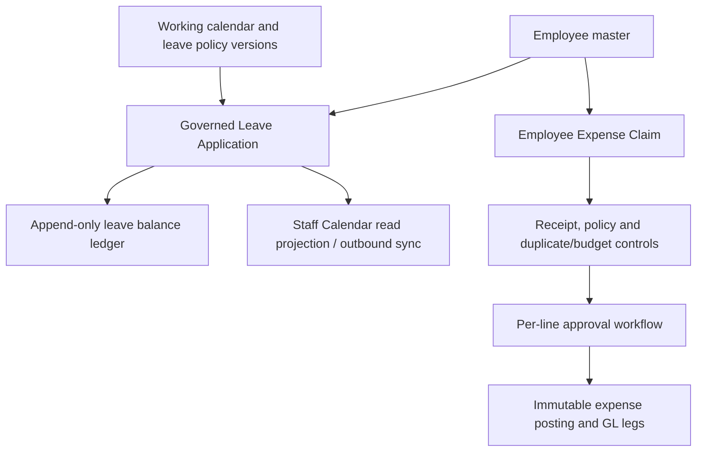

# ERP-System Project Logic

Product feedback initial production contract — 2026-09-24: `src/data/schema/productFeedback.ts`
defines Company-scoped `product_case` and `product_case_event` records, separate
from the customer warranty `service_ticket`. An authenticated ERP Agent with
active owner-backed `product_case.submit` permission/grant can submit a bounded
feedback or ticket through `POST /api/agent/cases` with an idempotency key;
the same Agent requires `product_case.read_own` to read its own result. Agent
identity and tenant are derived from its ERP-issued Bearer credential, never
from request body fields or an AI-provider key. `src/modules/product/productCase.ts`
owns creation, own-case visibility, Company-scoped human reads, optimistic
status transitions and atomic case-event/central-audit writes. The human
`product.cases.read` and `product.cases.manage` permissions back the API-mode
Admin > Product Cases queue. Demo mode does not emulate these governed writes.
The current states are `submitted`, `triaged`, `in_progress`, `resolved` and
`closed`. Evidence append, task/release linkage, independent post-release
verification and full product acceptance remain open. Production revision
`b8c0208aae430d26d672ce10f2a62ad88f068f71` has the schema, API and UI,
but zero Agent principals/grants and no live case submission; see
[the feedback plan](PRODUCT_FEEDBACK_PLAN.md) and
`src/api/productCases.integration.test.ts` for the tested boundary.
The internal intake pilot adds an 8 KiB JSON body boundary and process-local
10-per-Agent/50-per-Company per-minute limits; these are not distributed quotas.
The PostgreSQL-only RLS overlay prevents direct mutation of product-case event
history. `src/api/productCases.postgres.integration.test.ts` proves the
non-bypass role can submit but cannot read another Company or edit/delete
existing events.

Background style preference — 2026-09-15: the first-run wizard exposes four fixed styles
(Aurora, Mist, Paper and Night sky) alongside language selection. The choice is applied
through the existing browser-local `aria-background` preference and shared by sign-in,
setup, workspace and Settings; no business or tenant data is written. The seven-step
wizard contract remains unchanged. A company default with employee-level overrides is not
yet an implementation contract because the tenancy schema has no background preference
fields or authenticated read/write routes; adding that behavior requires a separate
Demo/PGlite and PostgreSQL-parity schema/API decision.

Colour palette preference — 2026-09-15: the same Language step also exposes six fixed,
contrast-aware palettes (Aria Blue, Royal Purple, Ruby Red, Sunflower Amber, Forest Green
and Ocean Teal). The selected palette is applied through browser-local `aria-palette`
tokens across sign-in, setup, workspace and Settings, with legacy accent swatches retained
as a custom device-local fallback. Palette choices are presentation preferences only and do
not alter tenant data, permissions, approvals or business calculations. Company defaults and
per-employee overrides remain outside the contract until scoped preference fields, routes,
permissions and Demo/PGlite/PostgreSQL parity are defined.

TASK-237 G10.1 acceptance mapping — 2026-09-13: the frozen Receipt Pilot
catalog and independent oracle satisfy the exact evaluation-set criterion. The
30 P01–P16 cases and 9 negative cases cover happy paths, invalid input, prompt
injection, unauthorized data, stale approval, revocation and retry/replay, with
Company scope and persisted Pack postconditions checked independently. This
accepts G10.1 only in that evidence record; G10.3 is now separately accepted for
the source/deterministic fixture boundary. G10.4 is separately accepted for the
source/CI release-control boundary; real-provider and production evidence remain
open. See the [dated acceptance evidence](ai-native/evidence/TASK-237-2026-09-13-g10-1-acceptance.md).

TASK-237 G10.3 fixture observability — 2026-09-13: canonical C-SG and C-MY
fixture runners emitted complete redacted reports with versioned fixture/model/
prompt/tool metadata, hashed correlations, simulated approval state, verified
Receipt/Pack/artifact postconditions, latency, provider calls, retries and
`fullRetryCostMicros`. Focused tests reject unredacted identifiers, forbidden
sensitive fields and under-reported retry cost. This accepts G10.3 for the
source/deterministic fixture boundary; S4 owner-approved budgets, live-provider
measurements, production rollout/retention/disable and human acceptance remain
open. See the [dated evidence](ai-native/evidence/TASK-237-2026-09-13-g10-3-fixture-observability.md).

TASK-237 G10.4 CI release-control acceptance — 2026-09-13: the current candidate
`b695a833` passed remote CI run `34746493412`, which executes the same
deterministic evaluator, broken-fixture fail-closed probe and rollout/
emergency-disable probe. The local probe rejected a broken candidate, advanced a
valid prompt version and blocked rollout after disable. This accepts G10.4 for
the source/CI boundary; production rollout, retention and emergency-disable
observation remain open. See the [dated evidence](ai-native/evidence/TASK-237-2026-09-13-g10-4-ci-acceptance.md).

TASK-237 S4 provider scope and budget handoff — 2026-09-13: measured local
fixture and hosted Demo query-only facts are consolidated with the required
provider/model/data-policy and p95/cost/call/concurrency owner fields. The
existing observability validator remains fail-closed while the budget state is
pending; this handoff does not invent thresholds or establish provider,
production or human-acceptance evidence. See the [dated handoff](ai-native/evidence/TASK-237-2026-09-13-budget-scope-handoff.md).

TASK-237 Demo model evaluation rerun — 2026-09-13: a registered-Origin session
preflight returned HTTP `201`, then three fresh Chromium contexts completed all
30 frozen query slots but passed only 2/30, 5/30 and 6/30 proposals because the
gateway returned bounded `demo_gateway_unavailable` failures. The deterministic
negative gate remained 9/9 with zero safety or false-success failures. This is
Demo query-only evidence and does not prove live model-scored receipt actions,
provider budgets, production or human acceptance. See the [dated rerun evidence](ai-native/evidence/TASK-237-2026-09-13-demo-model-evaluation-rerun.md).

TASK-237 local rollout/disable probe — 2026-09-13: the deterministic evaluator
accepts version metadata and the CI validate path now exercises broken-candidate
rejection, valid candidate advancement and emergency disable. This local probe
does not establish production rollout/retention/disable evidence. Candidate
revision `a4216346` subsequently passed remote CI run `34740634873`, including
the evaluator, broken-fixture and rollout/disable steps plus all configured
source/generated, database, Demo, i18n, browser, layout and public-subpath
checks. A later Screen-audit timing race on run `34743412098` was repaired by
waiting for the declared shared-list marker; repaired revision `b695a83` passed
run `34746493412`. See the [dated probe evidence](ai-native/evidence/TASK-237-2026-09-13-rollout-disable-probe.md),
[remote CI evidence](ai-native/evidence/TASK-237-2026-09-13-remote-ci.md) and
[failure/repair evidence](ai-native/evidence/TASK-237-2026-09-13-remote-ci-screen-audit-failure.md).

TASK-237 Demo model evaluation threshold — 2026-09-13: a shared 7-second paced
runner with bounded transient-error retries completed three independent 30-case
query-only runs at 30/30, 30/30 and 29/30 (100%, 100%, 96.7%), with provider calls
30, 30 and 31, retries 0/0/1, p95 latency 7,639–8,626 ms, 9/9 deterministic
negative cases and zero safety or false-success failures. This satisfies the
numeric Demo threshold for S3/G10.2;
live receipt actions, provider budgets, remote CI and production acceptance remain
separate. See the [dated threshold evidence](ai-native/evidence/TASK-237-2026-09-13-demo-model-evaluation-success.md).

TASK-202 authenticated API concurrent conflicting Pack facts — 2026-09-13: the
Company Receipts API regression now launches two same-scope POST requests with
one `packKey` but different date selections and proves exactly one `201` create
plus one mapped `company_receipt_pack_key_conflict`/409 result and one scoped
Pack row. Tenant scope remains session-derived and the shared immutable
uniqueness/replay command is unchanged. This is local PGlite/API evidence; a
PostgreSQL target, production release and Finance/QA acceptance remain separate.
See the [dated evidence](ai-native/evidence/TASK-202-2026-09-13-api-concurrent-conflict.md).

TASK-202 disposable PostgreSQL parity and authenticated Company Receipts E2E —
2026-09-13: a fresh local PostgreSQL 16 database passed the full cross-engine
Demo proof with identical PGlite/PostgreSQL results and exactly one winner in
the true concurrency race. The authenticated Company Receipts API/browser
journey also passed confirmation, refresh/search/range, Preview/PDF/Print and
responsive checks through the PostgreSQL adapter. Temporary databases were
dropped after the run. This is disposable local evidence only; production
readable SG/MY sources and Finance/QA visual Print acceptance remain separate.
See the [dated evidence](ai-native/evidence/TASK-202-2026-09-13-postgres-parity.md).

TASK-202 concurrent conflicting Pack facts — 2026-09-13: the local Company
Receipt Pack domain regression now launches two same-scope requests with one
`packKey` but different date selections and proves exactly one immutable create
plus one `company_receipt_pack_key_conflict`/409 result and one scoped Pack row.
The production composite uniqueness and fact-matched replay logic is unchanged.
This is local PGlite/source evidence; a PostgreSQL target, production release
and Finance/QA acceptance remain separate. See the [dated evidence](ai-native/evidence/TASK-202-2026-09-13-concurrent-conflict.md).

TASK-202 concurrent Pack-key convergence regression — 2026-09-13: the local
Company Receipt Pack domain test now launches two same-scope identical
`packKey` requests through the shared transaction helper and proves one created
snapshot plus one fact-matched replay, equal source hash/rows/totals and one
scoped Pack row. The production composite uniqueness and conflict-replay logic
is unchanged. This is local PGlite/source evidence; a PostgreSQL target,
production release and Finance/QA acceptance remain separate. See the [dated
evidence](ai-native/evidence/TASK-202-2026-09-13-concurrent-pack-key.md).

TASK-234 merged Pages publication and hosted no-override verification —
2026-09-13: Pages workflow `34751369035` published revision
`a67595d5b67d24d6dfcc02b0c04f89c0e6c391ae` with Demo mode and 136 files. Fresh
hosted Chromium rendered the exact Company Receipts title `Expenses & Tax
unavailable` without visible `&amp;`, then uploaded a 5 KB PNG through My
Receipts; the record moved from `Offline draft 1` to `Stored securely 1` and
remained after reload as `Quarantined · scanner unavailable`. No source,
response, module/permission or business-table override was used. This closes
the merged hosted Demo publication/title/upload visibility; scanner,
real-provider OCR, production and human Finance/QA acceptance remain separate.
See the [merged hosted evidence](ai-native/evidence/TASK-234-2026-09-13-merged-hosted-no-override.md)
and the [prior hosted evidence](ai-native/evidence/TASK-234-2026-09-13-hosted-no-override.md).

TASK-234 remote CI terminal acceptance — 2026-09-13: GitHub Actions run
`34730030719` completed successfully for revision
`d936a348e50d0b9edf7718ac1eadba1f5a17a4b6`. Source/generated, Demo, i18n,
desktop/mobile browser, Screen, transaction-list, operational-workspace,
production public-subpath and cleanup checks all passed. This closes the remote
CI regression-safety gate only; scanner availability, real-provider OCR,
production Pack release and human Pack/Print acceptance remain separate. See
the [dated terminal CI evidence](ai-native/evidence/TASK-234-2026-09-13-ci-terminal.md).

The merged revision `a67595d5b67d24d6dfcc02b0c04f89c0e6c391ae` has a separate
terminal CI run `34751368911`. Its source/generated, database, Demo, i18n and
desktop/mobile Browser smoke gates passed, but the Screen audit failed with
`LAYOUT [desktop:user-mgmt] transaction-list-v1 root missing`; later layout,
public-subpath and cleanup steps were skipped. The local audit recovery budget
is now 30 seconds and the focused and full local screen audits pass; a fresh
candidate CI terminal run is required for the repaired revision. See [merged CI
failure evidence](ai-native/evidence/TASK-234-2026-09-13-merged-ci-failure.md)
and the earlier [merged CI progress evidence](ai-native/evidence/TASK-234-2026-09-13-merged-ci-progress.md).

Fresh candidate CI run `34755628672` for `a6b2bb7d836d5bd2dfc3914637b80400e97f8c6d`
repeated the same `desktop:user-mgmt` shared-list root failure after all
pre-browser, i18n and Browser smoke gates passed. The follow-up audit repair
re-navigates a list route once when its root remains absent after the bounded
30-second wait; local 50/50 and full 130-route desktop/mobile audits plus lint
pass. Hosted CI run `34759696683` then completed successfully for repair
revision `20e8af00da0a9a4fdeee2a73b88abe2fde9bc791`, including all four Vitest
shards, Screen, transaction-list, operational-workspace, production
public-subpath and cleanup gates. This closes remote audit regression safety
for the repair; provider scope, real-provider OCR, production and human
acceptance remain open. See the [fresh CI evidence](ai-native/evidence/TASK-234-2026-09-13-fresh-ci-failure.md)
and [hosted retry terminal evidence](ai-native/evidence/TASK-234-2026-09-13-ci-retry-terminal.md).

TASK-234 docs-only hosted CI terminal acceptance — 2026-09-14: run
`34764953884` completed successfully for revision
`71d14f2bbd7bcd4b8c0aaabbf1964d99d2a8dfea`. All four Vitest shards and the
combined source/generated, PostgreSQL, Demo, i18n, browser, Screen,
transaction-list, operational-workspace, public-subpath and cleanup gates
passed. This is regression evidence for the documentation descendant only;
real provider, production and human acceptance remain separate. See the
[dated evidence](ai-native/evidence/TASK-234-2026-09-14-ci-docs-terminal.md).

Latest browser-tested Pages revision `07d2b08d34b6fe9aa52bf06fb50386befc7709c8` was rechecked
through the normal hosted Demo path: the restricted Company Receipts title was
`Expenses & Tax unavailable` without literal `&amp;`, and a 5 KB PNG uploaded
through My Receipts reached `Quarantined · scanner unavailable` and remained
after reload. Browser console errors/warnings were zero and no source,
response, permission, module or business-table override was used. This current
publication evidence remains separate from real-provider OCR, production and
human acceptance. See the [current hosted no-override evidence](ai-native/evidence/TASK-234-2026-09-13-current-hosted-no-override.md).

Historical TASK-234 public Pages bundle recheck — 2026-09-13: the read-only
Pages `release.json` identified revision
`976a863eabcb8f1499308a64dac646146ed44b6e` (`workflowRunId` `34689661151`),
whose `app.js` lacked the current module-title repair and whose
`screens-hr.js` read `d.capabilities.receipts` without unwrapping
`contextResponse.data`. The public CSS retained the wizard scroll and sticky
header/footer rules. This pre-publication record is superseded by the authorized
hosted verification above; it remains separate from real-provider and
production evidence. See the [dated public bundle
recheck](ai-native/evidence/TASK-234-2026-09-13-public-bundle-recheck.md).

TASK-234 My Receipts capability-envelope handoff — 2026-09-13: the committed
`5e983e9bd88a1d2bb4f0d25695d1a61f2d6a167b` screen fix unwraps the server
`{data, meta}` work-context response before reading `capabilities.receipts.writable`.
The focused Company Receipts/Demo regression confirms upload reachability and
localized access text without changing tenant, approval or Demo/PostgreSQL
contracts. The local publication gap is superseded by the hosted no-override
verification above; real provider and human acceptance remain open. See [dated
evidence](ai-native/evidence/TASK-234-2026-09-13-upload-title-candidate.md).

TASK-234 governed HEIC original inspection — 2026-09-13: the Receipt Assistant
now accepts HEIC/HEIF content after the existing tenant, version and SHA-256
checks. It avoids an unsupported browser image preview and offers a download
with the governed original name; PDF/PNG/JPEG/WebP previews remain unchanged.
This is local source/Demo evidence only and does not replace production provider
or business acceptance. See [dated evidence](ai-native/evidence/TASK-234-2026-09-13-heic-original-download.md).

TASK-204 effective-date ambiguity guard — 2026-09-13: the shared
`getEffectiveTaxRate()` repository query now returns `null` for an ambiguous
Company-scoped effective date instead of selecting one overlapping rule by
insertion order. Tests preserve inclusive `validFrom` / exclusive `validTo`
semantics and prove identical tax codes remain isolated by Master, Company and
tax regime. This is local source/Demo/PGlite evidence; qualified tax-owner
approval and production SG/MY configuration remain separate. See [dated
evidence](ai-native/evidence/TASK-204-2026-09-13-ambiguity-guard.md).

TASK-193 employee credential-envelope boundary — 2026-09-13: employee account
create/reset commands now require the exact encrypted-token envelope before
writes, active-secret reads fail closed on malformed persisted values, and
temporary-password reveal normalizes decrypt failures to bounded
`temporary_credential_unavailable` output. The authenticated route continues to
derive tenant scope from the session and appends reveal audit only after
success. Local HR/API/PGlite evidence passes 3 files / 19 tests; production
SMTP, separate Platform Superadmin recovery, PostgreSQL/RLS and owner review
remain open. See [dated TASK-193 evidence](ai-native/evidence/TASK-193-2026-09-13-credential-envelope.md).

TASK-201 bounded worker telemetry handoff — 2026-09-13: primary and calendar
workers now emit aggregate-only query duration, accept an optional bounded
transaction-local statement timeout, and keep document/calendar readiness
predicates aligned with worker claim rules. The read-only telemetry validator
enforces the fixed queue shape, privacy allowlist, explicit budget classification
and stdin pipeline marker. Local source/fixture/Demo gates pass; representative
production scale, SLO, alert, restore and failover evidence remain separate.
See [dated TASK-201 evidence](ai-native/evidence/TASK-201-2026-09-13-telemetry-handoff.md).

TASK-199 availability and rollback source handoff — 2026-09-13: the release verifier now owns response cancellation/reader release on bounded failures; availability events are fixed-message, secret-free and deduplicable; alert delivery remains default-deny with HTTPS host allowlisting; rollback accepts only immutable application image digests and preserves PostgreSQL/document volumes. Local fixture verification passes 4 files / 37 tests plus lint, typechecks, Demo and Demo build. Production alert sink, responder, delivered alert and exercised rollback remain open. See [dated TASK-199 evidence](ai-native/evidence/TASK-199-2026-09-13-source-handoff.md).

TASK-199 public availability recheck — 2026-09-13: a read-only
`check:availability` probe against `https://gmb01.xyz/erp` returned healthy for
revision `03487b13ce838407d97cd00697bd2b54b4a7c918`; all seven release checks
passed across 126 manifest assets. This confirms public availability and exact
release identity at probe time, while alert delivery, incident ownership and
rollback remain separate operational gates. See [dated recheck](ai-native/evidence/TASK-199-2026-09-13-public-availability.md).

TASK-205 source safety/readiness boundary — 2026-09-13: the document processing worker, HTTP drivers, connector readiness projection and authenticated retry action now enforce bounded application-owned errors, response cleanup, encrypted-token fail-closed checks, authenticated tenant scope and idempotent audit recovery. The focused local/API regression passes 6 files / 65 tests; production provider/account/region/retention/health/rotation/recovery and owner acceptance remain separate gates. See [dated TASK-205 evidence](ai-native/evidence/TASK-205-2026-09-13-source-boundary.md).

TASK-202 Receipt Pack Print contract — 2026-09-13: the authenticated Pack PDF
route now has direct `action=print` contract coverage for inline disposition,
private no-store caching, bounded artifact/source hashes, `%PDF` content and
`pdf_print` audit attribution under the session-derived Master/Company scope.
The Pack/API/PDF regression passes 4 files / 23 tests; Demo and browser checks
remain fixture evidence. Production readable SG/MY sources and Finance/QA
visual Print acceptance remain open. See [dated TASK-202 evidence](ai-native/evidence/TASK-202-2026-09-13-print-contract.md).

TASK-236 repository acceptance — 2026-09-11: the bounded durable Receipt Pack workflow now persists run/step state, approval waiting, leases, pause/resume/cancel and transactional trigger deduplication; disposable PostgreSQL two-worker proof and current-branch CI run `34530777179` passed. Production/provider/business-owner acceptance remains separate. See [TASK-236 evidence](ai-native/evidence/TASK-236-2026-09-11.md).

TASK-205 Vision readiness recheck — 2026-09-11: source-level Vision failure,
revocation, retry and same-chain recovery tests pass. Configured
`document-vision` health checks remain `warning` with
`provider_health_unverified` and do not advance `lastSuccessAt` without a live
probe. The hosted Demo endpoint
is a bounded receipt-search proposal service and does not receive receipt files
or stand in for `DOCUMENT_VISION_GATEWAY_URL`; Codex OCR review is therefore
synthetic evidence only. Production provider/account/region/retention/health
and live alert/recovery evidence remains an external gate. See the
[dated TASK-205 record](ai-native/evidence/TASK-205-2026-09-11-source-review.md).

The tenant-scoped `GET /api/integration/document-processing-readiness` projection
derives `masterFn` and `companyFn` from the authenticated session and ignores
client-supplied tenant query parameters. It keeps source capability, Company configuration and live provider evidence as
separate facts. It is secret-free and returns `externalProviderReady` only for a
BYOK Vision policy whose enabled connected connector has credentials, endpoint,
region, retention and healthy `lastCheckedAt` + `lastSuccessAt` evidence; a
historical success without its health-check timestamp remains unverified; pausing the connector
invalidates readiness even when that timestamp remains as historical metadata. A credential-only fixture
therefore remains `configured-provider-unverified`. Persisted connector credential
state is revalidated as encrypted envelopes at readiness, enable and health-check
boundaries, including connectors whose policy does not require a credential, so a
malformed non-empty stored value is invalid and cannot be enabled, reported healthy
or promoted to ready. The policy-selection command and worker extraction boundary
apply the same envelope check, so malformed persisted credentials fail closed
before any Vision or local-OCR call. A null envelope remains valid for an explicitly
credential-free OpenAI-compatible policy. Local OCR remains the safe
source capability and the Demo endpoint/Codex review does not become production
provider evidence. The readiness projection is scoped by both `masterFn` and
`companyFn`; a same-named Company under another Master receives its own default
state and cannot observe the configured connector endpoint or credential.

The shared document worker may claim queued scan/extraction jobs before a tenant
is known, but it derives the composite `masterFn` + `companyFn` scope from each
claimed job before reading bytes, calling Local OCR/Vision or persisting results.
The cross-tenant regression covers simultaneous `M1/C-SG` and `M1/C-MY` jobs and
asserts exact source-hash/byte correspondence and scope-preserving persistence.
When policies differ, the same boundary resolves the provider, region, model,
base URL and credential from that job's Company scope; a Local OCR job receives
no Vision credential, and a BYOK Vision job receives only its own connector data.

TASK-234 Agent provider configuration follows the same fail-closed credential rule:
`publicRow` reports `credentialConfigured` only for a valid encrypted-token envelope,
derives `enabled` from that validity for non-deterministic providers, and never returns
the stored label for a malformed value. The update command rejects a malformed
persisted envelope until the caller clears it or supplies a valid replacement; runtime
resolution retains its independent encrypted-envelope check.

Document worker retry and dead-letter persistence maps arbitrary scanner/provider
exceptions to bounded application-owned messages; raw provider URLs, credentials and
response bodies are not stored in document job or processing outbox error fields. The
three HTTP drivers pass `redirect: 'error'` so document requests fail closed on redirects.
Their successful responses are streamed and capped at 8 MiB before JSON parsing;
runtimes that expose only `text()` receive the same byte check before parsing;
failed responses and invalid or advertised oversized responses cancel their
unconsumed bodies before the fixed status, metadata or bounded-size error is
returned. Successful responses must parse as a non-array JSON object; syntax or
shape failures return one bounded application-owned error before field access. If a
streamed read fails, the reader is cancelled before the original transport error
is rethrown and its lock is released. The HTTP Vision driver preserves a
provider-supplied 64-character
hexadecimal visual fingerprint for worker validation and persistence; it never
derives that evidence from OCR text.

TASK-204 official-source recheck — 2026-09-11: IRAS and Royal Malaysian Customs/MOF
material was compared with the current effective-dated `tax_rule` seed and resolver.
The source-backed record keeps SG rate/registration/transition facts and surfaces the
Malaysia rental/leasing rate and exemption conflict for qualified-owner resolution.
No production tax rule or compliance claim changed. See the
[dated recheck](ai-native/evidence/TASK-204-2026-09-11-source-review.md).

Receipt upload and authorized Demo review — 2026-09-11: My Receipts must unwrap
`my.context().data` before reading `capabilities.receipts.writable`, matching the
existing Demo/API response envelope. The screen now does so; 3 focused regressions
and desktop/375px browser upload checks pass. No business permission or scanner
contract changed. The user selected the existing Demo gateway and delegated
OCR/receipt/PDF review to Codex. One synthetic receipt produced one persisted Pack;
authorized PDF bytes/hash remained identical after reload and both pages were
independently rendered/read. The local source repair is not deployed; the hosted
run used an explicitly temporary screen override and module/scan fixtures.
[Evidence and remaining boundaries](ai-native/evidence/TASK-234-2026-09-11-codex-demo.md).
At this pre-publication checkpoint, the no-override Pages check at 1440px still
showed zero upload controls because the published bundle read the work-context
envelope before `.data`; the local repair passed focused screen tests plus
desktop/mobile Demo E2E. Release-owner authorization was the next measurable exit
at that time. The later authorized Pages publication and hosted no-override
verification supersede this gap; scanner, real-provider OCR and human acceptance
remain open. See [the superseding hosted evidence](ai-native/evidence/TASK-234-2026-09-13-hosted-no-override.md).

The browser Demo gateway cancels an unconsumed body for rejected 403/503/redirect
responses before returning a bounded application error, and a denied session still
dispatches no inference request. This preserves the Demo transport boundary and
does not establish real-provider or production evidence. See the
[cleanup record](ai-native/evidence/TASK-234-2026-09-09.md#demo-gateway-rejected-response-cleanup--2026-09-11t103256z).

Upload repair release candidate — 2026-09-11: detached commit
`02f28fe5a3aaa69b1d6f63c09cf00a1415a8dca4` is based on the deployed Demo source
`ae7a3cfabde0e03a704d943dc1d99cc3bb672e2a` and contains only the My Receipts
response-envelope fix. Candidate lint, both typechecks, PGlite proof and a
temporary 3-test capability-envelope regression passed. The clean Demo build
and a fresh setup browser session
verified the three writable upload controls without a screen override. This is
a local release candidate; push, Pages deployment and production acceptance
remain separate.

Public Tunnel recovery — 2026-09-11: `https://gmb01.xyz/erp/` is available.
The system Tunnel now routes ERP to `127.0.0.1:18791`; public health returns 200
and the complete release verifier matches revision
`03487b13ce838407d97cd00697bd2b54b4a7c918` and all 126 asset hashes.
A narrowly scoped Cloudflare rule prevents email and performance-beacon HTML
injection on the ERP shell URLs. Chrome renders the Production sign-in page;
unauthenticated Employee, Company Receipt and Platform session APIs return 401.
This supersedes earlier public-502/pending-cutover checkpoints below. TASK-199
remains open for operational alerting/ownership and exercised rollback; OCR,
real-provider and business acceptance are separate. No database or application
release was changed. Evidence: [public recovery](ai-native/evidence/TASK-199-2026-09-11.md).

Application rollback remains a separate, explicit boundary. The source-controlled
`deploy/rollback-release.sh` accepts only reviewed immutable `@sha256:<64-hex>` image references, requires
`CONFIRM_RELEASE_ROLLBACK=YES`, recreates `api`, `web` and `calendar-worker` through a
temporary mode-0600 Compose override, preserves PostgreSQL/document volumes and checks
the private web-to-API health path. Local plan/guard tests do not prove production
rollback or alert ownership.

The release verifier cancels response bodies when URL or bounded-size prechecks fail,
cancels a stream reader when reading fails, and releases its reader lock after stream
errors. This prevents an operational probe from retaining an unconsumed body while
keeping its application-owned failure code.

Availability alerting remains an operations-owned boundary. `check-availability.mjs`
builds fixed-message degraded/recovered events and only delivers them through an
explicit HTTPS host allowlist with credential/query/fragment and redirect rejection,
bounded timeout and response-body cleanup. Each event carries a deterministic,
secret-free SHA-256 `dedupeKey` based on its release identity or bounded degraded
code, and the adapter forwards that value as `idempotency-key` for scheduler retry
deduplication. The source adapter is locally tested but does not select an alert sink,
assign a responder or send a production notification.

Availability handoff now also has a source-controlled `check:availability` wrapper
around the release verifier. It applies a bounded per-request timeout and emits one
sanitized `healthy` or `degraded` JSON event with stable exit codes, without sending
alerts or exposing response bodies. The focused fixture covers success, revision
mismatch and timeout; an approved sink, responder and exercised production alert are
still operational acceptance evidence.

The canonical `check:availability-alert` command consumes that same event and remains
dry-run by default. It calls the default-deny delivery adapter only when an explicit
HTTPS endpoint and matching host allowlist are supplied through environment
configuration; optional authorization and timeout values remain process-local. Missing
or rejected delivery configuration returns a bounded failure without printing
credentials or sink responses. This makes scheduler integration reviewable while
preserving the separate production sink, responder and delivered-alert gate.

Production Receipt-to-Pack checkpoint — 2026-09-10: the fresh local production
API/Web revision `9ec8c0e5c1361dfe77c8a3e8cdca4730e0b56e05` now has the new Master
`M-47F82ACB0A19`, SG Company `C-SG-136B3C173074` and MY Company
`C-MY-B2796BF9D340`. Real employee sessions completed clean-evidence inspection,
human metadata confirmation, Receipt creation, exact preview, immutable Pack
persistence/readback and PDF export for both countries. ClamAV marked both source
versions clean; OCR is not configured in this production Compose stack, so the
extraction jobs are currently dead-lettered after scanning and the manual clean
evidence path remains the supported fallback. Public Tunnel cutover, OCR worker
readiness and human visual PDF review remain open. See the
[production evidence](ai-native/evidence/TASK-234-2026-09-09.md#production-receipt-to-pack-pilot--2026-09-10).

Current TASK-234 checkpoint — 2026-09-10: shared G06 intent and Pack persistence
commands are now browser-compatible factories. Server facades preserve their
existing APIs; Demo runtime binds both factories with Web Crypto and shared audit.
The Demo Pack path uses shared creation/replay commands and enforces the reviewed
selection digest. Demo preparation, persisted approval and execution now use shared
G06 commands with actor/Company ownership and transactional audit. Local integration
and Company Receipts browser regression pass; authentication remains synthetic.
Real operator acceptance remains open. Pages release
`eaf7f6ebe9527fb895080201b71bfec9494751ce` is deployed by run 34423634266.
All 135 served assets match the clean committed build; the remaining manifest
entry is the unserved empty `.nojekyll` marker. The previous release has a
hash-verified local rollback copy. Full-suite local regression passed: 895 tests,
with 3 PostgreSQL tests skipped. Remote CI run 34423634351 was observed after the
prior run was superseded and has now been rechecked as terminal `cancelled`: all
four Vitest shards passed, while the combined typecheck/transaction/Demo-build job
was cancelled during the browser matrix. A later read-only recheck found CI run
34539106998 green for the published pre-repair revision
`3e93249e34ff607fc693c1ad7b72e020df25825c`, including the browser and layout
audits. That result is separate from the dirty root and detached upload-repair
candidate; no current-root CI success is claimed.
Browser access resumed. The real existing-Master setup path exposed a static
catalog/entitlement mismatch. The local repair projects actual Master availability,
disables unavailable modules/dependencies and preserves the shared write guard.
Eight focused tests, four browser viewports and common local gates pass. The
repair is deployed; full human pilot acceptance remains open. Chrome control
again requires Mac unlock. Continue in an isolated fresh Demo session or an
already authorized workspace; do not overwrite the old Master's disabled modules.
The assistant success view now opens its existing Pack PDF after rechecking the
completion artifact hash; opening does not execute another creation command.
Selected rows are now progressively expandable beyond 20 with amount, currency,
purpose, version and evidence facts. Original evidence can now be opened through
the governed document-content boundary after exact-version and byte-hash checks.
Actual human inspection and the same-run real gateway pilot remain open.

The default browser gateway is `https://gpt.yapweijun1996.com/demo` / `demo-auto`.
One synthetic query on the registered GitHub Pages origin succeeded (117 reported
tokens); tested localhost origins were rejected. This is protocol evidence only,
not full Receipt-to-Pack/operator acceptance. Requests send user query text, not
receipt files, and do not occur at startup. See [AI_PROVIDERS.md](AI_PROVIDERS.md).

The reproducible Receipt pilot runner now passes SG/MY local fixture journeys,
exact-confirmation cancellation and persisted Pack/PDF verification after database
reopen. Each preview row must match a successful receipt detail read, and exact
source files are retrieved through document permissions and hash-verified before
confirmation. The inspection guard rejects duplicate preview/detail identities and
extra successful details before approval. File retrieval does not establish human
viewing. Fixture usage is explicitly synthetic; interactive live mode remains gated
by account/data-policy/spend authorization. See [pilot execution evidence](ai-native/evidence/TASK-234-2026-09-09.md#reproducible-pilot-runner--local-fixture-evidence).

The active milestone is Phase 2 of [GOAL.md](../GOAL.md), the real Receipt-to-Pack
pilot. [GOAL_EXECUTION_PLAN.md](GOAL_EXECUTION_PLAN.md) owns the current continuation.
TASK-234 now connects `openAiProvider.ts` through `receiptAssistantProvider.ts`
and `receiptAssistantBootstrap.ts` to `src/server.ts` with explicit activation.
The session-derived Company supplies encrypted credentials and limits; only the
pinned OpenAI GPT-4.1 mini global/no-training pilot is supported. Every egress
rechecks configuration and resolved grants against the run snapshot. Changes
require a fresh run; only granted tools are advertised and no transaction spans
network IO. Tool-call metadata and result IDs survive the whole transcript.
Fixed HTTPS, redirect denial, byte/token/output bounds and sanitized errors apply.
A saved credential alone does not enable calls. HTTP disconnect still propagates
through provider setup/runtime to fetch and body reads; cancellation is cooperative,
not rollback of committed work. Local injected responses prove protocol wiring,
not real-model or production acceptance. See [AI_PROVIDERS.md](AI_PROVIDERS.md)
for explicit activation, pricing and external data-policy constraints.

Provider budget custody (`aiRuntime.ts`, `receiptAssistant.ts`): once `complete`
is dispatched, failure is not evidence of zero charge. `reservedCostMicros` is
known reported spend plus retained maximum reservations for calls with unknown
cost; `spentCostMicros` includes only valid provider reports. A valid response
reconciles its own reservation even when output is too large; a report exceeding
the adapter's per-call maximum fails closed. The conversation carries charged
exposure and consumed retries across tool turns. Runtime pre-dispatch budget/input rejections consume
no call or retry; failures after dispatch to the adapter retain reservations. This is conservative local accounting, not a provider invoice
or proof of live pricing; the adapter must supply a defensible maximum.

TASK-240 adds [source-backed execution packets](AI_NATIVE_EXECUTION.md) and
[receipt pilot contracts/cases](ai-native/PILOT_TEST_MATRIX.md). G01 adapter
contract fixtures precede the real G02/G03 transports; G06 must bind the complete
reviewed receipt selection atomically, including newly matching rows. These are
implementation requirements, not changes to the existing Pack command or domain
contract. Existing key replay and current-visibility checks remain authoritative.

## AI Native target and implementation boundary — 2026-09-09

[GOAL.md](../GOAL.md) is the target/DoD owner for EPIC-068. TASK-227 delivers
planning; TASK-228 and TASK-232 are now Done with G01.1-G01.4 and G05.1-G05.4
accepted; TASK-232/S1-S5 implements and verifies the least-privilege Agent identity,
authenticated transport, lifecycle and database-isolation boundary. TASK-233/S1
defines the server-owned read/draft/confirmed/approval-required policy classes, S2
persists exact reviewed intent with human-only decisions and server expiry, and S3
executes only the approved exact Pack selection with source locking and replay
evidence; S4 proves approval-change replay, current-grant expiry denial,
changed-payload conflict and governed correction; S5 verifies P06-P12, persisted
Pack/artifact postconditions, disposable PostgreSQL isolation, authenticated
desktop/mobile browser behavior and the full local suite. TASK-230/S1 now selects
and pins the MCP transport/auth topology and adds an executable local authorization
fixture; TASK-230/S2 adds the versioned SDK Streamable HTTP endpoint, RFC 9728
discovery, six governed G01 tools and bounded structured results; TASK-230/S3 adds
per-call issuer/audience/scope revalidation and no-write authorization/approval
negative paths; S4 proves the same reviewed Receipt Pack intent through official
TypeScript `@modelcontextprotocol/sdk@1.30.0` and Python `mcp==1.27.2` clients,
including dropped-response replay and export artifact/source hash separation.
TASK-229/S1 verifies the completed prerequisites, the current W3C/Chrome WebMCP
surface and the ordinary Company Receipts browser journey. S2 adds a feature-detected
six-tool page adapter with live actor/Company/permission fingerprints, AbortSignal and
generation retirement, lifecycle hooks, shared API/Demo detail and read-only Pack
preparation. S3 adds the visible evidence, exact totals, cancellation/no-write path,
selection-digest recheck and confirmation bridge for Pack creation. S4 exercises the
fallback invalid-input, denied Company-switch, permission-revocation/recovery and
changed-selection retry paths at desktop/375px. Playwright Chromium
149 has no native `document.modelContext`. A later unlocked in-app browser recheck
completed local Demo setup, loaded `erp-webmcp-adapter.js` and returned
`document.modelContext === undefined`, `registerTool === undefined`,
`crossOriginIsolated === false` and no Permissions Policy API. S5 passes the current
full Vitest, Demo/build, theme, locale, mobile and repository gates with temporary
screenshot inspection. The post-S5 isolated Chrome 152 run with the official local
`WebMCPTesting` flag registers and invokes all six tools and proves visible
cancellation/confirmation, persisted Pack/PDF read-back, permission/Company/navigation
retirement and 375px bounds; G02.1-G02.4 are accepted for local/repository scope.
Bundled Chromium 149 and the in-app browser remain ordinary-UI fallbacks, while
production browser rollout/release evidence remains separate. See the
[post-S5 native acceptance evidence](ai-native/evidence/TASK-229-2026-09-09.md#post-s5-native-webmcp-acceptance--2026-09-09).
TASK-234/S1 defines the server-owned AI provider request/
response/tool-call contract, explicit draft/waiting/running/succeeded/failed/cancelled
states, whole-run deadline/cancellation and input/output/call/retry/cost limits with
actionable fail-closed errors; S2 adds Company-scoped provider/model/data-policy
configuration, AES-GCM credential storage, explicit rotation/provider-change decisions,
bounded model/egress/runtime limits and secret-free API/audit views. S3 adds the
server-owned bounded Receipt conversation loop, six allowlisted tools, cited facts,
exact Pack preview, G06 confirmation wait/resume, governed execution, persisted
Pack read-back and artifact/source hash verification. S4 adds the contextual vanilla-JS
workspace with visible cited sources, exact preview/confirmation, progress,
cancellation/recovery, Company/draft isolation, five locales, both themes and
desktop/375px focus/touch evidence. S5 passes the actual Demo/PGlite Pack/artifact
assertions and local gates. G07.1-G07.2 and G07.4 are accepted for local/repository scope; G07.3 remains open for the real server/provider journey;
the deterministic zero-spend provider is local test evidence only and no approved
real-provider account/spend is available. TASK-238/S1 now publishes a source-backed
matrix for order-to-cash, procure-to-pay, record-to-report, inventory, HR/leave/payroll
and receipt/evidence. It assigns engineering owner roles, links source/test evidence
and marks production-unproven and excluded stages explicitly; owner approval and
settlement/statutory implementation remain open. Evidence is in
[TASK-238/S1](ai-native/evidence/TASK-238-2026-09-09.md#cross-module-capability-matrix).
TASK-235/S1 now defines the versioned Company Receipt semantic
contract: server-derived Master/Company scope, own/company visibility, inclusive
date-only range, Company timezone, ready-only status, currency-separated Decimal
totals, as-of timestamp and receipt/document/version source IDs. Its five golden
fixtures pass. S2 reuses the authenticated G01 `receipt.search` selection boundary
with fixed field projection, server Company timezone, keyset pages and a 5,000-row
fail-closed bound; API/PGlite fixtures reconcile own/company/mixed-currency totals
and source IDs while rejecting tenant tampering, invalid ranges and revoked access.
S3 registers approved current managed-document versions in a Company-scoped governed
SOP corpus and exposes authenticated bounded retrieval after live permission, effective
date, retention, scan, extraction and field-allowlist checks; embedded instructions
remain untrusted data. S4 adds resolvable citations with source version/hash/effective
date/as-of metadata, grounded policy versus explicit unknown/conflict evidence,
transaction-fact labels and actor/Company/authorization-version scoped cache
invalidation. S5 verifies cache warm/cold, cross-Company and live permission-downgrade
isolation, stale/revoked citation rejection, the full local suite, Demo/build and
repository gates; PostgreSQL/provider/production work remains a separate release gate.
Source/test evidence:
[TASK-229/S5](ai-native/evidence/TASK-229-2026-09-09.md#s5--run-browser-regressions-and-close-the-local-checkpoint),
[TASK-234/S1](ai-native/evidence/TASK-234-2026-09-09.md#s1--define-runtime-states-and-limits),
[TASK-234/S2](ai-native/evidence/TASK-234-2026-09-09.md#s2--implement-secret-safe-server-configuration),
[TASK-234/S3](ai-native/evidence/TASK-234-2026-09-09.md#s3--implement-the-receipt-conversation-loop),
[TASK-234/S4](ai-native/evidence/TASK-234-2026-09-09.md#s4--build-the-contextual-workspace),
[TASK-234/S5](ai-native/evidence/TASK-234-2026-09-09.md#s5--validate-fixture-and-real-model-journeys),
[TASK-235/S1](ai-native/evidence/TASK-235-2026-09-09.md#s1-define-the-semantic-contract) and
[TASK-235/S2](ai-native/evidence/TASK-235-2026-09-09.md#s2-implement-bounded-factual-reads) and
[TASK-235/S3](ai-native/evidence/TASK-235-2026-09-09.md#s3--implement-scoped-sop-retrieval) and
[TASK-235/S4](ai-native/evidence/TASK-235-2026-09-09.md#s4--add-citations-and-freshness-rules) and
[TASK-235/S5](ai-native/evidence/TASK-235-2026-09-09.md#s5--verify-accuracy-and-isolation).
Web UI, future WebMCP tools, the inbound MCP adapter and internal AI must converge on the
same authenticated action contracts and existing domain commands. Outbound MCP
is a separate external-service trust boundary. AI does not own tenant selection,
financial calculations, approval authority or final transaction facts.

The first pilot reuses Company Receipt/Pack commands and verifies persisted Pack
and artifact identity after confirmation. It remains Company-owned and independent
of Expense Claims, reimbursement, GL and tax filing; upstream My Receipts upload
retains its Employee boundary. No receipt/Pack domain contract was replaced. TASK-228
adds the versioned contract catalogue in `src/modules/agent/actionContracts.ts`, the
session-bound dispatcher in `src/api/agentActions.ts` and shared Pack selection in
`src/modules/expenses/companyReceiptPack.ts`; `receipt_pack.prepare` is read-only and
`receipt_pack.create` remains confirmation-gated under TASK-233: the authenticated
Agent route requires an approved exact intent, while the human route remains the
original governed command. The dated contract,
negative-case, replay and adapter evidence is in
`docs/ai-native/evidence/TASK-228-2026-09-08.md`.
Current source references: [API resources](../src/api/resources.ts),
[Company Receipt commands](../src/modules/expenses/companyReceipt.ts),
[Pack commands](../src/modules/expenses/companyReceiptPack.ts),
[Pack governance](../src/modules/expenses/companyReceiptPackGovernance.ts),
[receipt API](../src/api/routes/companyReceipts.ts), and
[AI provider boundary](AI_PROVIDERS.md).

TASK-232/S2 adds [agentPrincipal and agentGrant](../src/data/schema/agent.ts) and the
admin-gated [Agent identity resolver](../src/modules/agent/agentIdentity.ts). A
delegated Agent or service automation gets a distinct non-login `app_user` bridge,
accountable human owner, tenant-scoped grant, action/resource/field allowlist, scope,
time window, version and optional Decimal amount ceiling. Resolution rechecks bridge
status, owner activity/membership and the central owner's current `authorizeWithin`
decision; a grant is not a role and does not inherit Platform or administrator
authority. S3 adds the issuer-separated `/api/agent/actions` boundary in
`src/api/routes/agent.ts` and `dispatchAuthenticatedAgentAction`; body actor/tenant
overrides are rejected, Agent results are field-projected and Pack export requires a
complete Pack field grant. `audit_log.agent_principal_id` and
`audit_log.delegator_user_id` preserve true Agent/service bridge plus accountable-owner
attribution under an append-only consistency check. S4 adds the hash-only
`agentCredential` table, one-time rotation, review, grant revoke and principal
pause/resume/disable/revoke APIs/UI. S5 keeps issuer lookup inside an explicit
`app.agent_issuer` RLS transaction and proves migration replay, expiry, revocation,
Company isolation, permission downgrade and audit attribution with a non-superuser
PostgreSQL FORCE-RLS role. Migrations 0104–0108 and generated RLS/schema checks cover
the boundary. Evidence:
[TASK-232/S2-S5](ai-native/evidence/TASK-232-2026-09-09.md#s5-database-isolation-and-close).

TASK-233/S2 adds `agent_execution_intent` and
`src/modules/agent/agentExecutionIntent.ts`. Preparation reuses the exact governed
Receipt Pack selection, persists actor/Company/action identity, complete receipt and
document version facts, selection/resource/payload digests and a server-owned 15-minute
expiry. The separately supplied execution intent key is stored only as a SHA-256 hash;
the module rejects key reuse with changed facts and rejects request identifiers that
would log the raw key. Approve/reject/cancel require the expected intent version, an
active human Company member and current Receipt Pack read authority; the non-login
Agent actor cannot decide. Verification re-runs the governed selection and rejects a
changed filter, record/version, newly eligible row, digest or expiry. This is a
confirmation record, not an approval workflow or financial authority; S3 supplies
the guarded Agent execution boundary. Source/test evidence:
[TASK-233/S2](ai-native/evidence/TASK-233-2026-09-09.md#s2-exact-intent-persistence-and-expiry-binding).

TASK-233/S3 adds `executeAgentReceiptPackWithin` to the authenticated Agent
dispatcher. It rechecks the active principal/grant and approved intent inside a
serializable tenant transaction, locks the matching Company Receipt rows, compares
the live selection and resource-version/payload digests, and inserts the Pack from
that locked selection without a second unconstrained query. A committed Pack is
checked before live-source revalidation for same-intent replay after source
correction; changed payloads still conflict. Concurrent edit/insert tests prove an
exact approved Pack or no Pack, and duplicate execution retains one Pack. Pack and
intent audit events retain Agent/owner attribution and only digest facts. Source/test
evidence: [TASK-233/S3](ai-native/evidence/TASK-233-2026-09-09.md#s3--execute-once-with-consistent-facts).

TASK-233/S4 keeps replay inside the current Agent authorization boundary. Supplied
selection/payload digests are checked before replay; a cancelled intent may replay
only when its own append-only intent audit already proves a committed Agent result,
while a pre-commit cancel/reject remains blocked. Grant expiry is rechecked before
the action transaction, and a governed source correction uses the existing
optimistic-version Company Receipt command plus append-only audit; the immutable
Pack retains its reviewed version-1 rows. Source/test evidence:
[TASK-233/S4](ai-native/evidence/TASK-233-2026-09-09.md#s4--handle-replay-and-human-corrections).

TASK-233/S5 closes the receipt-pilot negative-path matrix P06-P12. Focused
authenticated PGlite/API tests and disposable PostgreSQL tests verify no
unauthorized or duplicate business write across first execution, same-intent
replay, changed payload, grant expiry/revocation, Company isolation, concurrent
edit/insert, reject/cancel and scan/quarantine cases. The existing authenticated
browser flow verifies confirmation, refresh/search/range and immutable Pack
Preview/PDF/Print artifacts at desktop and 375px mobile sizes. This is local and
disposable-environment evidence; it does not certify production, remote MCP,
WebMCP, provider or physical-device behavior. Source/test evidence:
[TASK-233/S5](ai-native/evidence/TASK-233-2026-09-09.md#s5--verify-all-negative-paths).

TASK-230/S1 selects MCP `2025-11-25` Streamable HTTP at the versioned
`/api/mcp/v1` resource and pins `@modelcontextprotocol/sdk@1.30.0` with
`zod@4.5.4`. Production is an OAuth 2.1/OIDC protected-resource deployment:
the configured issuer must advertise RFC 9728 metadata and the resource server
must validate issuer, resource/audience, expiry, revocation and least-privilege
receipt scopes before mapping the subject to the existing tenant-scoped Agent
principal/grant. The local `mcpAuthorization` fixture exercises that contract
without claiming an issuer or accepting client-supplied tenant identity. TASK-230/S2
mounts the official stateless Streamable HTTP SDK lifecycle before the human module
gate, exposes only the six G01 tools through `dispatchAuthenticatedAgentAction`,
serves path-specific RFC 9728 metadata and returns structured action envelopes with
bounded input/result/time budgets (1 MB input, 50 MB default result and 100 MB hard
cap). TASK-230/S3 rechecks configured issuer/audience
and delegated scopes on every request, handles JSON-RPC batch scope unions, and
preserves the shared dispatcher for guessed-Company and changed-approval denials.
Evidence:
[TASK-230/S3](ai-native/evidence/TASK-230-2026-09-09.md#s3--enforce-authorization-on-every-call) and
[TASK-230/S4](ai-native/evidence/TASK-230-2026-09-09.md#s4--prove-two-client-interoperability) and
[TASK-230/S5](ai-native/evidence/TASK-230-2026-09-09.md#s5--verify-and-document-operations).

TASK-216 fixture repair, TASK-217 date-only repair, TASK-218 invoice presentation repair,
TASK-219 sales-invoice i18n repair, TASK-220 filled-action contrast repair, TASK-221
procurement receiving workflow repair and TASK-222 mobile/status usability repair
(2026-09-08) change no posting contract: governed tax facts are now present in fresh and
upgraded Demo procurement rows, while sales due-date arithmetic uses a shared calendar-
date helper and invoice aging/period KPIs derive from immutable facts without changing
posting status. Shared posting rejection remains authoritative.
[TEST_COVERAGE.md](TEST_COVERAGE.md) records every current module and evidence gaps;
TASK-216–223 own the eight specialist findings; TASK-216 through TASK-223 are complete
locally. Fresh schema/RLS checks prove
109 migrations, 259 tables, 229 generic policy tables and 10 explicit exemptions,
including the narrow transaction-local `app.agent_issuer` lookup boundary; the
disposable PostgreSQL proof used a non-superuser/NOBYPASSRLS API role and does not
claim production isolation. Domain fixes must update this mirror and the KB together.

> Main project knowledge base: `KBID: erp-system-project-logic`
> KB UUID: `ef47bf4b-83e1-42b2-a412-66912d04ea24`
> Source review: 2026-09-07
> Scope: Platform bootstrap/provisioning, Module Entitlement, Employee, Leave Application, Staff Calendar and Claim Record behavior

This document is the source-backed project-logic mirror for future agents and
maintainers. The KB is the primary continuity layer, while the current source and
tests remain the implementation proof. When behavior changes, update this document,
the relevant KB item and the tests in the same task.

## Product quality and audit evidence

The product-owner criteria are in [ERP_QUALITY_BASELINE.md](ERP_QUALITY_BASELINE.md).
The [2026-09-07 ERP specialist review](ERP_SPECIALIST_REVIEW_2026-09-07.md) records
current Demo workflow, date/KPI, i18n/contrast and recovery-test findings. In particular,
the seeded pending PO omitted governed tax snapshot fields and could not be invoiced after
receipt. TASK-216 repairs the compact seed and deterministic pack upgrade, and its shared
command proof completes exactly one balanced supplier invoice; production rows that are
still unclassified or regime-incompatible remain rejected. No posting contract was
weakened. Production/scale/physical-device evidence remains separate from local PGlite
and screen checks.

The 2026-09-09 TASK-232 follow-up closes the remaining local UI-resource gap:
Agent Governance module-local packs, Admin route labels and purchase-wizard labels
now pass the static 1,773-key / 74-pack audit and the full built-Demo matrix of 130
routes × five languages × desktop/mobile. This is presentation evidence only; it does
not change tenant authorization, business commands or persisted domain facts.

TASK-217 establishes the browser date-only contract: `screens-common.js` owns
`addCalendarDays`, which parses an ISO calendar date at a fixed UTC calendar origin,
uses `setUTCDate` for arithmetic and returns an ISO date without truncating a local
midnight timestamp. `screens-sales-hub.js` uses this helper for the 30-day invoice term;
invalid input preserves the prior display value. `src/browserDateOnly.test.ts` and the
built-Demo `#sales-invoices` route proof cover month/year and leap-day boundaries. This
is presentation/date derivation logic; stored monetary and posting facts remain owned by
the shared domain commands.

TASK-218 establishes the sales invoice presentation contract: `salesInvoiceViewFacts`
preserves the stored `rawStatus`, computes a non-negative balance from total and paid,
marks an invoice overdue only when it is outstanding and its due date is before the
active `workingBusinessDate`, and marks it posted in the selected fiscal period when
`invoiceDate` is within the inclusive `workingPeriodStartDate`/`workingPeriodEndDate`
range. Cards, filters, rows and invoice-facing detail documents consume these derived
facts. This is a view/aging contract, not a posting-state transition or AR settlement.

TASK-221 establishes the procurement receiving presentation contract: an approved/open
purchase order exposes its authorized full-receipt action on approval detail and from the
Goods Receipts entry point. The operator reviews the warehouse and receipt date, sees every
order line at read-only full quantity, and submits the existing shared `receiveGoods`
command with its tenant/session boundary and idempotency key. Partial quantities, QC
disposition, open receipt states and inspection actions are not part of this contract;
the UI must describe that boundary rather than imply unsupported capability.

TASK-222 establishes the mobile presentation contract: stable workflow enums remain data
values, while PO approval detail renders `pending_approval`/`open` through the existing
five-language status layer. User zoom remains available in the viewport metadata. At narrow
layouts, top-bar controls, filters, row actions, detail actions and modal actions target at
least 44px; row actions do not depend on hover. Shared modals focus their first field,
contain keyboard Tab focus and restore the opener on close. The built-Demo browser evidence
covers five locales at 375px, desktop at 1280px and 188px half-width reflow; physical-device
acceptance remains TASK-017.

TASK-223 establishes the screen-audit recovery contract: payment-voucher Retry is considered
recovered only after the actual route `navigate()` Promise completes with no visible posting
error. The audit uses a bounded 10-second timeout, records the measured recovery milestone,
and retains rejected-navigation, visible-error and timeout failures. The current full
130-route desktop/mobile built-Demo audit measured approximately 1333ms/949ms and passed;
this is local browser evidence, not production or remote CI evidence.

## 1. System boundary and execution contract

ERP-System has one domain contract in two runtimes:

- Demo uses the static web app with PGlite/IndexedDB.
- Production uses the web/API/PostgreSQL stack.
- `src/data/schema/` is the schema source of truth and `src/modules/` contains the
  shared transactional commands used by both modes.
- Commands named `*Within` run inside a caller-provided transaction. API routes
  derive `masterFn` and the active `companyFn` from the authenticated session.

The domain rule is therefore: validate the actor and tenant scope, lock or version
check the aggregate, write all related facts in one transaction, and emit the
append-only/audit evidence required by that domain. Client input never selects the
tenant boundary.

## 2. Employee logic

### 2.1 Employee master facts

The `employee` row is a tenant/company-scoped employment identity. It stores the
employee number, profile/contact data, department, job title, employment type,
manager, start date, annual leave entitlement, base salary, optional linked
`app_user` and `isActive` state. The database enforces a unique employee number per
`masterFn + companyFn` and a unique non-null employee-to-user link in that scope.

Source: `src/data/schema/hr.ts:1-46`.

### 2.2 Create flow

`createEmployeeWithin` performs the following in one transaction:

1. Validate full name, email, department, job title, employment type, ISO start
   date, non-negative annual leave days and a positive salary.
2. Accept a manual employee number or allocate one with
   `nextEmployeeNoWithin`. Auto allocation locks the company/sequence row, uses the
   scoped `documentSequence`, and formats the default as `EMP-<period>-<number>`.
3. Validate the manager belongs to the active company and reject duplicate employee
   numbers.
4. Insert the employee as active and synchronize manager-role projections when a
   manager is present.
5. Call `initializeEmployeeAnnualLeaveOpeningWithin`; the annual opening is
   idempotent by employee/leave type and only applies when a confirmed eligible
   `ANNUAL` policy exists.

Source: `src/modules/hr/employee.ts:127-213, 354-451` and
`src/modules/hr/leaveBalance.ts:130-213`.

### 2.3 Update flow and invariants

`updateEmployeeWithin` locks the row and accepts `expectedUpdatedAt` as the
optimistic-concurrency token for this legacy table. It does not allow the employee
number to change. Manager changes must stay in the same company, point to an active
employee and cannot create a reporting cycle; manager-role projections are then
reconciled.

Changing `annualLeaveDays` is not a silent overwrite of the displayed balance. The
profile is updated and an immutable `leaveBalanceEntry` of type `adjustment` is
appended with the delta. If the employee has no annual opening yet, the opening is
initialized instead. A linked application user's display name is synchronized when
the employee name changes.

Source: `src/modules/hr/employee.ts:290-352, 454-572`.

### 2.4 Staff onboarding and account lifecycle

Staff onboarding is a draft-to-account creation path. The historical command
name activateStaffOnboardingWithin means committing the draft atomically, not a
user activation step. It validates roles, creates/links identity and Company
membership, creates the employee and leave opening, and appends audit evidence.
New accounts are active immediately with no forced first-login password change.
API/Demo adapters now generate a 192-bit random credential automatically. The shared
transaction stores its hash and encrypted seven-day handoff together. Existing
identity links preserve credentials. The employee record exposes an HR-write-guarded
password/email handoff dialog; each copy rechecks the reveal boundary and plaintext
is never stored in drafts, ordinary responses, audit or browser persistent state.
Templates include the organization login code from the scoped Master. No email is
sent automatically; the operator reviews, copies and delivers it manually.
The canonical Employee role has nine grants, including the own-receipt mutations
established by migration 0097. Provisioning creates and binds that managed base role
automatically, so Staff onboarding may use no additional role; optional company roles
are only for extra business permissions. Provisioning also accepts the exact legacy
six-grant role without rewriting it; any extra grant or broader resource scope is
rejected.

employeeAccount.ts creates and resets immediately usable accounts. Reset still
revokes old sessions. Generated-password handoff uses an expiring encrypted
employeeActivationSecret envelope (legacy table name), with audited reveal; its
expiry does not expire the password or block login. Offboarding disables access,
clears recoverable secrets and retains historical evidence. Migration 0111 clears
legacy preactivated flags with per-user audit without changing password hashes,
role grants or isActive. The retired activation API returns 410 and never changes
credentials. Demo and API adapters no longer show a first-login activation form.

Source: src/modules/hr/staffOnboarding.ts, src/modules/hr/employeeAccount.ts,
src/api/routes/auth.ts, src/api/http.ts, drizzle/0111_immediate_account_access.sql.

### 2.5 Employee access boundary

The API derives the signed-in user's employee identity from the session/company
scope. HR management routes can operate on behalf of an employee; self-service
routes must resolve the actor's linked employee and must not accept a client-selected
owner as authority. Permission checks occur before the command and the command still
validates ownership/scope.

Sources: `src/api/routes/hr.ts`, `src/api/routes/my.ts`,
`src/modules/hr/employeeAccount.ts`.

## 3. Leave Application logic

### 3.1 Governed aggregate versus legacy compatibility

The current Leave Application function is the governed path in
`src/modules/hr/leaveApplication.ts`. A governed request has `legacyPolicy = false`,
an effective policy version, a working-calendar version, a current immutable
revision and lifecycle events. `src/modules/hr/leaveRequest.ts` is a legacy
compatibility path and must not be used as evidence that governed requests can skip
policy or approval governance.

The governed status vocabulary is:

`draft → pending → approved | rejected | withdrawn | voided`, with
`approved → cancelled` only through the cancellation process.

### 3.2 Draft creation and revision snapshot

`createLeaveDraftWithin` derives the subject employee from the actor or HR
management context, then `revisionSnapshot` validates and snapshots:

- active employee and active leave type;
- a confirmed effective-dated leave policy;
- employment-type eligibility;
- one working-calendar version covering both dates;
- chargeable working days for the selected full/half-day unit; and
- whether evidence is required after the policy's configured duration threshold.

The command creates the request, revision 1 and a `created_draft` event. It does not
trust a client-supplied days total.

Sources: `src/modules/hr/leaveApplication.ts:35-230, 232-295` and
`src/data/schema/hr.ts:229-476`.

### 3.3 Amend and submit

Only `draft`, `rejected` or `withdrawn` applications can be amended. The command
requires `expectedVersion` and an amendment reason, appends a new immutable revision,
resets the request to `draft` and records an `amended` event.

`submitLeaveApplicationWithin` requires the expected version and a draft. If the
revision requires evidence, the latest evidence state must be `received` or
`verified`. For paid leave it reserves the requested days before starting approval;
the reservation fails when `available = balance - reserved` is insufficient. The
request then moves to `pending`, an approval instance is started from the current
workflow configuration and a `submitted` event is appended.

Sources: `src/modules/hr/leaveApplication.ts:297-368, 387-473` and
`src/modules/hr/leaveBalance.ts:59-87, 351-443`.

### 3.4 Approval decision

Leave approval is a versioned, snapshotted approval workflow. The current actionable
queue is resolved for the signed-in actor and current approval step; a broad HR
permission does not replace a manager/named-employee/permission authority. The
workflow can also evaluate a department/type/date capacity rule as `none`, `warn`,
`extra_approval` or `block`.

An employee cannot approve their own leave. An intermediate decision keeps the leave
`pending` and advances the request version. On final decision:

- `approved`: settle the paid-leave reservation as `use`, append the decision event,
  create the applicable unpaid-leave payroll source and enqueue calendar sync;
- `rejected`: settle the paid-leave reservation as `release`, store the rejection
  reason and append the decision event.

Sources: `src/modules/hr/leaveApproval.ts:49-173, 221-470`,
`src/modules/hr/leaveApprovalWorkflow.ts:419-546`, and
`src/modules/hr/leaveApplication.ts:542-614`.

### 3.5 Withdraw, void and cancellation

- A pending request may be withdrawn by its owner/manager with a reason. Approval is
  cancelled, paid reservation is released and the request becomes `withdrawn`.
- HR may void non-terminal requests. An approved request must use cancellation; a
  cancelled or already voided request cannot be voided again.
- The owner may void only `draft`, `rejected` or `withdrawn` requests. This is the
  employee-facing delete/remove semantic: it creates a `voided` tombstone and keeps
  revisions/events/evidence; it does not physically delete the record.
- An approved request enters a separate `leaveCancellationRequest`. HR approval of
  that request credits back paid leave as a `cancellation` ledger entry, changes the
  leave to `cancelled`, emits the cancellation event and enqueues calendar/payroll
  effects. A rejected cancellation leaves the source leave `approved`.

Sources: `src/modules/hr/leaveApplication.ts:500-705, 707-858` and
`src/data/schema/hr.ts:579-676`.

### 3.6 Leave balance and evidence rules

`leaveBalanceEntry` is append-only. Supported entry types include `grant`, `accrual`,
`reserve`, `use`, `release`, `cancellation`, `adjustment`, `carry_forward`,
`expiry` and `encashment`. A projection sums `balanceDelta` and `reservedDelta` in
entry order:

`available = balance - reserved`.

Entries use full-day or half-day increments, a stable unique `entryKey`, a confirmed
policy context and a source reference. Replaying the same key with different facts
fails rather than silently changing history. Leave evidence stores managed-document
metadata/reference only; the current boundary does not upload or store file bytes in
the leave aggregate.

Sources: `src/modules/hr/leaveBalance.ts:1-340`,
`src/modules/hr/leaveApplication.ts:860-908`, and
`src/data/schema/hr.ts:413-476, 609-641`.

## 4. Staff Calendar and working calendar logic

### 4.1 Staff appointments are a separate fact source

`staffAppointment` is the canonical source for meetings, training, interviews,
client visits, medical appointments and other staff events. It stores UTC instants,
the display/recurrence timezone, an optional bounded RFC5545-like recurrence rule,
reminder minutes, external-sync opt-in, location, status and `recordVersion`.

Create/update/cancel commands validate `endAt > startAt`, recurrence and reminder
bounds, employee/company scope and optimistic record version. Appointment statuses
are `scheduled`, `completed` and `cancelled`.

Source: `src/data/schema/hr.ts:48-139` and
`src/modules/hr/appointment.ts:1-365`.

### 4.2 Staff Calendar is a projection, not a second owner

Leave requests remain governed by the Leave aggregate; appointments remain governed
by the appointment aggregate. The Staff Calendar read model projects both sources
without copying one into the other. Recurrence occurrences and reminders are bounded
materializations; the appointment master and recurrence rule remain authoritative.

Approved/cancelled Leave and opted-in staff appointments can enqueue outbound
calendar events. `calendarSync.ts` uses tenant-scoped outbox rows, event keys,
worker leases, retryable `pending/failed` states, `delivered` and `superseded` states,
and provider drivers (generic/Google/Microsoft). A failed external delivery must not
change the internal Leave or appointment fact.

Tenant email recovery is implemented by `src/auth/lifecycle.ts`, the public
request/confirm routes in `src/api/routes/auth.ts`, and
`web/public/assets/auth-recovery.js` at `/reset-password` beneath the configured
public mount. Company Owner and Master Admin reuse human `app_user` identity;
non-human and Employee-linked identities remain excluded, and an ambiguous email
across matching human accounts or Masters fails closed. Because a first Company's
Master Admin and Company Owner are separate accounts with distinct usernames but may
share an email, email-only recovery is unavailable for that ambiguous address; use the
account username and saved account details to identify the account. Confirmation locks
the token/user and rechecks active,
login-enabled human status before changing the password and revoking sessions.
Request throttling normalizes email before hashing and counts attempts before
issuance, including issuance failures. Tokens remain hashed in the token table,
encrypted in the pending outbox, and in a URL fragment during email navigation.
The recovery page immediately removes the fragment and retains the token only in
memory; both document navigation and fragment-only navigation are supported.
Platform Superadmin is a separate `platform_principal` authority and has no email
recovery implementation in this release; the tenant endpoint cannot recover it.
Employee account creation and HR reset accept only the server-side encrypted
credential envelope before opening their transaction. Active-secret reads validate
the persisted envelope, and temporary-password reveal maps malformed or
cryptographically tampered values to the bounded unavailable response without
returning crypto details. This protects the write, read and decrypt boundaries even
when persisted JSON no longer matches the TypeScript input contract.
See [TASK-193 local evidence](ai-native/evidence/TASK-193-2026-09-09.md).

Authentication mail failure records store application-owned phase codes only
(`auth_mail_payload_invalid`, `auth_mail_token_unavailable`,
`auth_mail_delivery_failed`, `auth_mail_delivery_record_failed`). Raw provider
exceptions, which can contain credentials or bearer links, are never persisted.

Authentication invitation and password-reset messages use the leased `outbox_event`
worker boundary as well. Automatic delivery is capped at five attempts by default;
`OUTBOX_MAX_ATTEMPTS` may tune the cap within the worker's safe 1–20 range. A terminal
failure records `dead_lettered_at` and is exposed as `dead_letter` through the sanitized
integration event log. This bounds provider outages without exposing encrypted token
payloads; production alerting and the operator recovery procedure remain TASK-201/
TASK-193 release evidence.

Both worker entry points also emit an aggregate-only `erp.worker.telemetry` snapshot
every 60 seconds by default. `src/worker/telemetry.ts` reports pending/ready/in-flight/
retrying/failed/dead-letter counts, oldest pending age and the measured aggregate
`queryDurationMs` for the outbox, document,
reporting, tax-evidence and calendar queues under their existing worker RLS flags. It
does not include tenant identifiers, payloads, credentials, lock owners or raw errors.
`createWorkerTelemetryEmitter` dispatches the snapshot single-flight without delaying the
business tick. Queue-specific `ready` and active `inFlight` counts now mirror the worker
claim boundaries for leases, document processing statuses, report attempts, enabled
calendar connections and reminder due time; focused tests cover outbox and document
lease cases plus calendar-connection behavior. The
aggregate queries are still whole-table queue reads, while calendar leave and
appointment readiness uses a tenant-scoped derived enabled-connection `LEFT JOIN`
to avoid a repeated per-row connection lookup; disabled connections remain counted in
`pending`. The duration field is measurement only. An optional
`WORKER_TELEMETRY_QUERY_TIMEOUT_MS` applies a bounded
transaction-local PostgreSQL statement timeout to each telemetry aggregate when an
owner supplies a budget; unset keeps the existing behavior. Representative query
budgets/plans,
the operational sink, thresholds, production SLOs and recovery ownership remain
TASK-201 evidence. No queue business rule changes in TASK-215.

A disposable PostgreSQL 16 pre-join baseline with 25,000 synthetic rows per monitored
queue returned all eight queues in 49ms under a 250ms local budget; its
calendar-leave plan was 169.348ms. A follow-up 25,000-row comparison measured
14.176–15.116ms for the correlated `EXISTS` and 8.856–9.252ms for the joined form;
the current source calendar-only read returned 25,000 ready leave events in 32ms.
The 122MiB fixture is local evidence only and does not establish the required
representative production volume or SLO.

`scripts/validate-worker-telemetry.mjs` is the source-controlled, read-only handoff
checker for captured telemetry. It validates the aggregate-only shape and only applies
a performance verdict when an Operations/database owner supplies `--max-query-ms`; it
has no default threshold and never connects to a tenant database.

Sources: `src/worker/outbox.ts`, `src/worker/telemetry.ts`, `src/worker.ts`, and
`src/modules/integration/eventLog.ts`.

Sources: `src/modules/hr/teamCalendar.ts`,
`src/modules/hr/calendarSync.ts:1-235, 319-503`, and
`src/data/schema/hr.ts` calendar/outbound tables.

### 4.3 Demo/API route parity and verification

`staff-calendar` is a Canonical route in both runtime modes. The API adapter calls
`/api/hr/calendar/staff`; `API_SCREEN_ROUTES` includes the route, and the screen audit
fails closed if a Canonical route loses API support metadata. `src/api/hrCalendar.integration.test.ts`
passes the authenticated read/create/update/cancel and conflict contract, while
`tests/e2e/staff-calendar.spec.mjs` proves mixed leave/appointment rendering, create,
staff filtering and searchable list behavior in the Demo shell. These route/browser
checks complement the domain projection tests; they do not claim production deployment
or physical-device evidence.

### 4.4 Working calendar is part of Leave calculation

`workingCalendar` is a stable identity; its immutable versions carry effective dates,
weekday patterns and `draft/confirmed/retired` status. Holidays are attached to a
calendar version and use `draft/pending_approval/confirmed/rejected` governance.
Leave duration resolves one confirmed version for the request's dates; a request
cannot cross two working-calendar versions.

Sources: `src/data/schema/hr.ts:229-332`,
`src/modules/hr/leavePolicy.ts`, `src/modules/hr/holidayCalendar.ts`.

## 5. Employee Expense Claim Record logic

### 5.1 Do not confuse two “Claim” domains

This document's Claim Record section describes the employee reimbursement flow:
`expense_claim` and `src/modules/expenses/claims.ts`.

Project billing uses a different `progress_claim` aggregate. It has only `draft` and
`posted`, validates that the project is not completed and that an effective tax rule
exists, then posts balanced AR/revenue/output-tax legs and increments project
`billedToDate`. See `src/modules/project/progressClaim.ts:47-170`.

### 5.2 Claim aggregate and draft ownership

An Employee Expense Claim has a stable tenant-scoped `claimKey`, human `claimNo`,
title, employee owner, status and version. A claim is composed of 1–100 lines and
each line may have allocations across department, cost center or project.

`createExpenseClaimDraftWithin` is idempotent by `claimKey` when the existing facts
match. It creates the draft, an employee-owned submission-authorization row and a
`created` event. Only the employee owner may replace draft facts.

`replaceExpenseClaimDraftLinesWithin` replaces the complete draft line set under an
expected version. Each line validates:

- merchant, purpose, ISO transaction date, category, currency and payment source;
- `originalNet + originalTax = originalGross` exactly;
- amount allocations reconcile exactly to line gross, or percentage allocations
  reconcile exactly to 100%; and
- a receipt can be linked only once and must belong to the employee in the active
  company.

Submitted facts cannot be rewritten through this draft command.

Sources: `src/data/schema/expenses.ts:199-386` and
`src/modules/expenses/claims.ts:40-461`.

### 5.3 Employee submission and system-assisted submission

`submitExpenseClaimWithin` requires the employee owner, a draft, the expected version
and at least one line. It snapshots the effective expense policy for every line and
rejects a missing receipt when the policy requires evidence. It hashes the submitted
facts, stores an immutable claim revision and starts one approval/control instance
per line before changing the claim to `pending_approval`.

There are two submission kinds:

- `employee`: the employee submits directly;
- `system`: an automatic actor may submit only when the employee explicitly enabled
  the fixed `expense-auto-submit-v1` authorization and every line has an
  employee-authorized, system-submitted receipt.

The system path is employee authority delegated under a recorded statement; it is
not a generic server bypass.

Sources: `src/modules/expenses/claims.ts:463-680` and
`src/data/schema/expenses.ts:318-386`.

### 5.4 Controls and per-line approval

At submission, `startExpenseLineControlsWithin` verifies the claim owner is an
active employee, then stores an immutable line control assessment containing:

- duplicate signals and a risk score/level (`none`, `low`, `medium`, `high`);
- effective duplicate/budget policy version;
- budget consumption, remaining amount and breach/action (`warn`,
  `extra_approval`, `block`); and
- the approval instance and line-approval projection.

Budget `block` rejects submission. A budget `extra_approval` inserts a permission
step. A high-risk duplicate requires a Finance override with a reason before final
approval; the override itself is immutable and permission-checked.

Approval is per expense line, not only at the claim header. A line may be
`pending`, `approved`, `rejected` or `returned`, and the aggregate projection is
recomputed as:

- any `returned` → claim `returned`;
- all lines `approved` → claim `approved`;
- all lines `rejected` → claim `rejected`;
- a mixture of approved/rejected → claim `partially_approved`;
- otherwise → claim remains `pending_approval`.

The approval queue is filtered to the current actor's actionable workflow authority.
Self-service claim reads are owner-scoped and redact duplicate evidence from the
ordinary employee projection.

Sources: `src/modules/expenses/controls.ts:448-860`,
`src/api/routes/expenseApprovals.ts`, and
`src/api/routes/my.ts:795-816, 996-1116`.

### 5.5 Final posting and downstream reimbursement

When a line reaches final `approved`, `decideExpenseLineWithin` calls
`postApprovedExpenseLineWithin` in the same transaction. Posting is idempotent by
line approval and refuses to proceed unless:

- the approval is final and its claim version matches the current claim;
- exactly one covering accounting period exists and is open;
- the effective policy snapshot and configured account types are valid; and
- rounded expense, input tax and gross amounts reconcile exactly.

The posting stores a facts hash and immutable posting row, then creates balanced GL
legs: expense debit, optional input-tax debit and credit to employee payable for
`employee_paid` or company-paid clearing for `company_paid`. A later reimbursement
batch/payment flow consumes posted employee-payable rows; it must preserve maker/checker
separation and masked/encrypted payout handling.

Sources: `src/modules/expenses/controls.ts:668-759`,
`src/modules/expenses/postings.ts:57-293`, and
`src/data/schema/expenses.ts:973-1051, 1140-1210`.

### 5.6 Supported claim states and deletion expectation

The schema vocabulary is `draft`, `submitted`, `pending_approval`,
`partially_approved`, `approved`, `rejected`, `returned`, `voided` and `posted`.
The canonical employee command path above explicitly creates `draft`,
`pending_approval`, and the per-line-driven approval projections. Do not assume that
every enum value has a public transition without checking the current route/action
registry. Submitted facts are revisioned and hashed; a “remove” operation must be a
domain-approved correction/void/tombstone path, never an ad-hoc physical delete.

## 6. Company Receipt logic (Expenses & Tax v1)

TASK-177–179 implement the canonical aggregate, secure capture-to-confirmation
foundation and permission-scoped browser register. TASK-180 query-side search/date
behavior and TASK-181's standalone immutable Receipt Pack are current. TASK-182 completes
the platform-owned `expenses_tax` entitlement and canonical Company Receipt mutation
permission cutover. TASK-183 is complete: `screens-company-receipts.js` now selects
the uploader's evidence from `my.receipts()`, reads the immutable confirmation context
and creates the receipt through the same adapter contract in both modes. The authenticated
API-mode browser harness passes against an isolated same-origin PGlite fixture and a
newly created disposable PostgreSQL 16 database. TASK-192 later deployed through 0098
and reset production to first-run state; the fixtures remain distinct from authenticated
production receipt UAT.

### 6.1 Ownership and evidence

A Company Receipt is a `masterFn + companyFn` business record. It references one
governed managed-document/version and keeps `uploaderUserId` as audit and current
visibility attribution. Creation requires the signed-in uploader's current,
clean, non-void `purpose='receipt'` document version. The direct command does not require
an Employee record, `expense_claim`, reimbursement, approval, bank data, GL posting or
tax decision. The browser picker now uses the employee-independent
`/api/company-receipts/evidence` contract, which returns only current, clean,
uploader-owned and unbound evidence. Governed binary upload/capture remains in
`/api/my/receipts`, so Employee Self Service is an explicit upstream capture boundary,
not a Company Receipt confirmation dependency.
Migration 0091 stores the document SHA-256 on the aggregate, backfills existing rows and
uniquely prevents another receipt with the same exact bytes inside the Company.

### 6.2 State and confirmation

The schema vocabulary reserves Draft, Processing, Ready, Needs Attention and Voided, but
current commands produce only Ready and retained Voided. Creation stores Ready even when
transaction date is absent; Missing Date now opens the same versioned metadata editor
used for normal correction. Upload/scan/OCR state remains in the
document services; confirmed merchant, receipt/invoice number, transaction date,
amount, currency, category, business purpose and notes belong to the Company Receipt.
The confirmation context reads candidate value, normalized value, source, model,
confidence, critical/review state and duplicate warnings without changing extraction
facts. A selected Vision gateway failure leaves extraction failed/unavailable for bounded
automatic retry, then `dead_letter` after five attempts by default; it never silently falls
back to local OCR. `retryDocumentProcessing` explicitly requeues the existing
document/version/extraction chain after a terminal failure. Clean evidence
permits manual entry when extraction is failed, unavailable, dead-lettered or not started;
quarantined/void/stale evidence remains blocked.
The Company Receipts UI is an orchestration-only client: it can select only eligible
uploader-owned document versions returned by `companyReceiptEvidence`, with bounded
search/cursor paging, then delegates the clean/current/duplicate decision to
`readCompanyReceiptConfirmationWithin` and creation to
`createCompanyReceiptWithin`. It cannot elevate a My Receipts document into a receipt
while the security scan remains unavailable.
Metadata correction requires `expectedVersion`; evidence/uploader identity is immutable.
Void requires a reason and retains who/when rather than physically deleting the row.

### 6.3 Register, date range and Receipt Pack

Current list/detail reads derive `masterFn`, `companyFn` and actor from Session, then
require explicit `expenses.company_receipts.read_own` or
`expenses.company_receipts.read_company`. The API passes only `own | company` visibility
to tenant-scoped domain predicates and paginates by bounded `afterId`. Confirmation and
create require `expenses.company_receipts.create`, metadata correction requires `.edit`,
and retained void requires `.void`; all remain uploader-scoped in the domain. Migration
0097 backfills those canonical grants for roles that previously held the old
`employee.receipts.write` capability and invalidates affected Company authorization
versions. That compatibility key now remains only for the My Receipts document flow.
Migration 0092 gives Employee/Manager own scope and Finance/Receipt Manager/Company Owner
explicit company scope without role-name authorization at request time.
TASK-180 implements query-side merchant, receipt-number, notes and category search. Date range
is inclusive on company-local `transaction_date`;
missing-date records stay visible but are excluded whenever a date range is active. The
Missing Date badge opens the same versioned Company Receipt metadata editor used for normal
correction, so the user can add a date without leaving the governed aggregate.

Migration 0093 and `companyReceiptPack.ts` resolve every permission-visible Ready receipt
with a non-null date in the selected inclusive range, independently of UI pagination
(maximum 5,000), then freeze the filters, chronological receipt/document facts, source
SHA-256 and exact Decimal totals grouped by currency. A stable `packKey` gives
fact-matched sequential replay; the creator alone may read/render the snapshot. The
domain receives the current resolved `own | company` visibility on every metadata read
and render: a frozen `company` Pack requires current `read_company`, while a frozen
`own` Pack is available with current `read_own` or `read_company`. The frozen snapshot
is evidence of what was selected, not a permanent authorization grant. TASK-196 closes
the downgrade and active-tenant gap with safe not-found responses, and the API records
an explicit preview versus original-evidence-export purpose for render actions.
As of 2026-09-07, TASK-202 source hardening makes the unique Pack key race converge to
deterministic replay or 409 conflict, exposes actor-scoped descending history with bounded
cursor pagination, keeps browser receipt amounts as validated decimal strings, and renders
localized register labels/content for en/ms/zh/ja/vi with an embedded Noto Sans CJK face.
Pack retention is the maximum retention deadline of its governed source documents. Legal
hold changes use optimistic versions and append-only events; purge requires a distinct
reviewer, rechecks retention/hold/frozen hashes, leaves an immutable tombstone and blocks
Pack-key reuse. Company IANA timezone defaults are returned through API/Demo company
context and drive local calendar presets. Local unit/API/Demo/browser proof passes;
disposable PostgreSQL same-key concurrency passes on a fresh PostgreSQL 16 database.
The local production release/download/Print path now has dated SG/MY Receipt-to-Pack
evidence; public HTTPS, OCR worker readiness and human visual PDF review remain
separate release gates.
The source/UI paths for Pack permission downgrade and Company Receipt correction/edit/void/date
correction exist, and local unit/API/Demo/browser evidence covers them. Their authenticated
browser/production UAT remains a P0 release-evidence follow-up until the dated ERP excellence
review is reconciled; source completion must not be mistaken for live release proof.
Rendering otherwise rechecks document-version/hash identity, scan-clean state, content
integrity and the 250 MB source limit. `companyReceiptPackPdf.ts` builds an A4 landscape
register with measured-width cell wrapping and repeated headers; it no longer
silently truncates merchant/purpose/uploader text. `documents/pdfFont.ts` corrects
only renderer-owned OpenType font stream declarations after flush, and disables
unmapped localized alternate digits/ligatures so dates/amounts remain extractable.
Existing imported evidence font streams are untouched. The full font remains embedded
(about 14 MB for a small Pack); subsetting was rejected after reader validation failed.
PDF artifact hashes can change with renderer revisions; stored selection/source
digests and source documents do not. Then `documents/evidencePdf.ts` copies all PDF pages, embeds JPEG/PNG or emits
an explicit identity placeholder for sub-2×2 PNG/JPEG sources or unsupported/corrupt
evidence. The governed source bytes remain unchanged and the identity page records the
original file name, MIME type and SHA-256. Preview, download and Print use
the same private no-store artifact and are audited without changing receipt state.
The shared PDF primitive is technical reuse only: Tax Evidence still joins
`expensePosting`, `expenseClaimLine` and `receiptInboxItem` and is not this business query.

Current source: `src/data/schema/expenses.ts`, migrations
`drizzle/0090_company_receipts.sql`, `drizzle/0091_sloppy_blackheart.sql`,
`drizzle/0093_company_receipt_pack.sql`, `drizzle/0097_company_receipt_canonical_permissions.sql`
and `drizzle/0102_great_mongu.sql`,
`src/modules/expenses/companyReceipt.ts`, `src/modules/expenses/companyReceiptPack.ts`,
`src/modules/expenses/companyReceiptPackGovernance.ts`,
`src/modules/expenses/companyReceiptPackPdf.ts` and `src/api/routes/companyReceipts.ts`.
Evidence/upload dependencies remain
`src/data/schema/documents.ts`, `src/modules/documents/upload.ts`,
`src/modules/documents/processing.ts`, `src/modules/documents/evidencePdf.ts` and
`src/api/routes/my.ts`. `src/api/moduleEntitlement.ts`,
`src/auth/accessMatrix.ts` and both data adapters apply the same commercial
`expenses_tax` Master-entitlement-plus-Company-allocation gate before route or API use.

### 6.4 Governed document Vision boundary

Document extraction is a separate governed worker boundary, not a general ERP assistant.
The default policy is local OCR; a selected BYOK Vision policy requires an explicit
provider, region and retention window. Credentialed Vision uses the Company-scoped
`document-vision` integration connector, whose command boundary accepts only a validated
AES-GCM envelope. Reconfiguring the connector replaces the previous encrypted value;
public connector reads and audit before/after payloads never include either plaintext or
encrypted credential material. Pausing the connector sets it to `paused`/disabled, so the
worker refuses to decrypt or call the provider while retaining the append-only audit
history.

The shared HTTP scanner/OCR/Vision driver boundary rejects gateway URLs containing
embedded credentials, query parameters or fragments before document bytes are sent.
Each driver also passes `redirect: 'error'`, preventing an HTTP redirect from forwarding
document bytes or provider authorization to another host. Successful responses are
streamed and capped at 8 MiB before parsing, while failed, invalid-content-length
and advertised oversized responses cancel their unconsumed bodies before the fixed
status, metadata or bounded-size error is returned. Malformed or non-object JSON is
rejected before service-specific fields are read.
The processing worker integration keeps a non-success HTTP Vision response in the
failed extraction state with no raw text or upstream detail, and it never silently
switches to local OCR; the 401/500 boundary is covered by the actual HTTP driver in
the source regression.

Provider failures remain failed/unavailable and are retried through the bounded worker
lease; after five automatic attempts the job is `dead_letter` and only an explicit
`retryDocumentProcessing` requeues the same document/version/extraction chain. The
authenticated `POST /api/documents/:documentId/actions/retry-processing` action is
governance-permissioned, tenant/version-bound and idempotently audited before calling
the same command. The worker never silently falls back from a requested Vision provider
to local OCR.

Sources: `src/auth/tokenCrypto.ts`, `src/modules/integration/connector.ts`,
`src/modules/documents/processing.ts`, `src/modules/documents/processingDrivers.ts`,
`src/api/routes/documents.ts` and `src/modules/integration/connector.test.ts` /
`src/modules/documents/processing.test.ts` / `src/api/documentGovernance.integration.test.ts`.

## 7. GST/SST effective-date and posting contract (TASK-204)

`tax_rule` is an effective-dated Company fact. `getEffectiveTaxRate()` in
`src/data/repo.ts` selects the Company regime and applies the single
`[valid_from, valid_to)` interval: `valid_from` is inclusive and `valid_to` is exclusive.
If multiple rules match the same Company, tax code and document date, the lookup returns
no rule so downstream posting fails closed instead of silently choosing an overlapping
version.
`expense_policy_version` follows the same interval and rejects zero-length ranges.

Each configured rule now carries an explicit `tax_classification`,
`input_tax_recoverable_pct`, official `source_url`/`source_effective_date`, and optional
approver/review timestamp. `unclassified` is a migration-safe legacy value only; the
posting boundary rejects it rather than guessing from `tax_code`.

`src/modules/localization/tax.ts` resolves the Decimal posting profile. GST standard,
zero-rated and exempt facts are distinguished. Malaysia SST service/sales/exempt facts
are non-recoverable by default; positive SST recovery requires explicit
`sst_deductible` classification. `createPurchaseOrder.ts` snapshots the classification
and recoverability into each PO line. Supplier invoice, purchase return and supplier debit
note commands use those snapshots to create balanced GL legs and omit the recoverable Input
Tax leg for ordinary SST. Expense policy snapshots retain the resolved classification, and
Expense posting fails closed when an old or malformed snapshot attempts generic recoverable
Input Tax behavior.

Source implementation is covered by `src/modules/localization/tax.test.ts`, the purchasing
tax/GL tests, `src/modules/expenses/policy.test.ts` and `postings.test.ts`. Tax migrations
`0100` and `0101`, followed by Receipt Pack/timezone migration `0102` and document-processing
migration `0103`, plus the generated Demo schema keep PostgreSQL and PGlite aligned. The
current Demo schema is version `103`.
A qualified tax owner must still review production configuration against current IRAS and
Royal Malaysian Customs/MOF sources before release; local evidence is not filing
compliance evidence. The 2026-09-07 review packet in
`docs/TAX_OWNER_REVIEW_2026-09-07.md` records why a generic open-ended MY
`sst_service` demo rule cannot stand in for category-specific production configuration,
including current 6% exceptions and transitional rules.

## 8. Cross-cutting safety rules

- Scope all reads/writes by `masterFn` and `companyFn` from session/context.
- Use `expectedVersion`, `expectedUpdatedAt` or idempotency keys exactly where the
  command contract requires them; stale writes return conflicts.
- Keep financial and balance effects in the same transaction as the state change.
- Preserve append-only lifecycle evidence (`leaveRequestEvent`, claim events,
  revisions and ledger entries); do not mutate history to “fix” a display.
- Store document references/metadata at the domain boundary; do not put receipt or
  medical-file bytes into Leave/Claim facts unless the dedicated document-storage
  contract explicitly says so.
- If a UI or KB summary disagrees with `src/` and its tests, verify and update the
  summary. Do not implement a new rule from a stale KB hit alone.

## 9. Source and verification index

| Slice | Schema/source | Core tests |
| --- | --- | --- |
| Employee master | `src/data/schema/hr.ts`, `src/modules/hr/employee.ts` | `src/modules/hr/employee.test.ts`, `src/api/employeeUpdate.integration.test.ts` |
| Onboarding/account | `src/modules/hr/staffOnboarding.ts`, `src/modules/hr/employeeAccount.ts` | `src/modules/hr/staffOnboarding.test.ts`, `src/modules/hr/employeeAccount.test.ts`, `src/api/employeeAccount.integration.test.ts` |
| Leave application | `src/modules/hr/leaveApplication.ts`, `leaveApproval.ts`, `leaveApprovalWorkflow.ts` | `src/modules/hr/leaveApplication.test.ts`, `leaveApproval.test.ts`, `leaveApprovalWorkflow.test.ts`, `src/api/leaveApplication.integration.test.ts` |
| Leave balance/policy | `src/modules/hr/leaveBalance.ts`, `leavePolicy.ts` | `src/modules/hr/leaveBalance.test.ts`, `leavePolicy.test.ts` |
| Staff Calendar | `src/modules/hr/appointment.ts`, `calendarSync.ts`, `teamCalendar.ts`, `web/public/assets/screens-hr.js` | `src/modules/hr/appointment.test.ts`, `teamCalendar.test.ts`, `src/api/hrCalendar.integration.test.ts`, `tests/e2e/staff-calendar.spec.mjs` |
| Expense Claim | `src/modules/expenses/claims.ts`, `controls.ts`, `postings.ts` | `src/modules/expenses/claims.test.ts`, `controls.test.ts`, `postings.test.ts` |
| Company Receipt foundation | `src/data/schema/expenses.ts`, `src/modules/expenses/companyReceipt.ts`, `src/api/routes/companyReceipts.ts` | `src/modules/expenses/companyReceipt.test.ts`, `src/api/companyReceipts.integration.test.ts`, `src/api/postgresSecurity.integration.test.ts` |
| Company Receipt Pack | `src/modules/expenses/companyReceiptPack.ts`, `companyReceiptPackGovernance.ts`, `companyReceiptPackPdf.ts`, `src/modules/documents/evidencePdf.ts` | `src/modules/expenses/companyReceiptPack.test.ts`, `src/api/companyReceipts.integration.test.ts`, `src/modules/expenses/taxEvidence.test.ts`, `tests/e2e/company-receipts.spec.mjs` |
| Claim downstream | `src/modules/expenses/reimbursementBatches.ts`, `reimbursementPayments.ts` | matching module tests |
| Project Progress Claim | `src/modules/project/progressClaim.ts` | project module/API tests where registered |

For a code change, also check `docs/STATUS.md`, `docs/SPEC.md`, the API route and
the Demo/API adapter path affected by the change. For this documentation-only sync,
the minimum local checks are `git diff --check` and Markdown/link inspection.

## 10. Module Access Control — current logic and approved replacement

Current source truth (verified 2026-08-12):

- `src/auth/moduleAccess.ts` is now a read-only tenant projection and requires both
  `master_module.enabled` and `company_module.enabled`; missing/unknown state denies;
- `/api/admin/modules` and its mutation action now return 403
  `platform_authority_required` after tenant authentication and disclose no entitlement
  state. `admin.modules.manage` is deprecated/non-assignable and migration 0095 removes
  stored tenant grants and revokes active overrides;
- tenant Module Activation route/UI and ongoing onboarding modules stage are removed. The
  initial Platform Superadmin setup has a trusted Module Activation choice before optional
  AI: the canonical catalog defaults the first Company to `hr` plus `expenses_tax`, while
  all commercial Master entitlements remain available for later Platform allocation. New
  Companies inherit the saved Master default allocation through trusted bootstrap code;
- `src/auth/moduleCatalog.ts`, `src/auth/platformEntitlement.ts`,
  `src/auth/platformSupport.ts`, `src/auth/platformSimulation.ts` and
  `src/api/routes/platform.ts` provide the commercial catalog, separate password/cookie
  platform realm, Master/Company entitlement API and exact-user simulation.

TASK-185 foundation and TASK-186 tenant-authority cutover:

1. Migration 0094 rebuilds `master_module` from the union of current enabled Company
   state, preserves `company_module`, and adds optimistic versions/default allocation.
2. The platform domain computes `effectiveEnabled = Master entitlement AND Company
   allocation`; missing/unknown facts deny and hard dependency violations conflict.
3. Only `platform_superadmin` with `platform.modules.read/manage` can use the platform
   APIs. TASK-186 removed tenant mutation authority and switched generic and mapped
   bespoke tenant paths to the dual-layer check.
4. TASK-186 applies the stored platform-owned Master default to newly created Companies.
   TASK-226 adds a one-time trusted initial Platform setup selection (and its static-Demo
   PGlite equivalent) before optional AI; tenant onboarding can no longer select modules.
5. TASK-187/migration 0096 authenticates Platform Superadmin with independent password
   credentials, one-hour non-remembered platform cookies and `platform.simulation.manage`.
   Explicit simulation of an active assigned tenant user is default-15-minute, cannot
   outlive the platform session, runs with exactly the target authority, remains visibly
   marked/revocable and records both identities; it never provides a MAC bypass.

For the API-mode hosted Demo only, the web build may set `VITE_PLATFORM_DEMO_AUTOFILL=true`.
The Platform bootstrap, Master and first Company forms then show editable public sample
values, a dismissible warning and `Next`/`Finish` progression; the source/customer default
is `false`. HEAD also adds one-click Demo Platform login, password Show/Hide, tenant-only
Remember and responsive containment. An existing Company resumes in tenant control without
rendering another creation form, action bar or next Demo password. The operator must select
`+ Create Company` to open the inline panel; only then does Demo mode derive `Acme Malaysia`
/ `myowner` for Company 2 or deterministic `Acme Company N` / `ownerN` identities later.
Cancel performs no mutation, returns focus to the opener and retains the Master-plus-ordinal
in-memory draft. Success selects the API-returned `companyFn`, clears the submitted draft and
closes the panel without opening the next one. The flag changes no API contract, permission,
transaction or audit rule, and disabled builds keep explicitly opened forms blank. Master
and Company mutations retain separate stable form-fingerprint Idempotency-Key values.

Deployment proof (2026-08-13): application commit `dff72c3` was released with
`./deploy/release.sh` only. Migrations, Platform principal, Master, Company and tenant-user
counts remained `99 / 1 / 1 / 2 / 3`; local and public health returned 200 and the hosted
HTML referenced the opt-in asset version. Live read-only smoke confirmed the closed CONTROL
DOM, editable Company 3 defaults, heading/opener focus transfer, Cancel cleanup and zero
horizontal overflow. No Company create request was submitted. GitHub Actions run
`31670650565` ran zero test steps because account billing/spending blocked every shard, so
the passing local gates—not that run—are the test evidence.

| Boundary | Current sources/tests | Target owner |
| --- | --- | --- |
| Platform entitlement foundation | `moduleCatalog.ts`, `platformEntitlement.ts`, migration 0094 and focused tests | TASK-185 done |
| Tenant effective module state | `moduleAccess.ts`, `moduleEntitlement.ts`, focused tests | TASK-186 done |
| Retired tenant mutation API/UI | `routes/admin.ts`, migration 0095, web app | TASK-186 done |
| Platform login and simulation | `platformSupport.ts`, `platformSimulation.ts`, `routes/platform.ts`, `platformSuperadmin.integration.test.ts` | TASK-187 done |
| Migration preservation | migration 0094 and `platformEntitlementMigration.test.ts` | TASK-185 done |
| Full adversarial/release proof | Focused platform/tenant evidence plus recorded cross-engine, browser and release gates; no production deployment implied | TASK-188 done |
| Elevated Platform tenant access | `platformTenantAccess.ts`, `moduleEntitlement.ts`, `routes/resources.ts`, `tenantTransaction.ts`, `platformSuperadmin.integration.test.ts`, `platformProvisioning.postgres.integration.test.ts`, `tests/e2e/platform-workspace-layout.spec.ts` | TASK-206–208 done; TASK-209 release-blocked |

### Platform tenant administration source boundary (EPIC-067)

Migration 0099 and current source introduce a second, elevated mode without changing the
exact Employee simulation contract:

- `Open as Platform Admin` requires `platform.tenant_access.manage`, reason/ticket and a
  default-15-minute access window. A hidden `identity_kind=platform_actor`, non-login
  `app_user` bridge and system-managed `Platform Tenant Admin` Company membership satisfy
  existing tenant foreign keys. Tenant users cannot list, assign, edit, invite, reset,
  employee-link or simulate that identity. Display and audit attribution use the true
  `platformPrincipalId`; bridge `actorUserId` remains technical evidence only.
- Admin-mode module visibility is baseline services plus
  `Master enabled AND Company allocated`. Missing, unknown or disabled commercial state
  fails closed with `module_not_enabled`. The bridge system role contains registered
  tenant permissions but neither `platform.*` nor deprecated `admin.modules.manage`.
- Ordinary mutations still require tenant permission, scope and business/workflow
  authority. A central sensitive-operation gate adds a current-Company 15-minute
  break-glass requirement; it does not bypass maker-checker, workflow actor, version,
  state, amount, posting or balance rules. Master/Company switching is audited and
  revokes break-glass.
- `Login as employee` remains mutually exclusive, fixed-scope exact-user simulation and
  applies `MAC effective AND target permission AND scope AND workflow authority`. It
  requires no reason/ticket and never inherits bridge or Platform permission.
- MAC mutation remains Platform-workspace-only. Return, logout, revoke, expiry or parent
  session termination invalidates tenant access.

Focused PGlite/API proof passes. TASK-195 now supplies the current PostgreSQL
non-superuser/non-BYPASSRLS runtime-role proof, TASK-206 adds disposable PostgreSQL proof
for hidden-actor/elevated-session behavior, and TASK-207 adds tenant-transaction module
gates, complete sensitive-operation classification, real purchasing/finance workflow
checks, dual attribution and switched-Company isolation. The target Company context is
set before `role_resource_scope` reconciliation and entitlement/resource gates, so
production FORCE-RLS does not reject the system-managed bridge membership or misclassify
an enabled module. TASK-208 is complete through isolated Playwright workspace, access
matrix and five-language desktop/mobile evidence. TASK-203 is complete through current-
HEAD CI run `34189671568`, while TASK-209 remains Blocked pending deployed revision and
production evidence.
No migration 0099 production deployment is claimed.

## 11. Platform Bootstrap & Tenant Provisioning — current source contract

`GET /api/setup/status` is the staged setup source: it reports platform-admin, Master,
Company and tenant-admin facts independently. Public bootstrap is open only when
`isFreshDatabase` is true. `completePlatformBootstrap` locks
`system_state.production_setup`, counts platform and tenant foundation rows, creates one
`platform_principal`/Superadmin role with a hash-only password and records a
`__platform__` audit event with request correlation and hashed source IP. It never writes
`app_user` or `erp_session`; concurrent or later attempts fail `already_initialized`.

`createMasterWithin` requires `platform.tenants.manage`, generates `masterFn`, validates
the commercial catalog/dependencies and stores Master entitlement/default Company
allocation. `createCompanyWithin` is one transaction for SG/MY localization/tax,
control-plane, accounts, live onboarding, inherited `company_module` rows, immutable
Master Admin and Company Owner roles/users/memberships. The first Company creates
separate accounts with distinct normalized usernames; their email addresses may be
shared. `master_admin_account` lets later Companies add a system-managed membership for
the same Master Admin identity. The
Platform API wraps both mutations in `platform_idempotency` keyed by principal/operation/
request hash and requires Platform CSRF, request ID and append-only audit.

The Master Admin role is not a master-scope bypass. Its exact permissions are dashboard
read, company switch, users invite/read/manage, roles read/write, audit read and settings
read/manage. Company Owner remains tenant-scoped and cannot mutate MAC. Business access
still requires `authenticated target user AND Master entitlement AND Company allocation
AND permission AND scope AND workflow authority`; Platform Superadmin privileges never
enter a simulation target. Migration 0098 adds the provisioning tables and backfills
`platform.tenants.read/manage` for existing Superadmins.

Current production-RLS contract: `createCompanyWithin` generates the exact server-side
`companyFn` and calls `setTenantContext` before its first `role_resource_scope` write;
the surrounding Platform idempotency transaction therefore runs Company provisioning
with transaction-local `app.master_fn`/`app.company_fn` and never needs a broad RLS
bypass. Bundled Compose creates separate migration/bootstrap, API and worker roles;
the API/worker roles are `NOSUPERUSER NOBYPASSRLS NOCREATEDB NOCREATEROLE`, and the
migration owner is used only by the profiled migrator. The current PostgreSQL 16
integration executes bootstrap → Master → Company through the HTTP routes and proves
RLS-filtered reads plus `42501` cross-tenant write denial. New Platform Companies now
record only the active onboarding stages; the retired `modules` value remains accepted
by the database check only for compatibility with older rows.

TASK-213 separately closes the production overlay's omitted `sales_enquiry_line` table and
adds a generated-schema coverage guard. It currently verifies 225 generic policy tables,
232 tables carrying both tenant keys and 10 explicit security/control-plane exemptions;
this source-level result complements TASK-195's runtime-role and provisioning-context
proof but does not replace target-host deployment evidence.

TASK-189–192 are complete. At the 2026-08-12 checkpoint, migration 0098/RLS and the application release
were verified against existing data, restore-tested backups were retained, and only
`erp-system_pgdata` plus `erp-system_document_storage` were removed before recreating the
stack without seed. That database had 249 public tables, 221 forced-RLS tables, zero
non-migration rows and empty document storage; health/root were 200 and setup status was
`requiresPlatformBootstrap:true`. The public browser showed Create Platform Superadmin and
no real account was created. TASK-193 remains blocked on missing SMTP; source CI run
`31570902479` passed all four Vitest shards, while docs-only push run `31573438483` was
blocked before any job started by GitHub Actions account billing.

The user authorized a repeat first-run reset at 2026-08-12T094234Z UTC. A new custom dump
and document archive were validated before deletion, including an isolated PostgreSQL 16
restore rehearsal. The recreated stack again applied migration 0098 and production RLS
without seed; the checkpoint status was `requiresPlatformBootstrap:true` with
`hasPlatformAdmin:false`, `hasMaster:false`, `hasCompany:false` and
`hasTenantAdmin:false`. Health/root are 200, the retired anonymous setup endpoint is 410,
and the browser showed Create Platform Superadmin. No account was created by the reset.
Later HEAD source is not immutable deployment proof. TASK-194 public health/setup probes
returned 502. Current-HEAD CI run `34189671568` passed all required shards and validation
gates, including PostgreSQL security, five-language browser, screen and layout audits;
the earlier PostgreSQL and i18n failures are historical repaired findings. TASK-199/209
own the remaining production/deployed evidence gap.

## 12. Production Trust & ERP Excellence logic boundary

EPIC-066 does not add a new business aggregate. It applies cross-cutting invariants found
by the source audit in [ERP_EXCELLENCE_REVIEW.md](ERP_EXCELLENCE_REVIEW.md):

1. current authority must dominate frozen artifact visibility;
2. every production tenant write, including Platform provisioning, runs under a
   least-privilege runtime role with exact server-owned RLS context;
3. Support Grant and exact-user Simulation form one explicit privileged-access policy,
   with MFA/step-up and no undocumented tenant-data exception;
4. UI availability derives from effective capabilities and every advertised correction
   reaches a real versioned command;
5. source, collected tests, passed tests, deployed revision and current health remain
   separate evidence states;
6. SLO/RPO/RTO, worker backlog and scale/retention/i18n behavior are part of ERP domain
   quality rather than release-note polish;
7. tax-rule ranges use one `[valid_from, valid_to)` contract and GL tax posting must
   dispatch by governed SG GST/MY SST classification, while AI/Vision source capability
   remains separate from provider-failure and production-configuration proof.

## Demo workspace identity restoration — 2026-09-10

`erp-system-data-adapter.js` resolves a selected human account's same-Master
Company role membership before `readPayload` constructs the scoped projection.
A browser Company preference cannot grant access. `applyData` only chooses a
showcase owner when no identity has been selected; a missing selected identity
has no owner flag or permissions. Invalid membership clears the local session.
This is Demo workspace restoration, not production authentication. The setup
browser regression covers new-Company login, reload, stale preference, denied
cross-Company switching and revocation. Shared business commands retain authority.
